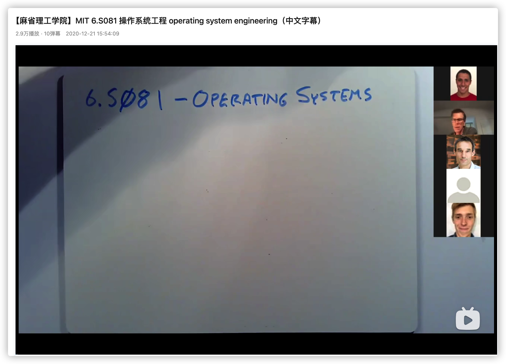
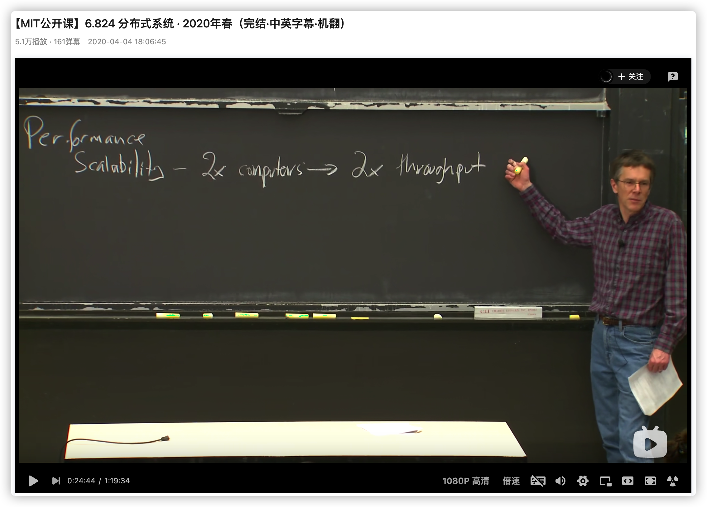
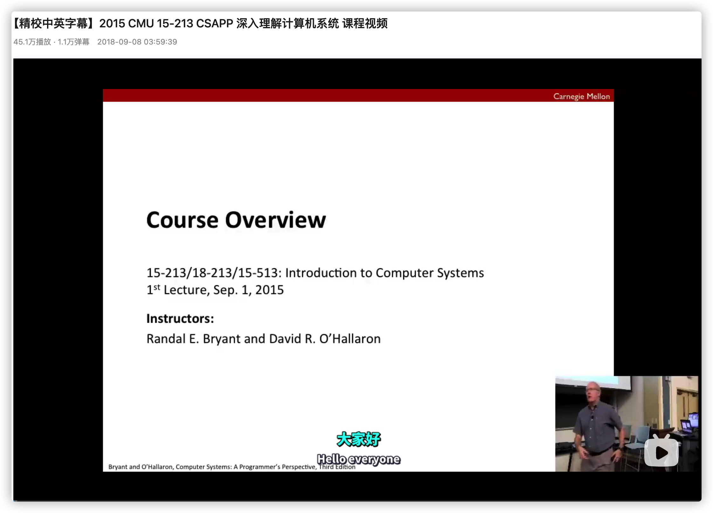
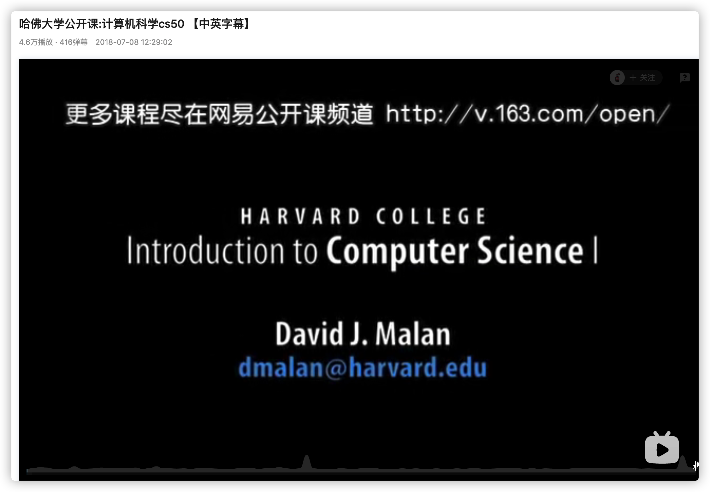
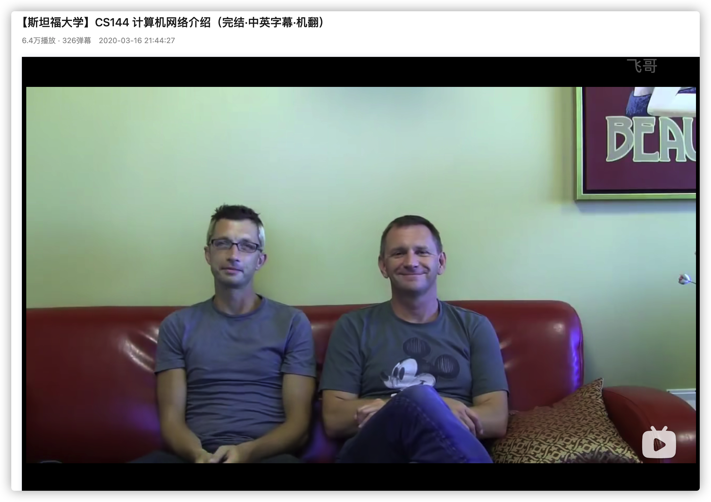

<h1 align="center">我学编程全靠B站了，真香-国外篇（第三期）</h1>

> 作者：阿秀
>
> 原文链接：[https://mp.weixin.qq.com/s/NPskxGeMa1XoTWFRq32CwQ](https://mp.weixin.qq.com/s/NPskxGeMa1XoTWFRq32CwQ)

  
这是六则或许对你有些许帮助的信息:

⭐️1、阿秀与朋友合作开发了一个编程资源网站，目前已经收录了很多不错的学习资源和黑科技（附带下载地址），如过你想要寻求合适的编程资源，<a href="https://tools.interviewguide.cn/home" style="text-decoration: underline" target="_blank">欢迎体验</a>以及推荐自己认为不错的资源，众人拾柴火焰高，我为人人，人人为我🔥！
  
2、👉23年5月份阿秀从<a style="text-decoration: underline" href="https://mp.weixin.qq.com/s?__biz=Mzk0ODU4MzEzMw==&mid=2247512170&idx=1&sn=c4a04a383d2dfdece676b75f17224e78" target="_blank">字节跳动离职跳槽到某外企</a>期间，为方便自己找工作，增加上岸几率，我自己从0开发了一个互联网中大厂面试真题解析网站，包括两个前端和一个后端。能够定向查看某些公司的某些岗位面试真题，比如我想查一下行业为互联网，公司为字节跳动，考察岗位为后端，考察时间为最近一年之类的面试题有哪些？

网站地址：<a style="text-decoration: underline" href="https://top.interviewguide.cn/" target="_blank">InterviewGuide大厂面试真题解析网站</a>。点此可以查看该网站的视频介绍：<a style="text-decoration: underline" href="https://www.bilibili.com/video/BV1f94y1C7BL" target="_blank">B站视频讲解</a>   如果可以的话求个B站三连，感谢！
    
3、😊
    分享一个阿秀自己私藏的黑科技网站，<a style="text-decoration: underline" href="https://hkjtz.cn/" target="_blank">点此直达</a>，主要是各类小众实用APP、网站等，除此外也包括高清影视、音乐、电视剧、AI、纪录片、英语四六级考试、考研考公、副业等资源。
  

  
4、😍免费分享阿秀个人学习计算机以来收集到的免费学习资源，<a style="text-decoration: underline" href="/notes/07-resources/01-free/01-introduce.html" target="_blank">点此白嫖</a>；也记录一下自己以前买过的<a style="text-decoration: underline" href="/notes/07-resources/02-precious.html" target="_blank">不错的计算机书籍、网络专栏和垃圾付费专栏</a>；也记录一下自己以前买过的<a style="text-decoration: underline" href="/notes/07-resources/02-precious.html" target="_blank">不错的计算机书籍、网络专栏和垃圾付费专栏</a>
  

  
5、🚀如果你想在校招中顺利拿到更好的offer，阿秀建议你多看看前人<a style="text-decoration: underline" href="https://www.yuque.com/tuobaaxiu/httmmc/npg1k81zeq4wfpyz" target="_blank">踩过的坑</a>和<a style="text-decoration: underline"  target="_blank" href="https://www.yuque.com/tuobaaxiu/httmmc/gge9ppd0mbu2d3dp">留下的经验</a>，事实上你现在遇到的大多数问题你的学长学姐师兄师姐基本都已经遇到过了。
  

  
6、🔥 欢迎准备计算机校招的小伙伴加入我的<a  style="text-decoration: underline" href="https://www.yuque.com/tuobaaxiu/httmmc/xg0otqvc17wfx4u9" target="_blank">学习圈子</a>，一个人踽踽独行不如一群人报团取暖，圈子里沉淀了很多过去21/22/23/24/25届学长学姐的<a  style="text-decoration: underline" href="https://www.yuque.com/tuobaaxiu/httmmc/gge9ppd0mbu2d3dp" target="_blank">经验和总结</a>，好好跟着走下去的，最后基本都可以拿到不错的offer！</a>如果你需要《阿秀的学习笔记》网站中📚︎校招八股文相关知识点的PDF版本的话，可以<a style="text-decoration: underline" href="https://www.yuque.com/tuobaaxiu/httmmc/qs0yn66apvkzw0ps" target="_blank">点此下载</a> 。
   

大家周一鸭，今天来点猛料，给大家推荐点我的压箱收藏-国外知名大学的公开课。

我推荐的不多，本着少就是多的原则，只给大家推荐我看过最好的五门视频，主要是来自两所国外高校：MIT美国麻省理工、CMU卡内基梅隆大学。

我还看过一些其余国外大学的视频，比如英国剑桥大学、牛津大学的视频以及一门帝国理工学院数据库系列视频。

但因为这些视频基本都是英文字幕，没有中文配套字幕，观看门槛较高，需要比较好的英文水平，就没有给大家推荐。

至于国内高校的视频，前面已经推荐过不少了，详情可以看下下面两篇文章：

其中上述两篇文章包括但不限于国内高校老师等老师讲的是C/C++、Java、Python（爬虫、数据分析、机器学习等）、GO语言、前端（JavaScript以及Vue）、操作系统、计算机网络、数据结构与算法、数据库（MySQL）、Linux等学习教程。

本期推荐的一些经典视频主要是国外篇，可以放心基本都有中文字幕。

本文也会中间掺杂着推荐一些计算机经典书籍，这些书籍基本上在当当和京东都有售，至于电子版则在下面这个电子书仓库中可以找到：https://github.com/forthespada/CS-Books

好了，话不多说，这就开始吧。

## 一、MIT Operating System Engineering 6.828 YYDS 

很多非科班感觉最难学的是学科应该就是计算机系统结构结构相关的知识，不要说非科班，很多科班学生学不好的比比皆是。

计算机系统结构是一个统称，你可以理解为大学里“**计算机系统**”或者“**计算机组成**”，这些内容是是了解软件底层的的重要视角。

国内有一本经典计算机系统书籍，叫做《深入理解计算机系统》，英文缩写：CSAPP，这本书很多人相信应该都有。

为什么说这本书是神书？原因太多了，不过最主要的一点应该是这本书的实用性很强，而且这本书基本是站在程序员的视角来写的。

这本书的视频版正是美国麻省理工 MIT 6.828系列视频，不过现在貌似已经改名叫做 6.S081了。

对于那些想了解计算机系统以求编写更快、更高效、更可靠的软件的人来说，这本书和这个视频是很好的起点。

**地址**：https://www.bilibili.com/video/BV1Dy4y1m7ZE

**推荐指数**：⭐⭐⭐⭐

## 二、MIT 6.824 分布式系统

这个视频是我在看完MIT 6.824之后发现的，当初觉得不错就就收藏起来了，但没有看。

一直到了研三下的时候，那个时候忙着写论文，按理说是没空看视频的。

可我的博士师兄整天在QQ上跟我推荐这门视频，早上起来第一件事就是跟我说这门课怎么怎么好，中午吃饭完又在QQ跟我说这个视频讲的多么多么好！

后来，emm，真香！！！

这个视频确实真的好！！！

主要是因为分布式系统已经应用越来越广了，随着现代化计算机数量的增加，他们在分布上逐渐开始变得分散起来。

其中一个比较好的解决措施是采用大型机器，或者一些超级计算机，比如我国比较知名的天河系列超级计算机。

但并不适用于所有情况，因为更实际的情况是很多很小的应用程序都同时在多台机器上运行，这就不得不引入分布式系统了，墙裂推荐这个视频！

你不会失望的！

对了，这里也顺便推荐一本书《数据密集型应用系统设计》，这本书是所有后端同学必须要看的，如果你想以后往架构师方向发展，这本书同时保持了深度和严谨性，是你绝对不应该错过的一本神书！

**地址**：https://www.bilibili.com/video/BV1Dy4y1m7ZE

**推荐指数**：⭐⭐⭐⭐⭐

## 三、卡内基梅隆大学 Introduction to Computer Systems CMU 15-213 Fall

除了上述麻省理工的两门计算机体系视频比较知名之外，还有一门计算机系统视频同样出名，它就是CMU 的15-213系列视频。

不过建议优先去看MIT 6.828，也就是第一个视频，如果在看完6.828后学有余力可以再来看一下这个视频。

**地址**：https://www.bilibili.com/video/BV1iW411d7hd

**推荐指数**：⭐⭐⭐⭐

## 四、哈佛大学公开课:计算机科学CS50 【中英字幕】

这是一门系统计算计算机科学的视频，最开始是我在网易公开课上看到的，不过后来发现在B站居然也有这门课，果断收藏。

按理说哈佛大学知名度那么高，但是这门课却远远不如MIT的6.828和6.824出名，我觉得很是奇怪...这门课的质量也挺高的，但看过的人却很少。

**地址**：https://www.bilibili.com/video/BV1ks411p7js

**推荐指数**：⭐⭐⭐⭐⭐

## 五、斯坦福大学 CS144 计算机网络介绍

这是我看过最好的国外计算机网络系列课程。

是的，这是我看过最好的国外计网系列的视频，至于国内最好的，我觉得要属韩立刚老师的计算机网络视频了，第一期已经推荐过了，这里就不多做赘述了。

这本课的质量很好，但我有一个建议，那就是在刷这门课程的时候，最好跟《计算机网络：自顶向下方法》这本书一起看，能起到事半功倍的效果。

**地址**：https://www.bilibili.com/video/BV137411Z7LR

**推荐指数**：⭐⭐⭐⭐⭐

其实国外优秀的视频还有很多，可能我推荐的也不是很全，如果大家有更好的视频推荐，欢迎在评论区进行留言。
