<h1 align="center">呕心沥血一个月，为小白新手准备的C++求职版学习路线</h1>

> 作者：阿秀
>
> 原文链接：[https://mp.weixin.qq.com/s/3pcENm2--dVWksNjvtCTcQ](https://mp.weixin.qq.com/s/3pcENm2--dVWksNjvtCTcQ)

  
这是六则或许对你有些许帮助的信息:

⭐️1、阿秀与朋友合作开发了一个编程资源网站，目前已经收录了很多不错的学习资源和黑科技（附带下载地址），如过你想要寻求合适的编程资源，<a href="https://tools.interviewguide.cn/home" style="text-decoration: underline" target="_blank">欢迎体验</a>以及推荐自己认为不错的资源，众人拾柴火焰高，我为人人，人人为我🔥！
  
2、👉23年5月份阿秀从<a style="text-decoration: underline" href="https://mp.weixin.qq.com/s?__biz=Mzk0ODU4MzEzMw==&mid=2247512170&idx=1&sn=c4a04a383d2dfdece676b75f17224e78" target="_blank">字节跳动离职跳槽到某外企</a>期间，为方便自己找工作，增加上岸几率，我自己从0开发了一个互联网中大厂面试真题解析网站，包括两个前端和一个后端。能够定向查看某些公司的某些岗位面试真题，比如我想查一下行业为互联网，公司为字节跳动，考察岗位为后端，考察时间为最近一年之类的面试题有哪些？

网站地址：<a style="text-decoration: underline" href="https://top.interviewguide.cn/" target="_blank">InterviewGuide大厂面试真题解析网站</a>。点此可以查看该网站的视频介绍：<a style="text-decoration: underline" href="https://www.bilibili.com/video/BV1f94y1C7BL" target="_blank">B站视频讲解</a>   如果可以的话求个B站三连，感谢！
  
3、😊
    分享一个学弟发给我的20T网盘资源合集，<a style="text-decoration: underline" href="https://docs.qq.com/sheet/DY3VPVklVaFFMcUZ4?tab=9h5afr" target="_blank">点此白嫖</a>，主要是各类高清影视、电视剧、音乐、副业、纪录片、英语四六级考试、考研考公等资源。
  

  
4、😍免费分享阿秀个人学习计算机以来收集到的免费学习资源，<a style="text-decoration: underline" href="/notes/07-resources/01-free/01-introduce.html" target="_blank">点此白嫖</a>；也记录一下自己以前买过的<a style="text-decoration: underline" href="/notes/07-resources/02-precious.html" target="_blank">不错的计算机书籍、网络专栏和垃圾付费专栏</a>；也记录一下自己以前买过的<a style="text-decoration: underline" href="/notes/07-resources/02-precious.html" target="_blank">不错的计算机书籍、网络专栏和垃圾付费专栏</a>
  

  
5、🚀如果你想在校招中顺利拿到更好的offer，阿秀建议你多看看前人<a style="text-decoration: underline" href="https://www.yuque.com/tuobaaxiu/httmmc/npg1k81zeq4wfpyz" target="_blank">踩过的坑</a>和<a style="text-decoration: underline"  target="_blank" href="https://www.yuque.com/tuobaaxiu/httmmc/gge9ppd0mbu2d3dp">留下的经验</a>，事实上你现在遇到的大多数问题你的学长学姐师兄师姐基本都已经遇到过了。
  

  
6、🔥 欢迎准备计算机校招的小伙伴加入我的<a  style="text-decoration: underline" href="https://www.yuque.com/tuobaaxiu/httmmc/xg0otqvc17wfx4u9" target="_blank">学习圈子</a>，一个人踽踽独行不如一群人报团取暖，圈子里沉淀了很多过去21/22/23届学长学姐的<a  style="text-decoration: underline" href="https://www.yuque.com/tuobaaxiu/httmmc/gge9ppd0mbu2d3dp" target="_blank">经验和总结</a>，好好跟着走下去的，最后基本都可以拿到不错的offer！此外，每周都会进行<a  style="text-decoration: underline" href="https://www.yuque.com/tuobaaxiu/httmmc/npg1k81zeq4wfpyz" target="_blank">精华总结和分享！</a>如果你需要《阿秀的学习笔记》网站中📚︎校招八股文相关知识点的PDF版本的话，可以<a style="text-decoration: underline" href="https://www.yuque.com/tuobaaxiu/httmmc/qs0yn66apvkzw0ps" target="_blank">点此下载</a> 。
   

## 前言

这是阿秀原创的学习路线以及项目推荐系列文章，如下图：

如有盗版，必回拿起法律武器捍卫自己的正当权利，《C++学习路线&项目推荐》的全部内容我将它放在了阿秀的学习圈中，欢迎了解[阿秀的学习圈](/notes/05-xiustar/01-xiustar_reading_guide/01-introduce.html#阿秀组建了一个校招学习圈子)。

以下是正文：

  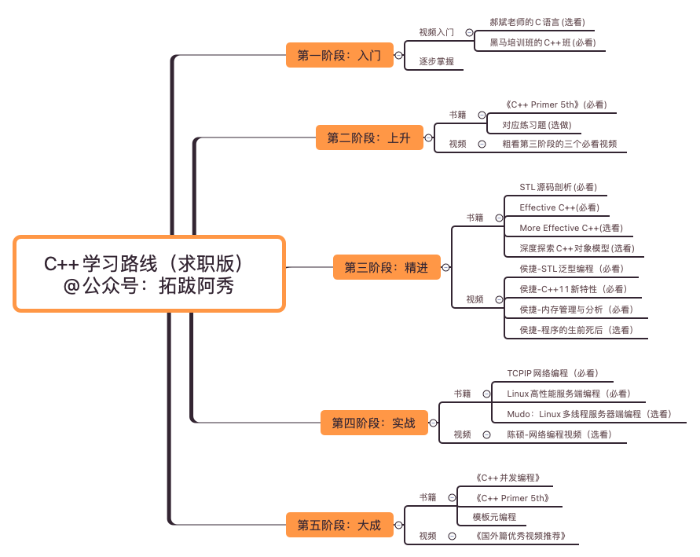

----20221108插入一条更新-----

有小伙伴私信说我下面推荐的黑马2017视频被删掉了，B站没了

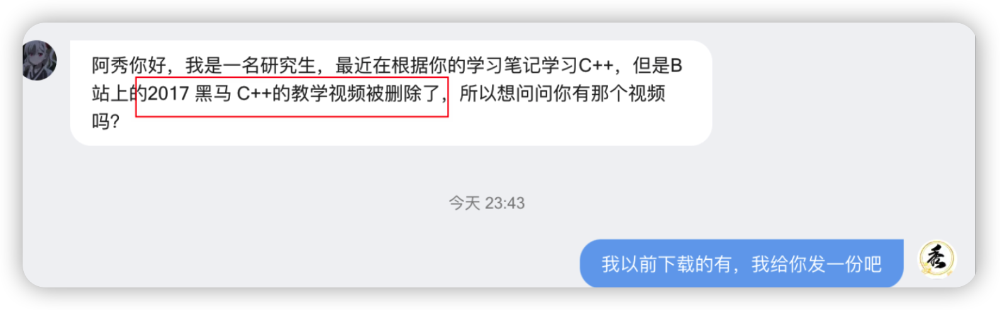

还好我以前下载的有，可能这就是所谓的搜集癖作祟吧哈哈。

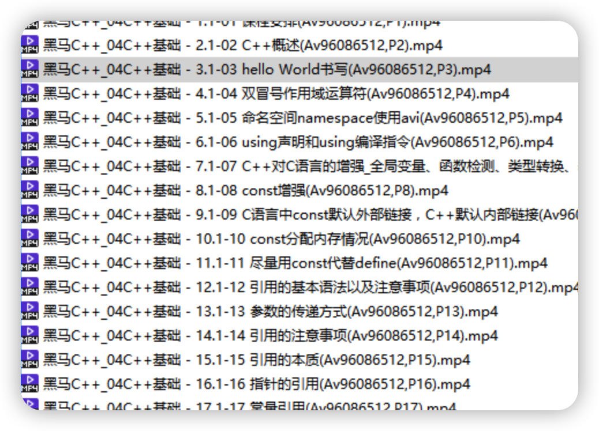

我把它放在我的公众号上了，直接扫描下方二维码，回复"**黑马C++视频**"即可下载

 

 

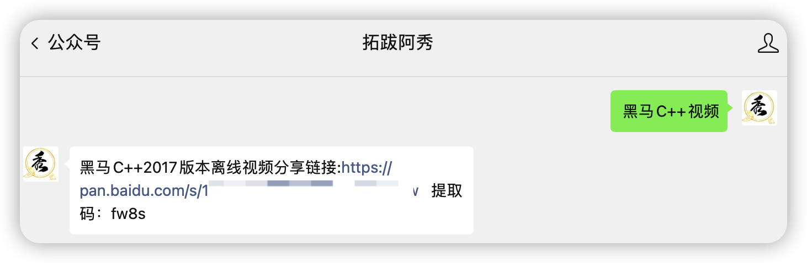

## 1、先唠两句

老粉丝可能知道我有个还在读大学的表弟，今年大三了。

他是非科班转到计算机来的，所以基本功比较差，我专门花了一个多月写了这篇学习路线，全文超过8000字，文章润色了好久，配套的资料全部找齐了。

本篇学习路线主要有五个阶段组成，每个阶段我都推荐的有对应的书籍和视频，对于其中的内容也进行了标注，分为**必看**和**选看**两种，有些内容是必看的，这个一定要看，不可以省略跳过；有些内容是选看的，有时间就看吧，没有时间可以后期记得再补上！

这篇学习路线最开始是发在自己的知识星球上，现在分享给大家。

可能很多小伙伴都知道，我很早之前就有一个知识星球，不过星球中只有我和我表弟两个人，每天坚持打卡，记录自己的学习沉淀过程，我也算带着他学习吧。

中国古代有句话叫做“一人得道鸡犬升天”，当自己有能力的时候就会带带自己身边亲近的人，这是人之常情。

后来有些人问我介不介意多一个表弟？不是亲生的那种...

得益于字节取消大小周，现在变成每周双休了。于是我每周也能多出来将近30个小时，想了想还是开放一下吧。

在星球中，我分享自己在工作中学到的，并且回答一些本科学弟学妹和研究生师弟师妹们的问题，主要是学习和求职相关。

如果你有学习和打算提升自己的打算可以在[阿秀个人的公众号后台](https://mp.weixin.qq.com/s/_EJAvdWl-6M0J7EQP0ct7A)回复“**知识星球**”，了解一下；

如果你没有学习的打算就别加了，可能不是很适合你，因为这个星球以前的名字叫做“**卷王养成集中营**”，后来内卷不是违法了么，害怕被请去喝茶，所以我就改了个名字，叫做**阿秀的学习圈**。 

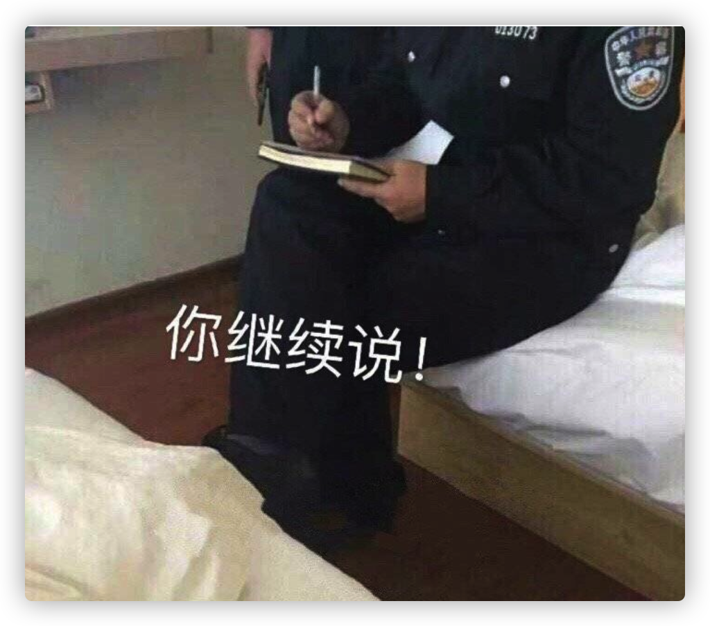
 

## 2、学习路线

说回正题，这篇学习路线我真的写了一个月左右，不要怀疑，是真的一个月，主要是因为最近部门老大又接了一些新项目，我们也在加班加点干活。

所以就只能利用各种碎片化时间写出来的这篇学习路线，主要是面向一些小白和非科班选手，如果你有一定基础了，我建议你按照我以前的学习路线去学就行，就是这篇：

[个人C++学习路线大公开](https://mp.weixin.qq.com/s?__biz=Mzk0ODU4MzEzMw==&mid=2247511492&idx=1&sn=1ff7a02bdfdc23a4b70b826636cd69be&source=41#wechat_redirect)

如果是转行，可以按照现在的这篇学习路线来学。

这篇C++学习路线主要是**面向求职**，认真走完前三阶段绝对能帮助你找到一个不错的工作了。

走完全部五个阶段，你可以说自己是一名合格的C++研发工程师了。

对于本文中推荐的书籍，当当、JD上均有售相应的指纸质版，对应的免费电子版PDF可以在下面这两个仓库找到：

地址1：[https://github.com/forthespada/CS-Books](https://github.com/forthespada/CS-Books)

地址2：[https://gitee.com/ForthEspada/CS-Books](https://gitee.com/ForthEspada/CS-Books)

除此之外，本文也会推荐一些视频我已经放在公众号后台了，获取方式或者地址都在对应的推荐视频下面了。

## 第一阶段、入门

我一直建议一些小白选手在入门最开始不要直接去啃书，特别是不要在最开始的时候就去啃一些黑皮书！

这些书籍很好，但暂时不适合现在的你。

如果你在小白阶段就直接去啃这些内容，妥妥的劝退。

### 1、郝斌老师的C语言教程（选看）

 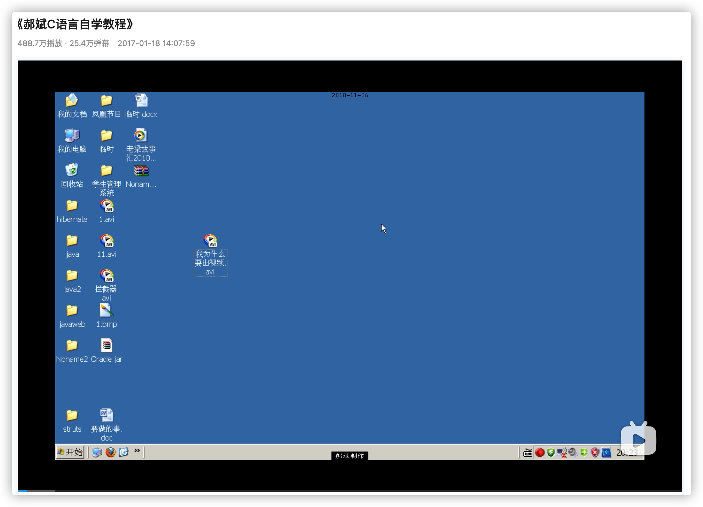

地址：https://www.bilibili.com/video/BV1os411h77o

如果你有别的语言基础，比如Java、Python等，那么郝斌老师的C语言教程就直接跳过吧。

如果你没有别的语言基础，还是看一下郝斌老师的教程吧。

如果你没有最基本的C语言基础，可能连指针是什么内容都不清楚。

那么你在学习C++的时候，比如智能指针那一块会很萌，觉得有些内容看起来云里雾里，前言不搭后语，摸不着头脑。

### 2、黑马培训班的C++教程（必看）

 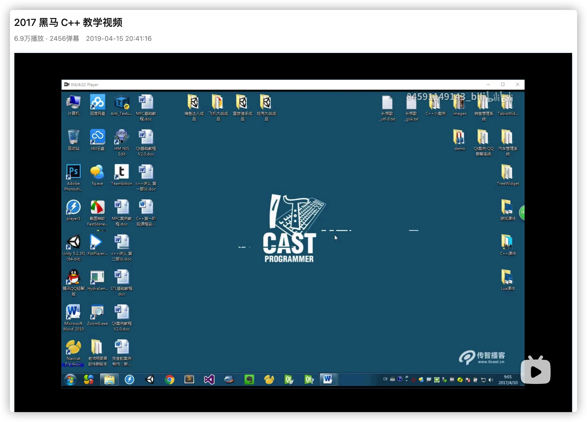 

地址：https://www.bilibili.com/video/BV1Tb411j7uM

**这个必看！**再次重申一遍，**这个必看！！！**

我看的是2017版的黑马C++，现在还有小伙伴在我2019年下的留言回复我。。

 

最好也跟着视频中一起敲，可能你最开始敲的时候速度很慢，对其中的某些内容也不甚其解，没关系，跟着敲就是了。

就好像阿秀以前在看这门视频的时候一样，一个字一个字的敲。

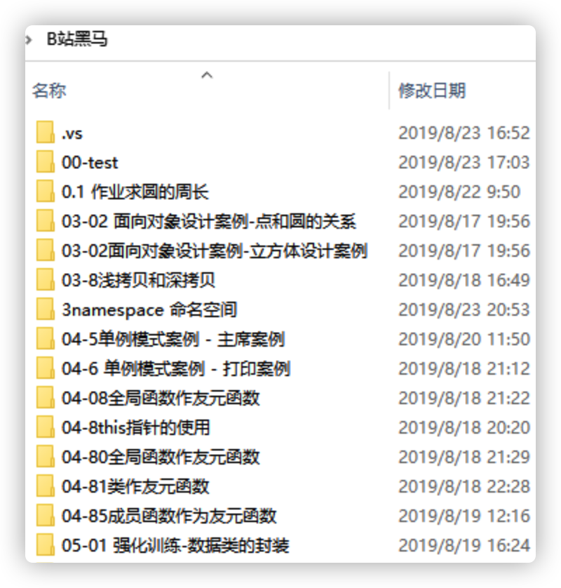

>公众号后台回复“**笔记**”，即可获得我当初自己手敲的黑马C++课程练习。

关于看一些编程类视频的方法，我以前也分享过自己是如何看视频的，感兴趣的可以看看。

文章地址：https://mp.weixin.qq.com/s/rXprhIxwYGRJoRWyhS-lvQ

## 第二阶段、上升

这是整个C++学习路线中最重要的一个阶段，依然是从书籍和视频两个方面入手。

如果说第一阶段是带你入门，那么第二阶段就是帮你打好基础，让你在后期的学习中如履平地、不至于根基不稳。

### 1、《C++ Primer 第五版》或者《C++ Primer Plus 第六版》

这是两本完全不一样的书。

前者，也就是《C++ Primer 第五版》适合一些有基础的选手，封面如下； 

选择这本书的人最好是有一些C语言基础的，也就是可以跳过第一阶段的郝斌老师的C语言教程，只看黑马教程的那些人。

当然了你如果有其余语言的基础就更好了。

在看这本书的时候记得**不要跳过课后练习题**，没必要每道题都要仔仔细细的做，但是每小节后的前2-3题绝对需要自己做一下。

不要觉得自己学得挺不错的，就直接跳过课后题了，我以前看这本书的时候也觉得自己都看懂了。

转头去做一下课后题，才知道我看懂个锤子。。。

这本书的前8章是基础部分，需要好好看；第9 - 12章为容器、算法这些知识；第13章-19章为进阶一点的拷贝、重载等等知识点。

对于13-19章之间的内容，你可能第一次理解不了，没关系，后期遇到问题再来接着翻对应的知识点就行。

因为我就是这么过来的，比如拷贝构造函数和智能指针部分，我记得我至少来来回回看了三四遍才理解清楚。。。

我知道还有一本《C++ Primer 5th》对应的练习题集，其实严格意义来说这本并不是对应的习题集，而是《C++ Primer 5th》课后题的答案。封面如下：

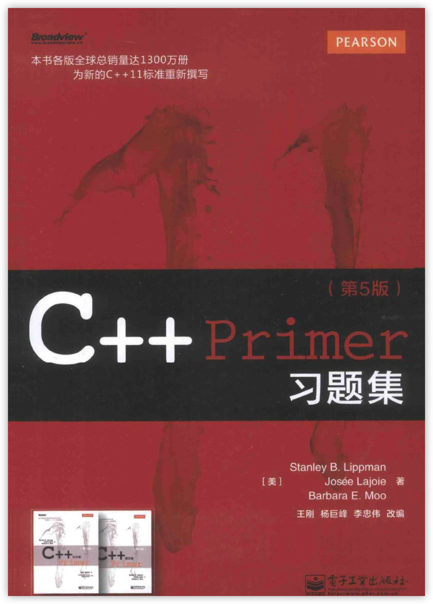 

很多人都问我这本书有没有必要去买？私以为《C++ Primer 5th》课后的题就足够了，可以直接在网上搜答案就可以。

**量不在多，在乎于精**。

如果有不懂的及时弄懂就行，这本习题集没必要买，况且里面还基本都是《C++ Primer 5th》的课后题答案。

有时候选择太多反而是一种坏事，可选项太多反而会导致不好下手，不知道该选哪个了。

第二本书，也就是《C++ Primer Plus 第六版》适合小白选手，也就是没有任何语言基础的选手，封面如下：

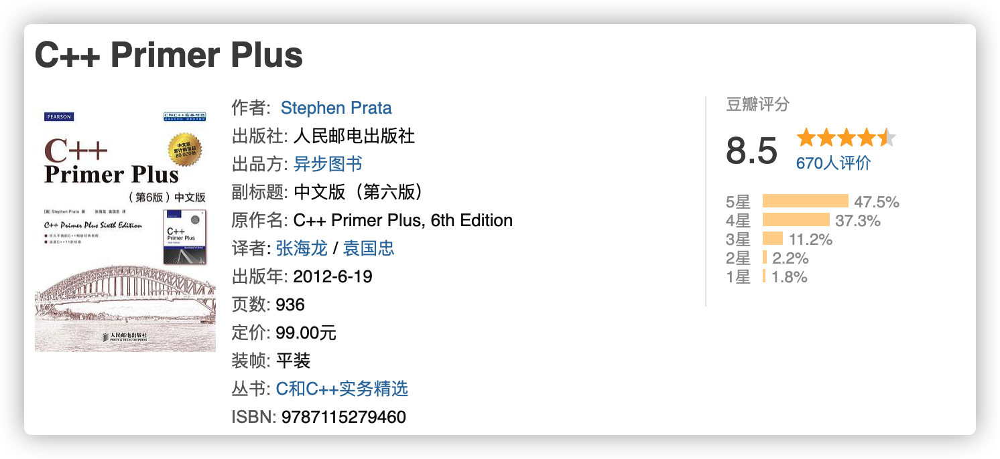 

这本书是完全的小白向书籍，甚至可以说讲的太详细了。

选择这本书的人建议你必须看完第一阶段的《郝斌老师的C语言教程》和《黑马培训班视频》，然后再去买这本书，千万不要去买《C++ Primer 第五版》那本书了。

记得要根据自身的情况来选择不同的书籍。

### 2、粗看三个侯捷老师的视频

看书是一件比较乏味的事，特别是那些大黑书，看起来比较枯燥，因此课题穿插一些视频。

在第二阶段，我建议先粗看一下第三阶段三个必看视频，也就是侯捷老师的**STL泛型编程、C++11新特性、内存管理与分析**这三门课程。

>侯捷老师的全部课程，可以在我的个人公众号后台回复”侯捷“即可获取。

我知道看到这里，可能有同学怀疑我在乱说，甚至直接喷我教坏学弟学妹们，刚开始学习就直接看这么高深的东西。。。

为什么要提前看第三阶段的几个视频？

**第一**、我是推荐你在第二阶段视频，但不代表你可以在第二阶段直接上来就看书，看这几个视频的前提是至少学完、看完C++的基础知识后，比如《C++ Primer 第五版》的前八章，至少要看完前八章再来粗看视频。

**第二**、正如上面说的，看书是一件很容易让人感到乏味的事情，换一种接受知识的形式再回头看书的话，效率一般都会大为改善。猪肉大葱的饺子吃习惯了还想吃吃韭菜鸡蛋的呢。。

**第三**、侯捷老师的这几个视频是每个学习C++的人都应该仔细看几遍下来的，只看一遍是绝对记不住的。

所以可以在第二阶段先大致看看这几个必看的视频，在第三阶段再来仔细看看这几个视频。

我以前跟大家分享过自己在看视频时候的一些方法，就是下面这篇文章：

但侯捷老师的这几个视频不适用这些方法，侯捷老师的这几门课程，你只需要认真看下去即可，如果你有跟着敲的决心也可以，不打算跟着敲也没事，认真看就行。

你在看这三个视频的时候可能会觉得懵，觉得云里雾里摸不着头脑，不要慌，这是正常的。

觉得不懵，反而不正常。。。

视频中的某些知识点看不懂、听不明白，没关系，接着看下去就行。

不需要理解的很透彻，只需要对其中出现的名词有个大概印象即可。

## 第三阶段、精进

### 1、必看的2本书和选看的2本书

具体来说必看的两本书，或者说，必看的两本书和一章节是STL源码剖析、Effective C++、深度探索C++对象模型第三章

而选看的两本书：More Effective C++、深度探索C++第三章以外的部分

**为什么要看这两本书和一章？**

往近了说，面试会问，这是一个很真实的答案，没办法，人家面试官问啊。

是的，面试会问，稍微正规点的C++面试绝对会问STL库的，而且还可能会根据你的回答来看要不要继续深挖下去。

比如Vector扩容机制、unordered_map和map底层数据结构是什么、哈希冲突如何解决？

**往远了说**，

《STL源码剖析》这本书带你走进C++下最知名的库的底层，一探其中奥秘，通过这本书和侯捷老师的STL源码视频，你会对STL有一个完全不一样的认识。

那些容器、库函数，会在你写代码和刷题的时候提供事半功倍的效果，**值得看**。

《Effective C++》正是写给那些自以为“精通”了C++的人看的，相信我，C++绝对是一门高深莫测的语言，这本书只是带你管孔窥豹一点它的奥秘，**值得看**。

《深度探索C++对象》，这是本好书，但内容太冗杂了，最重要的就就是其中第三章虚函数部分。

以前我就分享过，区分C++应聘者的水平高低最好的一个方法就是问他虚函数和STL部分知识点。

这两个部分的知识点，应聘者能答得不错的话，可以说明这个应聘者是学过一些C++的，C++语言的基本功没什么大问题的。

所以第三章虚函数部分，**值得看**。

选看的两本书不是好书吗？不值得看吗？

不是，它们一样是很好的C++书籍，但是优先级可以往后放一放，找到工作再说。

先把最主要的必看的两本书籍看完再说，这选看的两本书可以后期再看。

### 2、必看的三个视频和一个选看的视频

侯捷老师是台湾的C++大师，学习C++的应该没有不知道侯捷老师的。

以前还很有幸看过侯捷老师视频直播哈哈。

扯远了，必看的视频分别是侯捷老师的STL泛型编程、C++11新特性、内存管理与分析

选看的视频则是侯捷老师的程序的生前死后。

>侯捷老师的全部课程，后台回复”侯捷“即可获取。

必看的三个视频重要性依次递减，最重要的就是STL泛型编程，最次的就是内容管理与分析。

其中STL泛型编程是帮助你理解《STL源码剖析》这本书；C++11新特性则是帮助你理解《C++ Primer 第五版》中的C++11新特性。

毕竟光看书，纯靠自己理解一些知识点很容易走错路或者钻牛角尖，有人带着会好很多。

## 第四阶段、实战

其实认真学完前三阶段已经差不多了，再去找个项目好好做做，思考钻研一下。

基本C++语言这块，你是没啥问题了，再了解一些数据结构与算法、操作系统、计算机网络、数据库的知识就可以出去可以出去找工作了。

如果你有志在C++这条路上走下去，那你可以接着往下看下去了。

一个好的C++开发工程师对网络编程一定是十分熟悉和了解的，毕竟学习C++不像学习Java那样，能在学习过程中通过搭建自己的网站或者做一些小Demo来获取自我满足感。

正常来说，你在学习C++的过程中，很长一段时间段内陪伴你的都是一个黑乎乎的命令框，网络编程阶段是为数不多你能够获得一些满足感的阶段。

推荐你在该阶段通过自主开发一个服务器来加深自己对网络编程的理解的认识。

我想很多人都会内心OS：”什么？烂大街的服务器项目？秀哥你没搞错吧，怎么推荐我去学这个？“

其实烂大街的东西，并不代表它不值得去做。

还有就是很多人在简历上写了Web服务器项目，但是实际上都是直接copy的github上的开源项目，可能看都没看懂就说是自己做的项目。

这样的人多了去了。。。

### 1、两本必看的书、一本选看的书

学习C/C++ Linux相关的网络编程，必看的两本书分别是《TCP/IP 网络编程》和《Linux高性能服务端编程》。

前者是本很好的书，原因就是手把手教你写代码，这是真的手把手教你写代码。。唯一不好的点就是书中的很多知识讲的太浅了，很多功能和原理都只是一笔带过，远远不如《Linux高性能服务端编程》讲的深。

我记的这本书好像一共24章左右，每章都是一个例子，也许大家可能被一些广告语上的”手把手教你XXX“坑怕了。

不要担心，这本书真的是手把手教你写各种网络通信的例子。。。

我以前在看这本书的时候专门去 **github** 上找了别人做好的笔记，一边看别人的笔记一边看书，最后又在别人的笔记基础上删删改改形成了自己的笔记，把书中的例子也敲了个遍。 

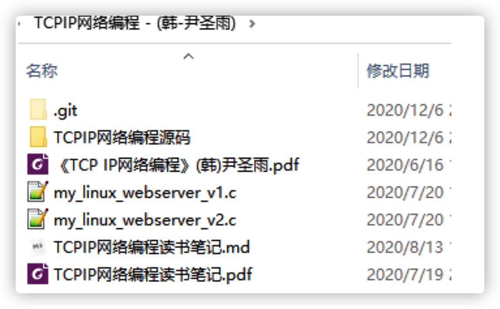

>公众号后台回复”阿秀笔记“，即可获得我以前手敲的《TCPIP网络编程》的笔记啦

看完《TCPIP网络编程》后，你应该去看有一下游双老师的《Linux高性能服务端编程》。

这本书讲的相当不错，是每一个从事服务端开发的人必备的一本书，《TCPIP网络编程》那本书告诉了你How，这本书则告诉你Why。

>公众号后台回复”阿秀笔记“，即可获得我以前收集的《Linux高性能服务端编程》对应的源码文件了

还有一本选看的书，是北师大陈硕老师的《Mudo：Linux 多线程服务端编程》。

这本书好，但是有点高深了，而且工业界用Mudo的也不是很多，如果不是从事服务端研发的同学可以不看这本书或者后期有需要了再来看这本书。

### 2、选看的一个视频

陈硕老师以前也在博览网录制了一个跟《Mudo：Linux 多线程服务端编程》配套的视频。

> 陈硕老师的视频，公众号后台回复”陈硕“即可领取。

就如同他的书一样，这个视频的观看门槛一样比较高，如果不是专门从事服务端开发的C++人员，可以不看这个视频的。

### 3、一个付费专栏

如果你自学能力比较强，能够按照安心啃下来《TCPIP网络编程》和《Linux高性能服务端编程》这两本书也可以。

如果不可以，或者还是习惯通过视频的方式学习，那你可以试试一个牛客网的Linux C/C++服务器的开发专栏，不过是付费的。

网上免费资源有很多，但免费的资源质量良莠不齐，最好看一些经典的或公认的比较好的视频。

相对而言付费的资源质量有保证一些，我以前在牛客网进行求职分享的时候，看过他们的这个Linux C/C++服务器的开发专栏，看了其中的课表和主要内容，该讲的内容基本都涉及到了，基本上把《TCPIP网络编程》和《Linux高性能服务端编程》这两本书汇总最主要的一些知识点都覆盖到了，质量还不错。

最主要的是有人带着你学，比自己蒙头苦学好多了。

地址：https://www.nowcoder.com/courses/cover/live/504?coupon=AcNi2gn

当然了，如果你想要理解的更深，我还是建议你去好好看《TCPIP网络编程》和《Linux高性能服务端编程》这两本书。

## 第五阶段、大成

### 1、书籍

第五阶段的东西其实更多时候是在工作中用到的，比如并发编程、模板元等，对应的书籍有《 C++沉思录 》、《 C++ 模版元编程 》以及《C++并发编程实战》。

在求职的时候基本不需要看这些书籍，这些都属于后期，等你真正拿到offer了，确定从事C++相关的工作了再去看这些书籍。

除此之外，我建议你回归C++这门语言的本源，那就是再从头看一遍《C++ Primer 第五版》或者把它当做一本字典，就放在你的工位上，遇到不确定的当场翻。

### 2、视频

如果你能学到第五阶段，已经很强了，至少比我强的多了。。。

那我就会把我珍藏的几个优秀视频推荐给你吧，基本都是体系原理、分布式相关的视频，在下面这篇文章中:

[我学编程全靠B站了，真香-国外篇（第三期）](https://mp.weixin.qq.com/s?__biz=Mzk0ODU4MzEzMw==&mid=2247511688&idx=1&sn=ecf0c27116ad05d23266182a1f808cb1&source=41#wechat_redirect)

## 结语

好的 C++开发者从来不怕找不到工作，即使你日后从事 Java/Go的工作，由于语言的原理都是相通的，所以你的学习成本会比别人小的多。

我仔细想了想自己这些年的语言史：大学写了一年的C语言和VB，三年的C#；研究生写了一年的Python，两年的C++；工作了开始写JavaScript、Go以及Vue、React这些框架。

你要问我最喜欢哪门语言？

**毫无疑问绝对是是C++！！！**

 

**C++天下第一！！**！

种一棵树的最好时间是十年前，其次就是现在，**真心希望学弟学妹们以及一些想要转计算机的小伙伴们加油！**

 
