<h1 align="center">汇前人之所长，为小白新手准备的前端求职版学习路线</h1>

  
这是六则或许对你有些许帮助的信息:

⭐️1、阿秀与朋友合作开发了一个编程资源网站，目前已经收录了很多不错的学习资源和黑科技（附带下载地址），如过你想要寻求合适的编程资源，<a href="https://tools.interviewguide.cn/home" style="text-decoration: underline" target="_blank">欢迎体验</a>以及推荐自己认为不错的资源，众人拾柴火焰高，我为人人，人人为我🔥！
  
2、👉23年5月份阿秀从<a style="text-decoration: underline" href="https://mp.weixin.qq.com/s?__biz=Mzk0ODU4MzEzMw==&mid=2247512170&idx=1&sn=c4a04a383d2dfdece676b75f17224e78" target="_blank">字节跳动离职跳槽到某外企</a>期间，为方便自己找工作，增加上岸几率，我自己从0开发了一个互联网中大厂面试真题解析网站，包括两个前端和一个后端。能够定向查看某些公司的某些岗位面试真题，比如我想查一下行业为互联网，公司为字节跳动，考察岗位为后端，考察时间为最近一年之类的面试题有哪些？

网站地址：<a style="text-decoration: underline" href="https://top.interviewguide.cn/" target="_blank">InterviewGuide大厂面试真题解析网站</a>。点此可以查看该网站的视频介绍：<a style="text-decoration: underline" href="https://www.bilibili.com/video/BV1f94y1C7BL" target="_blank">B站视频讲解</a>   如果可以的话求个B站三连，感谢！
    
3、😊
    分享一个阿秀自己私藏的黑科技网站，<a style="text-decoration: underline" href="https://hkjtz.cn/" target="_blank">点此直达</a>，主要是各类小众实用APP、网站等，除此外也包括高清影视、音乐、电视剧、AI、纪录片、英语四六级考试、考研考公、副业等资源。
  

  
4、😍免费分享阿秀个人学习计算机以来收集到的免费学习资源，<a style="text-decoration: underline" href="/notes/07-resources/01-free/01-introduce.html" target="_blank">点此白嫖</a>；也记录一下自己以前买过的<a style="text-decoration: underline" href="/notes/07-resources/02-precious.html" target="_blank">不错的计算机书籍、网络专栏和垃圾付费专栏</a>；也记录一下自己以前买过的<a style="text-decoration: underline" href="/notes/07-resources/02-precious.html" target="_blank">不错的计算机书籍、网络专栏和垃圾付费专栏</a>
  

  
5、🚀如果你想在校招中顺利拿到更好的offer，阿秀建议你多看看前人<a style="text-decoration: underline" href="https://www.yuque.com/tuobaaxiu/httmmc/npg1k81zeq4wfpyz" target="_blank">踩过的坑</a>和<a style="text-decoration: underline"  target="_blank" href="https://www.yuque.com/tuobaaxiu/httmmc/gge9ppd0mbu2d3dp">留下的经验</a>，事实上你现在遇到的大多数问题你的学长学姐师兄师姐基本都已经遇到过了。
  

  
6、🔥 欢迎准备计算机校招的小伙伴加入我的<a  style="text-decoration: underline" href="https://www.yuque.com/tuobaaxiu/httmmc/xg0otqvc17wfx4u9" target="_blank">学习圈子</a>，一个人踽踽独行不如一群人报团取暖，圈子里沉淀了很多过去21/22/23/24/25届学长学姐的<a  style="text-decoration: underline" href="https://www.yuque.com/tuobaaxiu/httmmc/gge9ppd0mbu2d3dp" target="_blank">经验和总结</a>，好好跟着走下去的，最后基本都可以拿到不错的offer！</a>如果你需要《阿秀的学习笔记》网站中📚︎校招八股文相关知识点的PDF版本的话，可以<a style="text-decoration: underline" href="https://www.yuque.com/tuobaaxiu/httmmc/qs0yn66apvkzw0ps" target="_blank">点此下载</a> 。
   

## 前言

这是阿秀原创的学习路线以及项目推荐系列文章，如下图：

如有盗版，必回拿起法律武器捍卫自己的正当权利，《学习路线&项目推荐》的全部内容我将它放在了阿秀的学习圈中，欢迎了解[阿秀的学习圈](/notes/05-xiustar/01-xiustar_reading_guide/01-introduce.html#阿秀组建了一个校招学习圈子)。

## 导言

最近越来越多的小小伙伴开始尝试转前端，因为后端确实太卷。

相比于后端，前端上手难度更低，且由于一些高校在本科教育阶段不怎么涉及前端科目，很多人都直到校招阶段才知道原来可以投递前端岗位，这也就导致很多人失去了很上岸机会。

如果你不知道互联网常见技术岗有哪些，可以看下这篇科普文：[https://interviewguide.cn/notes/05-xiustar/02-campus_prepare/02-02-%E4%BA%92%E8%81%94%E7%BD%91%E5%B8%B8%E8%A7%81%E6%8A%80%E6%9C%AF%E5%B2%97%E5%88%86%E7%B1%BB.html](https://interviewguide.cn/notes/05-xiustar/02-campus_prepare/02-02-%E4%BA%92%E8%81%94%E7%BD%91%E5%B8%B8%E8%A7%81%E6%8A%80%E6%9C%AF%E5%B2%97%E5%88%86%E7%B1%BB.html)

这里简单贴一下自己总结的一些前端技能栈和学习路线这块的东西。

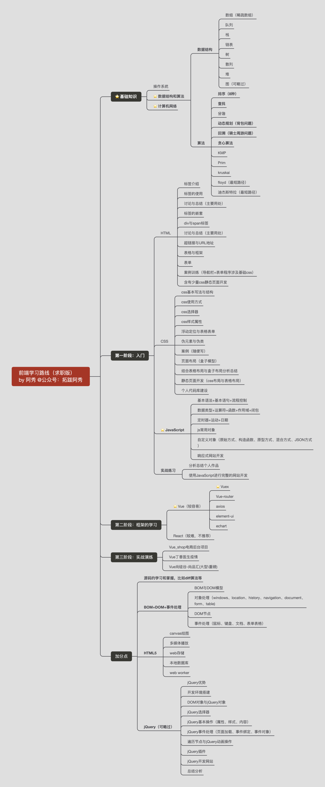

## 1、前端上岸经验

阿秀的学习圈子里分享过不少人选择前端最终上岸的经验，可以点击这里去看看别人的上岸经验，多看看别人的上岸经历比自己踽踽独行好得多：[https://mp.weixin.qq.com/mp/appmsgalbum?__biz=Mzk0ODU4MzEzMw==&action=getalbum&album_id=3141393535481708552#wechat_redirect](https://mp.weixin.qq.com/mp/appmsgalbum?__biz=Mzk0ODU4MzEzMw==&action=getalbum&album_id=3141393535481708552#wechat_redirect)

前端的学习可以分为**基础知识**、**主流框架学习**两步来走，当然还有计算机基础学科这块。

其中**基础知识**主要是JavaScript、HTML、CSS，这三个也被称为前端三驾马车；

**主流框架学习**则主要是Vue或者React二选一即可，阿秀建议选Vue，因为Vue入门更简单，特别是对于一些非科班的人来说，更是尽量去选Vue会比较好一些，React学习成本过高，不建议。

国内目前对这块没有严格要求，特别是校招来说，Vue或者React都可以。

除此之外，还需要一些操作系统的只是（一丢丢即可，很少）、计算机网络（这个比较重要）、数据结构与算法等，这些内容的学习可以去看学习路线中的“**计算机校招基本学科速成路线**”以及“数据结构与算法刷题路线”中的介绍，这里就不再一一展开。

## 2、几个高频问题

### 1、我要不要去参加培训班？

这种情况要分两种情形去分析：

- 如果你自制力不太好，自律性比较差，因为一般自学坚持是最难的，也没系统的流程（很难），那么你就可以选择去报个培训班，因为你真的没选择

- 如果你时间充足（比如刚大一或者大二或者研一），有大把的时间用来打基础，自己也愿意拿出时间去系统学习，那你直接跟着这条路来学就行，一些比较知名的培训机构培训费动不动就是上万，这也是一笔不小的开支了。

不要去浪费这个钱，没必要。

### 2、前端是不是真的比较容易学？

是，前端相较于后端好学一点，没有后端对数据库 + 操作系统 + 计算机网络要求那么高。

加上前端专业在各高校还没有普及和开设，知道学习前端并且付之行动的学生很少。

可以直接告诉你的是前端相较于后端对于非科班来说更好上岸一些，但是前端前期找个web工作是不难，但你如果基础不扎实，

起点心态不对，你很难成长和深入，也就不会拿到所谓的高薪，就别提挣钱了。

IT 行业肯定是靠一步步积累的，如果一开始就是为挣快钱来的，中间又不思进取的话，早晚要离开的也不少。

## 3、大前端的完整技术路线

我找同事要了一份专业的大前端完整技术知识图谱，这是一名专业的高级前端研发工程师所需要具备的一些技能，当然这并不代表校招生就需要具备这些技能，权当科普了，具体的学习路线在下面。
### 第一阶段：基础语法

- HTML CSS:

HTML进阶、CSS进阶、div css布局、HTML css整站开发、

- JavaScript基础：

Js基础教程、js内置对象常用方法、常见DOM树操作大全、ECMAscript、DOM、BOM、定时器和焦点图。

- JS基本特效：

常见特效、例如：tab、导航、整页滚动、轮播图、JS制作幻灯片、弹出层、手风琴菜单、瀑布流布局、滚动事件、滚差视图。

- JS高级特征：

正则表达式、排序算法、递归算法、闭包、函数节流、作用域链、基于距离运动框架、面向对象基础、

- JQuery：基础使用

悬着器、DOM操作、特效和动画、方法链、拖拽、变形、JQueryUI组件基本使用。
###  第二阶段：HTML5和移动Web开发

- HTML5：

HTML5新语义标签、HTML5表单、音频和视频、离线和本地存储、SVG、Web Socket、Canvas.

- CSS3:

CSS3新选择器、伪元素、脸色表示法、边框、阴影、background系列属性改变、Transition、动画、景深和深透、3D效果制作、Velocity.js框架、元素进场、出场策略、炫酷CSS3网页制作。

- Bootstrap:

响应式概念、媒体查询、响应式网站制作、删格系统、删格系统原理、Bootstrap常用模板、LESS和SASS。

- 移动Web开发：

跨终端WEB和主流设备简介、视口、流式布局、弹性盒子、rem、移动终端JavaScript事件、手机中常见JS效果制作、Zepto.js、手机聚划算页面、手机滚屏。
### 第三阶段：HTTP服务和AJAX编程

- WEB服务器基础：

服务器基础知识、Apache服务器和其他WEB服务器介绍、Apache服务器搭建、HTTP介绍。

- PHP基础：

PHP基础语法、使用PHP处理简单的GET或者POST请求、

- AJAX上篇：

Ajax简介和异步的概念、Ajax框架的封装、XMLHttpRequest对象详细介绍方法、兼容性处理方法、Ajax框架的封装、Ajax中缓存问题、XML介绍和使用。

- AJAX下篇：

JSON和JSON解析、数据绑定和模板技术、JSONP、跨域技术、图片预读取和lazy-load技术、JQuery框架中的AjaxAPI、使用Ajax实现爆布流案例额。
### 第四阶段：面向对象进阶

- 面向对象终极篇：

从内存角度到理解JS面向对象、基本类型、复杂类型、原型链、ES6中的面向对象、属性读写权限、设置器、访问器。

- 面向对象三大特征：

继承性、多态性、封装性、接口。

- 设计模式：

面向对象编程思维、单例模式、工厂模式、策略模式、观察者模式、模板方法模式、***模式、装饰者模式、适配器模式、面向切面编程。
### 第五阶段：封装一个属于自己的框架

- 框架封装基础：

事件流、冒泡、捕获、事件对象、事件框架、选择框架。

- 框架封装中级：

运动原理、单物体运动框架、多物体运动框架、运动框架面向对象封装。

- 框架封装高级和补充：

JQuery框架雏形、可扩展性、模块化、封装属于传智自己的框架。
### 第六阶段：模块化组件开发

- 面向组件编程：

面向组件编程的方式、面向组件编程的实现原理、面向组件编程实战、基于组件化思想开发网站应用程序。

- 面向模块编程：

AMD设计规范、CMD设计规范、RequireJS，LoadJS、淘宝的SeaJS。
### 第七阶段：主流的流行框架

- Web开发工作流：

GIT/SVN、Yeoman脚手架、NPM/Bower依赖管理工具、Grunt/Gulp/Webpack。

- MVC/MVVM/MVW框架：

Angular.js、Backbone.js、Knockout/Ember。

- 常用库：

React.js、Vue.js、Zepto.js。
### 第八阶段：HTML5原生移动应用开发

- Cordova：

WebApp/NativeApp/HybirdApp简介、Cordova简介、与PhoneGap之间的关系、开发环境搭建、Cordova实战（创建项目，配置，编译，调试，部署发布）。

- Ionic：

Ionic简介和同类对比、模板项目解析、常见组件及使用、结合Angular构建APP、常见效果（下拉刷新，上拉加载，侧滑导航，选项卡）。

- React Native：

React Native简介、React Native环境配置、创建项目，配置，编译，调试，部署发布、原生模块和UI组件、原生常用API。

- HTML5 ：

HTML5 中国产业联盟、HTML5 Plus Runtime环境、HBuilder开发工具、MUI框架、H5 开发和部署。
### 第九阶段：   Node.js全栈开发：

- 快速入门：

Node.js发展、生态圈、Io.js、Linux/Windows/OS X环境配置、REPL环境和控制台程序、异步编程，非阻塞I/O、模块概念，模块管理工具、开发流程，调试，测试。

- 核心模块和对象：

全局对象global，process，console，util、事件驱动，事件发射器、加密解密，路径操作，序列化和反序列化、文件流操作、HTTP服务端与客户端、Socket.IO。

- Web开发基础：

HTTP协议，请求响应处理过程、关系型数据库操作和数据访问、非关系型数据库操作和数据访问、原生的Node.js开发Web应用程序、Web开发工作流、Node.js开发Blog案例。

- 快速开发框架：

Express简介 MVC简介、Express常用API、Express路由模块、Jade/Ejs模板引擎、使用Express重构Blog案例、Koa等其他常见MVC框架。

- Node.js开发电子商务实战：

需求与设计、账户模块注册登录、会员中心模块、前台展示模块、购物车，订单结算、在线客服即时通讯模块。

## 4、计算机基础科目的学习

不再具体展开，直接去看我写的"《⭐️⭐️03、计算机校招基础学科速成路线 已完成》"，链接在这里：[https://www.yuque.com/docs/share/d884cbf9-6863-4b92-a966-e672a18e5b7d](https://www.yuque.com/docs/share/d884cbf9-6863-4b92-a966-e672a18e5b7d?#)

前端的学习并不是只有前端这一门，还有很多计算机从基础课程的学习的，这里是不可以跳过的。

切记切记！不可跳过！

## 5、前端入门

### HTML

这个其实是最简单的，主要是一些标签的学习和使用，比如div、span这种很通用的模块，以及\<head>，\<title>，\<body>，\<header>，\<footer>，\<article>，\<section>，\
\<canvas>这种标签等，这部分建议去看下B站pink老师的教学视频就完事了。

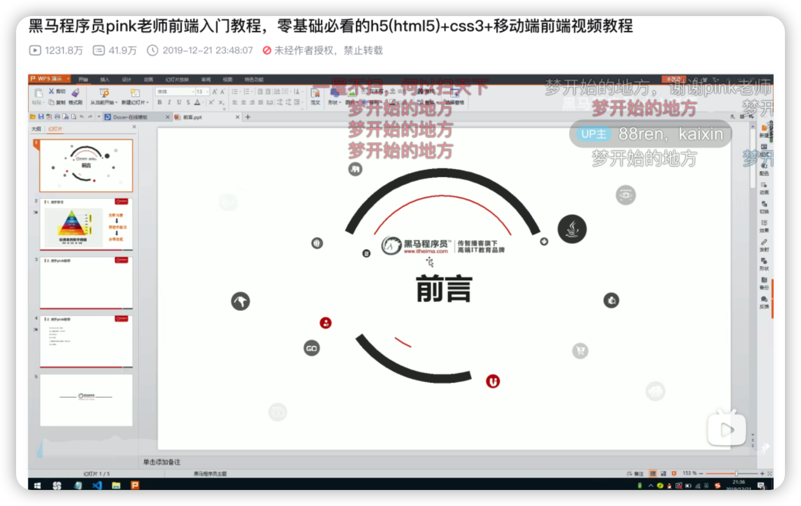

> 地址：https://www.bilibili.com/video/BV14J4114768

视频时间不长，大概花一两周时间就能看完，事实上HTML是静态网页期间用的比较多，等后期你掌握了框架之后基本就用不到HTML里的很多内容了。

比如td这些表格标签，基本用不上了，都是会用一届UI库来画表格了，比较知名的UI库有element-UI、antd等，这个后面再说。

这些标签你并不需要每个都记住，但你要知道有这种标签，所以你在具体使用的时候可以看一些使用手册比如菜鸟教程或者MDN之类的。

MDN：[https://developer.mozilla.org/zh-CN/docs/Web/HTML](https://developer.mozilla.org/zh-CN/docs/Web/HTML)
菜鸟教程：[https://www.runoob.com/html/html-tutorial.html](https://www.runoob.com/html/html-tutorial.html)

### CSS

如果说HTML是前端的骨架的话，那么CSS就是给这副骨架穿上五颜六色的衣服，让这幅骨架变得更好看。

这里同样推荐上面提到的那个视频，黑马的Pink老师还是挺好的，很多人都是在他的引导下进入的前端开发。

同样推荐两本书：《CSS进阶之旅》或者《CSS揭秘》，二选一即可。

阿秀自己买的是CSS揭秘。

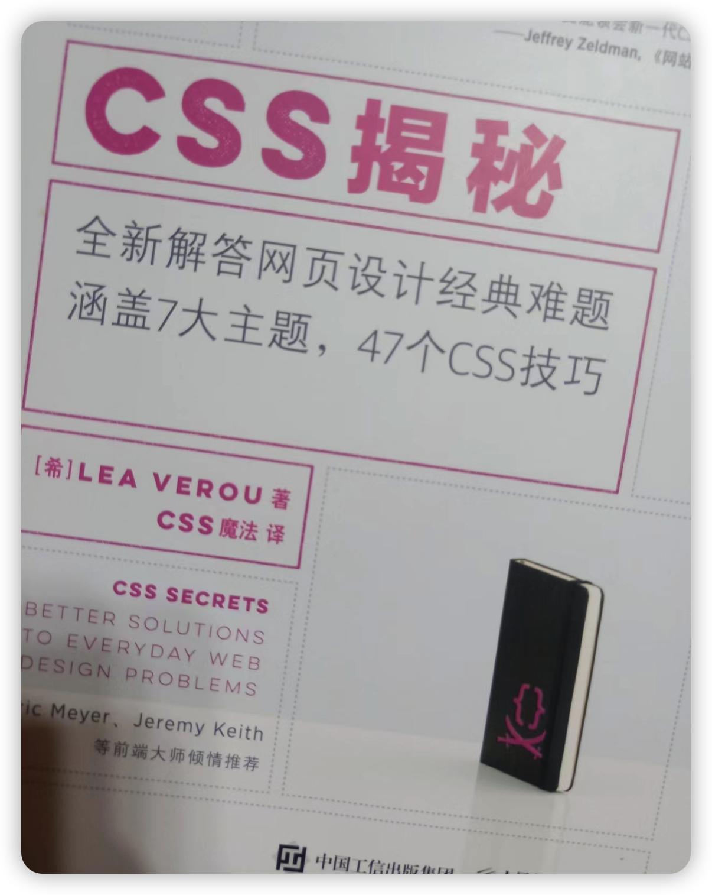

### JavaScript

JavaScript是前端三大马车中**最重要**的，可以不专门去学HTML，也可以在用的时候再具体去查CSS，但JavaScript不行，JavaScript是前端基本功的重中之重。
推荐一本大黑书《JavaScript高级程序设计》，也叫蝴蝶书。

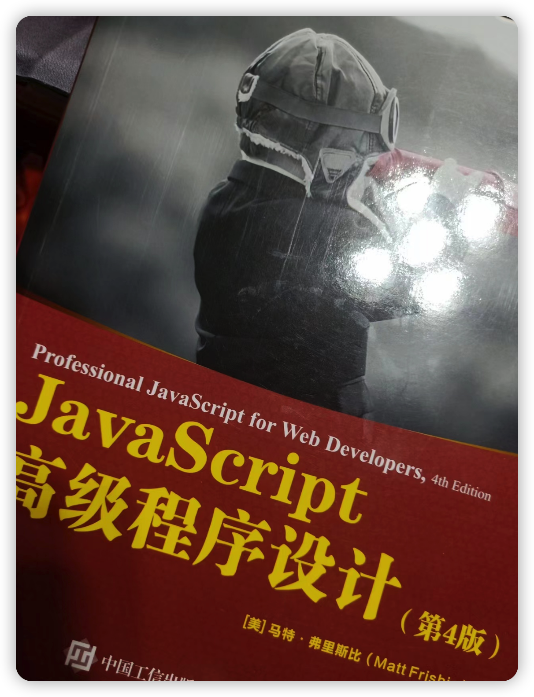

不要被它的名字所吓到，认为这是什么高级教程，emm可能书名看着挺唬人的，但这本书真的是很好的入门级书籍了。

可以说是前端开发者必备的殿堂级书籍了。

如果你比较喜欢看视频，可以去看pink老师的JavaScript视频就行，这个比较全，下面是这个视频中的一些分P，都是前人总结好的。

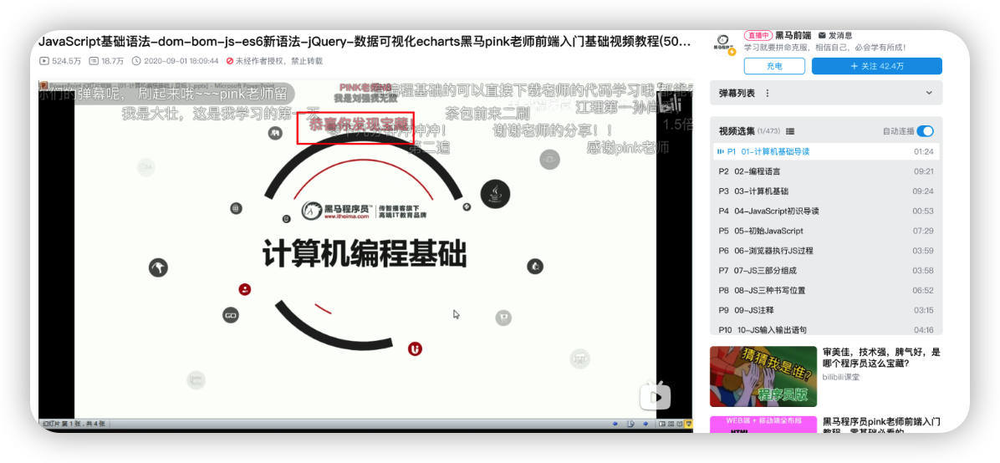

- 变量：P11～19

- 数据类型：P20～40
- 运算符：P41～54
- 流程控制分支结构：P55～68
- 循环：P69～95
- 数组：P96～112
- 函数：P113～133
- 作用域：P134～139
- JS预解析：P140～142
- 对象：P143～153
- 内置对象：P155～186
- 简单数据类型和复杂数据类型：P187～190
- DOM：P194～265
- 事件高级：P247～265
- BOM：P266～286
- PC端网页特效：P287～329
- 移动端网页特效：P331～353
- 本地存储：P354～357
- jQuery：P358～442
- 数据可视化：P443～473

> 地址：[https://www.bilibili.com/video/BV1Sy4y1C7ha?spm_id_from=333.337.search-card.all.click&vd_source=3fc05c3b7f095e12a12ea9850e2e0a35](https://www.bilibili.com/video/BV1Sy4y1C7ha?spm_id_from=333.337.search-card.all.click&vd_source=3fc05c3b7f095e12a12ea9850e2e0a35)

对了，额外推荐一本书《**你不知道的javascript系列**》，共分为上中下三本，其中价值最高的就是其中的上册，中下两册写的有点不太好。

其实JavaScript是一门弱语言，不像C++或者Java的诞生，整个过程都比较严谨。JS的诞生有点令人啼笑皆非，这门语言从设计到推出一共就花了十天时间hhh，虽然后面经过很多轮的二次修正，但语言层面上依然有些bug，《你不知道的javascript系列》会让你对这门语言有全新的认识。

强烈推荐，阿秀自己就买了这本书。

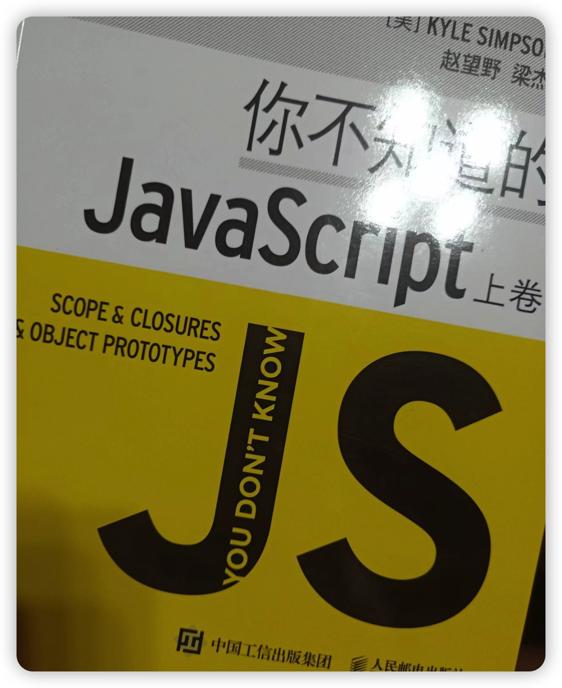

### 综合练手推荐

前端是一个特别需要你动手自己写的技术方向，千万要自己写！自己动手敲，包括各种CSS样式之类的都需要你动手做。
这里推荐一个很有名的前端练手项目，**50projects50days，**也就是50天50个前端小项目。

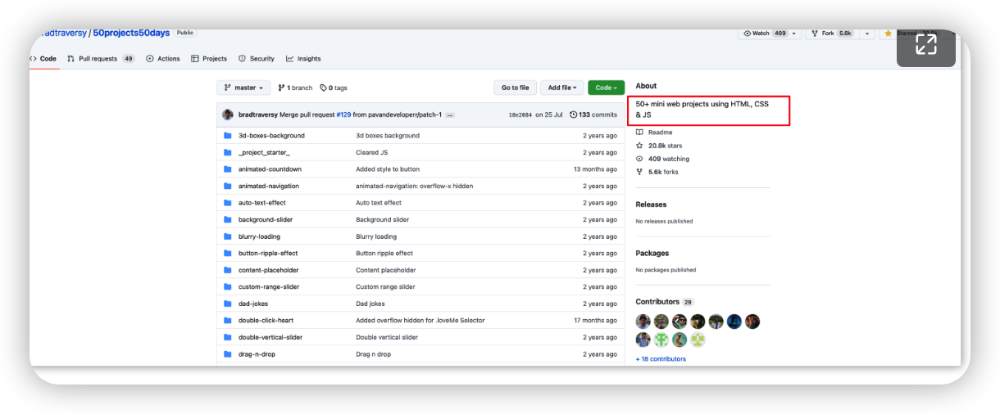

> 地址：[https://github.com/bradtraversy/50projects50days](https://github.com/bradtraversy/50projects50days)

就像它介绍的那样，一天一个，50个用HTML、CSS、JavaScript写成的小demo。

B站上也有人上传了自己的练手经过，你在练手的过程中，也可以看看别人的经验。

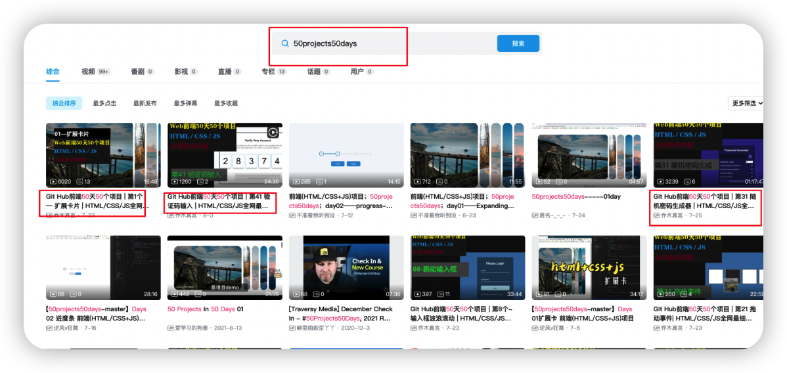

> 链接：[https://search.bilibili.com/all?vt=74736837&keyword=50projects50days&from_source=webtop_search&spm_id_from=333.1007](https://search.bilibili.com/all?vt=74736837&keyword=50projects50days&from_source=webtop_search&spm_id_from=333.1007)

### HTML5、CSS3以及ES6等

前端发展至今已经很长时间了，所以为了应对功能越来越强大的浏览器、客户端等，HTML慢慢变成了HTML5、CSS慢慢演化成了CSS3、JS慢慢变成了TS，还有ES等语法。

所以**前端的弊端也在于此，就是你可能需要经常补充新的内容，新的知识点**。

对于ES6以及CSS3等内容的学习，这里推荐一些资料和书籍，自取即可。

书籍：《深入理解ES6》、《Javascript设计模式与开发实践》、《现代 JavaScript 教程
》
视频：html5 +css3：[https://www.bilibili.com/video/BV1Kg411T7t9?spm_id_from=333.337.search-card.all.click&vd_source=3fc05c3b7f095e12a12ea9850e2e0a35](https://www.bilibili.com/video/BV1Kg411T7t9?spm_id_from=333.337.search-card.all.click&vd_source=3fc05c3b7f095e12a12ea9850e2e0a35)

## 6、框架学习

## ⭐️Vue

Vue是一门前端框架，但Vue在使用过程中经常会跟全家桶一起用，也就是Vue-Router、Vuex这些在一起使用，所以阿秀比较建议前期找个视频看起来。

你不懂什么叫Vuex，没关系，多看看视频里怎么做的，能照样学下来就可以；

你不懂什么叫Vue-router，也没关系，多看看视频里怎么做的，能照样学下来就可以；

你不懂什么叫E-chart图表，更没关系，多看看视频里怎么做的，能照样学下来就可以；

最开始多"抄一抄"老师是怎么做的，然后才是自己去实践和学习。

Vue的视频，黑马讲的比较好，这里推荐几个视频，学习顺序有前后之分，先学1，再学2，然后再接着往下学。

**切记不要跳。**

### 1、Vue实战项目：电商管理系统（Element-UI）

**这个建议好好看，我就是直接学的这个项目开始上手前端的。**

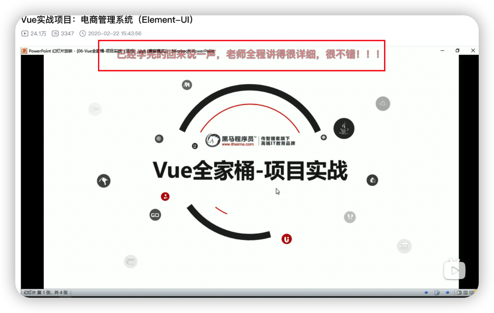

> 地址：[https://www.bilibili.com/video/BV1E7411c7M8?spm_id_from=333.337.top_right_bar_window_custom_collection.content.click&vd_source=3fc05c3b7f095e12a12ea9850e2e0a35](https://www.bilibili.com/video/BV1E7411c7M8?spm_id_from=333.337.top_right_bar_window_custom_collection.content.click&vd_source=3fc05c3b7f095e12a12ea9850e2e0a35)

配套资料，链接：https://pan.baidu.com/s/1UlO7JAqIHzT2ET_Od_sn0g 
提取码：h54h 

###  2、电商平台数据可视化实时监控系统-Echarts

这个视频可以不看完，学几种比较常见的图表即可，比如折线图、饼图、柱状图就行。

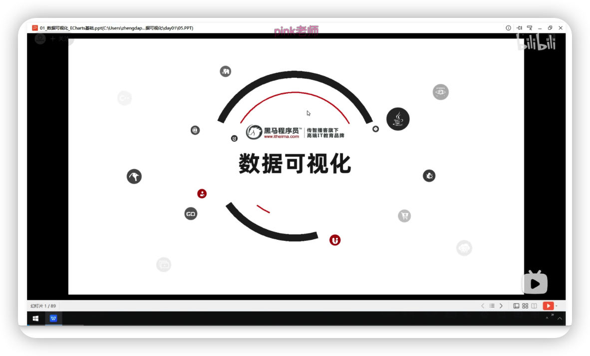

> 地址：[https://www.bilibili.com/video/BV1bh41197p8?spm_id_from=333.337.top_right_bar_window_custom_collection.content.click&vd_source=3fc05c3b7f095e12a12ea9850e2e0a35](https://www.bilibili.com/video/BV1bh41197p8?spm_id_from=333.337.top_right_bar_window_custom_collection.content.click&vd_source=3fc05c3b7f095e12a12ea9850e2e0a35)

### 3、Vuex从入门到实战

这个建议好好看。

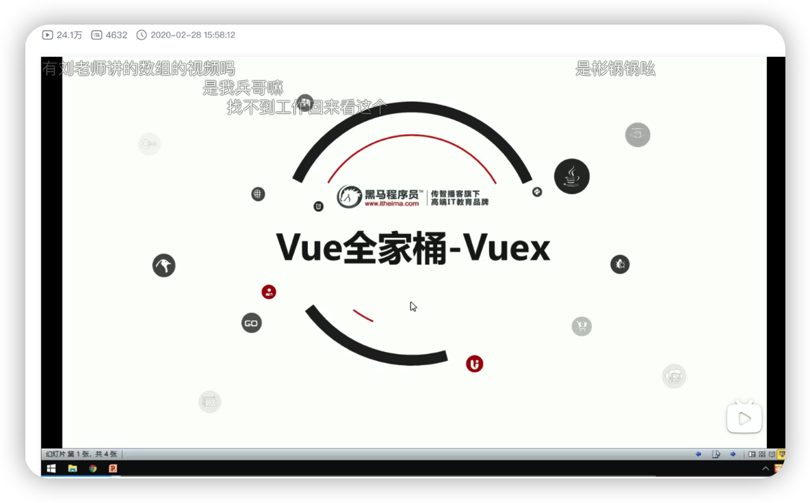

> 地址：[https://www.bilibili.com/video/BV1h7411N7bg?spm_id_from=333.337.search-card.all.click&vd_source=3fc05c3b7f095e12a12ea9850e2e0a35](https://www.bilibili.com/video/BV1h7411N7bg?spm_id_from=333.337.search-card.all.click&vd_source=3fc05c3b7f095e12a12ea9850e2e0a35)

### 4、Vue源码解析系列课程

这个要求能力比较高，只能说学了有好处，面试的时候吹吹牛逼能用得上，不学也没什么。

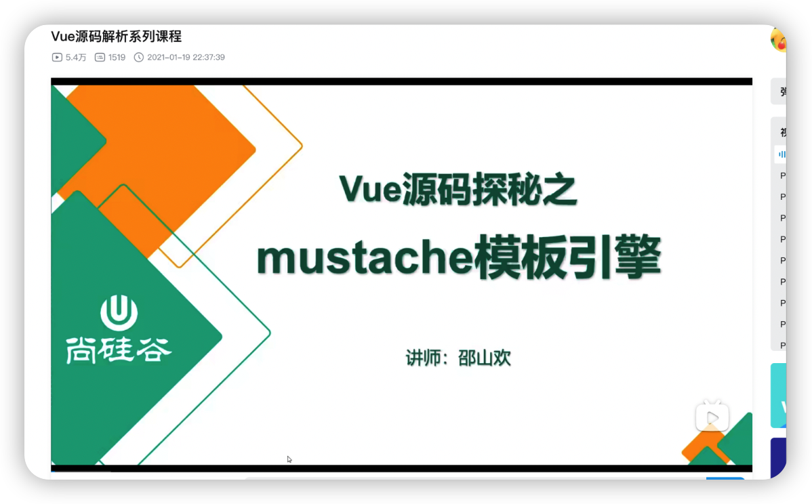

> 地址：[https://www.bilibili.com/video/BV1iX4y1K72v?spm_id_from=333.337.search-card.all.click&vd_source=3fc05c3b7f095e12a12ea9850e2e0a35](https://www.bilibili.com/video/BV1iX4y1K72v?spm_id_from=333.337.search-card.all.click&vd_source=3fc05c3b7f095e12a12ea9850e2e0a35)

## React

react的学习难度要大于Vue，**其实不是很推荐**。

如果你打算学习React的话，不要去跟黑马的视频去学，黑马的React讲的不太好，去看尚硅谷张天禹的React会比较好一些。

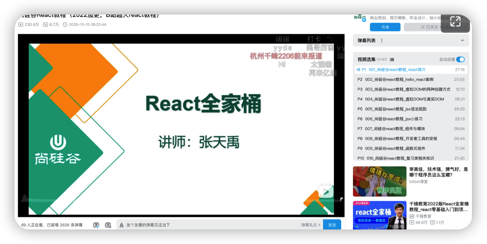

> 地址：[https://www.bilibili.com/video/BV1wy4y1D7JT?spm_id_from=333.337.search-card.all.click&vd_source=3fc05c3b7f095e12a12ea9850e2e0a35](https://www.bilibili.com/video/BV1wy4y1D7JT?spm_id_from=333.337.search-card.all.click&vd_source=3fc05c3b7f095e12a12ea9850e2e0a35)

## 7、一些过来人的经验和建议

随着大前端（小程序）的流行，前端所能做的事情越来越多，适当了解学习一些后端的知识有利于更好的学习工作，例如Node.JS等，都可以去了解了解。

一般好的前端开发工程师，都是对后端稍微了解一点的，大多数全栈研发工程师都是从前端慢慢演变过来的。

node.js虽然是后端语言，但语法基本跟JS没啥区别，学习成本极低，如果你想要在互联网这行久干的话，后端是你必须要接触的。

**这是真话。**

但现在还在纠结学习语言的小白们可能暂时还是体会不到这句话的，就好像高中时班主任会告诉我们要好好学习，说学习是很重要的，但当时的我们都不以为意，认为班主任在糊弄我们或者故意夸大，但现在回头去想想，当时班主任说的这句话真的很正确，无奈，当时的我们理解不了罢了。

