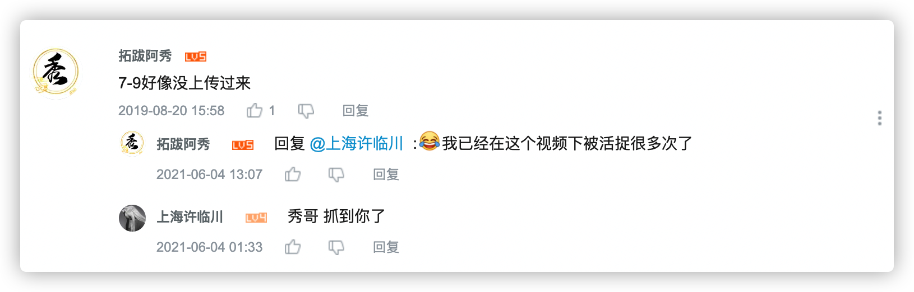
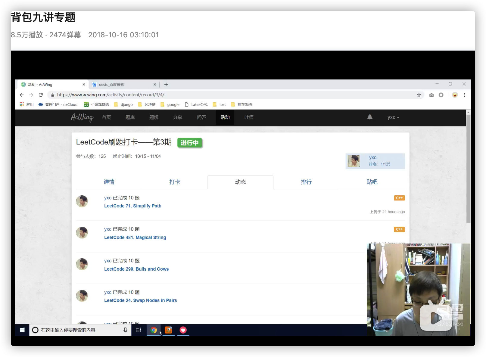
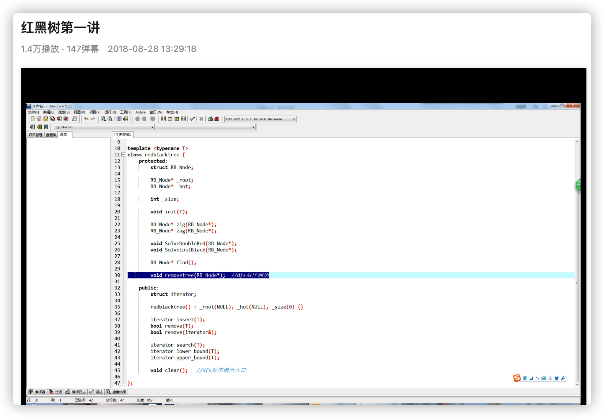
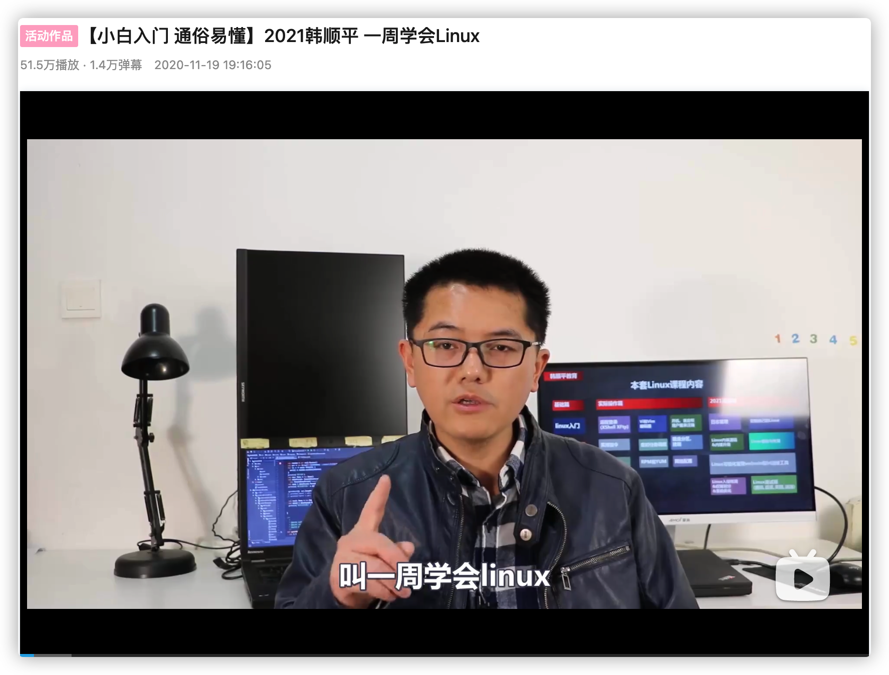
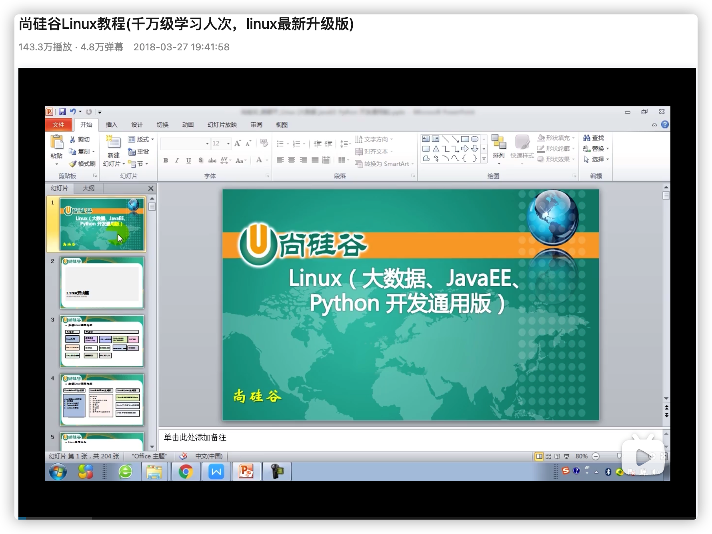

<h1 align="center">我学编程全靠B站了，真香（第一期）</h1>

> 作者：阿秀
>
> 原文链接：[https://mp.weixin.qq.com/s/ct6yind_rqjl3sOZk_33sQ](https://mp.weixin.qq.com/s/ct6yind_rqjl3sOZk_33sQ)

  
这是六则或许对你有些许帮助的信息:

⭐️1、阿秀与朋友合作开发了一个编程资源网站，目前已经收录了很多不错的学习资源和黑科技（附带下载地址），如过你想要寻求合适的编程资源，<a href="https://tools.interviewguide.cn/home" style="text-decoration: underline" target="_blank">欢迎体验</a>以及推荐自己认为不错的资源，众人拾柴火焰高，我为人人，人人为我🔥！
  
2、👉23年5月份阿秀从<a style="text-decoration: underline" href="https://mp.weixin.qq.com/s?__biz=Mzk0ODU4MzEzMw==&mid=2247512170&idx=1&sn=c4a04a383d2dfdece676b75f17224e78" target="_blank">字节跳动离职跳槽到某外企</a>期间，为方便自己找工作，增加上岸几率，我自己从0开发了一个互联网中大厂面试真题解析网站，包括两个前端和一个后端。能够定向查看某些公司的某些岗位面试真题，比如我想查一下行业为互联网，公司为字节跳动，考察岗位为后端，考察时间为最近一年之类的面试题有哪些？

网站地址：<a style="text-decoration: underline" href="https://top.interviewguide.cn/" target="_blank">InterviewGuide大厂面试真题解析网站</a>。点此可以查看该网站的视频介绍：<a style="text-decoration: underline" href="https://www.bilibili.com/video/BV1f94y1C7BL" target="_blank">B站视频讲解</a>   如果可以的话求个B站三连，感谢！
  
3、😊
    分享一个学弟发给我的20T网盘资源合集，<a style="text-decoration: underline" href="https://docs.qq.com/sheet/DY3VPVklVaFFMcUZ4?tab=9h5afr" target="_blank">点此白嫖</a>，主要是各类高清影视、电视剧、音乐、副业、纪录片、英语四六级考试、考研考公等资源。
  

  
4、😍免费分享阿秀个人学习计算机以来收集到的免费学习资源，<a style="text-decoration: underline" href="/notes/07-resources/01-free/01-introduce.html" target="_blank">点此白嫖</a>；也记录一下自己以前买过的<a style="text-decoration: underline" href="/notes/07-resources/02-precious.html" target="_blank">不错的计算机书籍、网络专栏和垃圾付费专栏</a>；也记录一下自己以前买过的<a style="text-decoration: underline" href="/notes/07-resources/02-precious.html" target="_blank">不错的计算机书籍、网络专栏和垃圾付费专栏</a>
  

  
5、🚀如果你想在校招中顺利拿到更好的offer，阿秀建议你多看看前人<a style="text-decoration: underline" href="https://www.yuque.com/tuobaaxiu/httmmc/npg1k81zeq4wfpyz" target="_blank">踩过的坑</a>和<a style="text-decoration: underline"  target="_blank" href="https://www.yuque.com/tuobaaxiu/httmmc/gge9ppd0mbu2d3dp">留下的经验</a>，事实上你现在遇到的大多数问题你的学长学姐师兄师姐基本都已经遇到过了。
  

  
6、🔥 欢迎准备计算机校招的小伙伴加入我的<a  style="text-decoration: underline" href="https://www.yuque.com/tuobaaxiu/httmmc/xg0otqvc17wfx4u9" target="_blank">学习圈子</a>，一个人踽踽独行不如一群人报团取暖，圈子里沉淀了很多过去21/22/23届学长学姐的<a  style="text-decoration: underline" href="https://www.yuque.com/tuobaaxiu/httmmc/gge9ppd0mbu2d3dp" target="_blank">经验和总结</a>，好好跟着走下去的，最后基本都可以拿到不错的offer！此外，每周都会进行<a  style="text-decoration: underline" href="https://www.yuque.com/tuobaaxiu/httmmc/npg1k81zeq4wfpyz" target="_blank">精华总结和分享！</a>如果你需要《阿秀的学习笔记》网站中📚︎校招八股文相关知识点的PDF版本的话，可以<a style="text-decoration: underline" href="https://www.yuque.com/tuobaaxiu/httmmc/qs0yn66apvkzw0ps" target="_blank">点此下载</a> 。
   

不会有人不是B站大学毕业的吧？？？

不会吧？？

我先来，我是就读于B站大学2020届的阿秀同学，有没有同是B站大学的校友，欢迎在底部评论区留言你所属的届数。

好了，我摊牌了。其实我是个刷视频狂魔，B站收藏夹里也收藏了很多编程类视频比如**C/C++、Go语言、操作系统、数据结构和算法、计算机网络、数据库、Python爬虫、机器学习**以及我这段时间正在学习的前端。

下面分享一下我在B站大学就读时的课程表，老实说，我看过的视频有很多，同时B站优秀的编程类视频也有很多，我只分享一下我觉得还不错的编程类学习视频。

我看过的不仅有国内的还有一些国外的精品课程，比如 MIT .828、6.824以及CMU15-213 。

因为篇幅原因，本期就**先讲国内中文的，国外篇的后续再分享**，可以先透露一句，国外的计算机编程类视频优秀的着实不少。

我只推荐我了解的，换句话说就是我看过的或者说我身边小伙伴跟我推荐的那些视频。

至于那些没看过的、不了解的课程，我不乱说，也不乱推荐，如果你有好的欢迎你在文末留言，正所谓众人拾柴火焰高。

## 一、C/C++

### **1、这个可能是最好的C语言教程**

郝斌老师的C语言教程可能是B站最好的一门C语言教程了，截止目前为止，足足有468W的播放量。

我也看过小甲鱼的，觉得小甲鱼讲的有点粗糙，而且小甲鱼总是开车。。。我看了几P就关掉了。。。

**地址**：https://www.bilibili.com/video/BV1os411h77o?from=search&seid=13772202421959055259

**推荐指数**：⭐⭐⭐⭐⭐

C语言是一门很重要的课程，特别是指针部分，建议那些想要入行计算机或者刚上大学的小伙伴看一下这门课程。

### **2、黑马C++视频**

这份C++视频是我开始自学C++之路看的第一个视频，质量挺不错的，用来入门很合适。

但要记得跟着敲，不要只是看而不动手敲，这样看完一遍基本没啥影响，最好跟着老师敲起来。

视频下面还有我在2019年的留言，，，现在还经常有小伙伴在底下回复我。。

**地址**：https://www.bilibili.com/video/BV1Tb411j7uM

**推荐指数**：⭐⭐⭐⭐⭐

### **3、侯捷老师的STL源码剖析**

台湾 C++ 大佬-侯捷老师在博览网有五六门课程：

- C++面向对象开发
- STL标准库与泛型编程
- C++新标准C++11&14
- C++内存管理机制
- C++ Startup揭秘

私以为这门STL标准库和泛型编程是最好的，没有之一。

C++方面有几本圣经级别的书，《STL源码剖析》就是其一，虽然那本书有点老了，但设计思想真的很棒！

**下载方式**：其实以前B站就有侯捷老师的课程的，但是被下架了，挺可惜的。后来我专门去收集了侯捷老师的课程和课件，公众号后台回复“侯捷”就可以领取了。

**推荐指数**：⭐⭐⭐⭐⭐

记得要好好看啊。

### **4、侯捷老师的内存管理**

在我个人看来，这门课是侯捷老师除了STL源码剖析之外的第二好的了。

**推荐指数**：⭐⭐⭐⭐

如果学有余力的话，建议也刷一刷，领取方式为后台回复“侯捷”。

至于侯捷老师的其余课程，比如C++11新特性也挺值得看的，至于其他的有时间就去刷刷吧。

## 二、Java

我知道有人看到这里可能会直接右上角关闭文章、甚至直接diss我：

“**阿秀，你不是C/C++/Golang技术栈吗？哪里的资格推荐Java啊**？”

没吃过猪肉还没见过猪跑吗？

Java身为互联网第一语言，阿秀身边有几个Java大佬不奇怪吧？

一个人推荐的视频合集可能包含主管臆断，但五六个Java大神推荐的Java视频里都有这门视频，那基本可以确定这么视频质量不错了。

这几个Java视频是我专门找六个玩的不错的小伙伴请教得来的，综合了几个人的推荐得到了下面这份视频榜单。

### **1、尚硅谷宋红康老师的 Java 零基础视频**

狂吹一波宋老师，Java入门YYDS！！！

我知道还有一位毕向东老师的Java基础视频也挺不错，不过他讲的Java版本有点老了，再三考虑后还是推荐大家优先学一下宋红康老师的这门视频吧。

**地址**：https://www.bilibili.com/video/BV1Qb411g7cz

**推荐指数**：⭐⭐⭐⭐⭐

### **2、尚学堂高琪老师的Java视频**

高琪老师以前就出过Java类的视频，当时出的并不多，但是效果很好。

于是前段时间又出了Java300集的视频，尚硅谷高琪，没的说！

**地址**：https://www.bilibili.com/video/BV1ct411n7oG

**推荐指数**：⭐⭐⭐⭐⭐

### **3、求知课堂2019Java入门视频**

求知课堂的这门课，没有什么废话，上来就给你干货的那种，所以这也是这门课高口碑的一个重要因素。

**地址**：https://www.bilibili.com/video/BV1CJ411m7gg

**推荐指数**：⭐⭐⭐⭐⭐

### **4、尚硅谷Java8新特性**

Java8出来有一段时间了，这个视频最好在看完上面任意一个视频后再来看，这样会比较好接受一点。

**地址**：https://www.bilibili.com/video/BV1ME411y7Ce

**推荐指数**：⭐⭐⭐⭐

### **5、B站最强的Java项目-谷粒商城**

Java这门语言需要学习的知识点有很多，不太可能只通过一些视频就掌握这门语言达到就业的水平，所以有必要再去看一些实战类的视频。

我问了六个小伙伴和同事，其中四个人都推荐这门课，质量可见一斑！

但这门课涉及知识点也是比较多的，比如微服务、分布式、MySQL之类的，所以建议后期再来学一下这门课程。

**地址**：https://www.bilibili.com/video/BV1np4y1C7Yf

**推荐指数**：⭐⭐⭐⭐⭐

## 三、数据结构与算法

### **1、青岛大学王卓老师，YYDS**

总当有人问我数据结构与算法推荐入门学哪个的时候，我都会推荐他去看一下王卓老师的这门数据结构与算法课程！

我看过不少数据结构与算法的课程，可讲的清楚明白的没多少，王卓老师算一个！

**地址**：https://www.bilibili.com/video/BV1nJ411V7bd

**推荐指数**：⭐⭐⭐⭐⭐

### **2、清华邓俊辉老师的数据结构与算法课程**

除了王卓老师之外，邓俊辉老师的这门数据结构与算法课程讲的也非常不错！

听说邓老师在清华现场讲这门课的时候，教室里座无虚席，不少非科班的小伙伴都会跑来旁听。

**地址**：https://www.bilibili.com/video/BV1jt4y117KR

**推荐指数**：⭐⭐⭐⭐⭐

### **3、背包九讲**

这是Y神的背包九讲专题，共分为两讲。其中背包在这里是指背包算法的意思，背包算法是ACM竞赛中经常会考到的题目，也是比较优区分度的算法题目了。

不少大厂在笔试中也经常会考察背包算法这一题型，Y神讲得挺不错的，推荐大家去看看。

**地址**：https://www.bilibili.com/video/BV1qt411Z7nE

**推荐指数**：⭐⭐⭐⭐⭐

### **4、红黑树**

如果要说常见的数据结构里，哪个数据结构最麻烦、最难以掌握？

**绝对非红黑树莫属了**，如果只是自己看的话很多人可能看很多遍都不太懂红黑树。

这是B站上难的的讲解红黑树的视频了，这哥们带你手写红黑树，强的一批！赶快收藏一波！

**地址**：https://www.bilibili.com/video/BV1Ss411F76x

**推荐指数**：⭐⭐⭐⭐⭐

## 四、操作系统

### **1、南京大学袁春风老师的计算机基础视频**

如果你对于计算机不怎么了解或者说你想要入门学习计算机或者说对操作系统有个大概的了解，那袁春风老师的计算机基础系列视频你是不应该错过的。

**地址**：此系列一共有四部

计算机系统基础（一）：程序的表示、转换与链接：https://www.bilibili.com/video/BV1gx411n7aG

计算机系统基础（二）：程序的执行和存储访问 袁春风：https://www.bilibili.com/video/BV1Xx411E7qn

计算机系统基础(三)：异常、中断和输入_输出 袁春风：https://www.bilibili.com/video/BV1kW411M7Tc

计算机系统基础（四）：编程与调试实践_南京大学 袁春风：https://www.bilibili.com/video/BV1GE411T7Qs

**推荐指数**：⭐⭐⭐⭐

### **2、清华操作系统原理**

清华大学陈老师的操作系统课程讲的也挺不错的，言简意赅，很多要点都给你讲到了。

主要内容分为以下十章：

- 【操作系统】 Operation System 第一章：概述
- 【操作系统】 Operation System 第二章：操作系统基础操作
- 【操作系统】 Operation System 第三章：连续式内存分配
- 【操作系统】 Operation System 第四章：非连续式内存分配
- 【操作系统】 Operation System 第五章：虚拟内存
- 【操作系统】 Operation System 第六章：页面置换算法
- 【操作系统】 Operation System 第七章：进程和线程
- 【操作系统】 Operation System 第八章：CPU调度
- 【操作系统】 Operation System 第九章：同步
- 【操作系统】 Operation System 第十章：信号量和管程
  

**地址**：https://www.bilibili.com/video/BV1uW411f72n

**推荐指数**：⭐⭐⭐⭐

### **3、操作系统-哈工大李治军**

还有一门哈工大的操作系统讲的也很不错，李治军主讲。

我记得这门课在慕课网上也同步更新过了，感兴趣的小伙伴也可以去慕课网看。

**地址**：https://www.bilibili.com/video/BV1d4411v7u7

**推荐指数**：⭐⭐⭐⭐

### **4、南京大学的操作系统-设计与实现” (蒋炎岩)**

这门课也是挺不错的，而且是难得的设计和实现相关的知识点了。

但相应的，这门课需要比较深厚的基本功，阿秀建议有一定操作系统知识后再来看这门课。

**地址**：https://www.bilibili.com/video/BV1N741177F5

**推荐指数**：⭐⭐⭐⭐

## 五、计算机网络

同样的，计算机网络好的视频也有很多。

### **1、韩立刚老师的计算机网络**

如果让我推荐一个计算机网络视频教程，我觉得非韩立刚老师的视频莫属了。

韩老师讲课很有意思，你在看视频的时候回不自觉的哈哈大笑起来，并且韩老师讲课也很有亲和力。

强烈推荐韩老师的计算机网络课程！

**地址**：https://www.bilibili.com/video/BV1Qr4y1N7cH

推荐指数：⭐⭐⭐⭐⭐

### **2、计算机网络微课堂**

湖南科技大学的一位计算机网老师出品的视频，这位老师一直在更新这个视频，讲的很不错！

隐隐有韩立刚老师那门课程的味道了，哈哈哈

**地址**：https://www.bilibili.com/video/BV1c4411d7jb

**推荐指数**：⭐⭐⭐⭐

### **3、大连理工线上教育课程《计算机网络》**

大连理工的这个计算机网络视频很老牌了，不少同学在学习计算机网络的时候也会选择看一下这门视频。

如果有同学想要多学一点计算机网络的话，也可以多看一下这个视频。

**地址**：https://www.bilibili.com/video/BV19x411z7Pu

**推荐指数**：⭐⭐⭐⭐

## 六、数据库（MySQL、Redis）

数据库这部分我主要是看了一些 MySQL 和 Redis 的视频，下面就分开推荐一下我看过的比较好的数据库相关的视频吧。

很多人都会觉得关系型数据库那么多，就比如世界三大关系型数据库MySQL、SQL Server、Oracle，别的两个为什么不学？为什么一定要学MySQL？

其实关系型数据库这块大差不差，学好一个其他两个基本就没啥问题了，而且 MySQL 在真实场景应用中占比很大，所以推荐大家掌握好 MySQL 就完事了。

**首先是MySQL**

### **1、尚硅谷的MySQ入门视频 + 高级篇**

我当初入门的时候学的就是这个数据库视频，我觉得讲的非常不错，现在推荐给大家！拿来入门非常不错！

**地址**：https://www.bilibili.com/video/BV12b411K7Zu?from=search&seid=961473311935205402

**推荐指数**：⭐⭐⭐⭐

### **2、黑马的MySQL实战教程**

学完了基本概念，来搞搞实战吧。黑马的这个实战教程挺不错的，也是比较少见的实战类MySQL视频了。

**地址**：https://www.bilibili.com/video/BV1vi4y137PN?from=search&seid=961473311935205402

**推荐指数**：⭐⭐⭐⭐⭐

### **3、尚硅谷MySQL数据库高级教程**

如果在看完前两个视频后是可以接着看一下这个数据库优化视频的。

正如那句话说的那样：入门容易，“精通”很难，这个是的数据库视频高级教程。

**地址**：https://www.bilibili.com/video/BV1KW411u7vy

**推荐指数**：⭐⭐⭐⭐⭐

### **4、Redis视频**

其实Redis视频，我并没有看过很多，我更多的是看《Redis设计与实现》和《Redis实战》这两本书。

我从这里两本书中学到了很多，这两本书 JD 和 当当均有售，有意的话可以去买一下纸质版。

至于这两本书的电子版，则在阿秀的电子书仓库有保存，有需要的可以自己去下载。

**电子书仓库**：https://github.com/forthespada/CS-Books

我看的是周阳老师的Redis视频：**尚硅谷超经典Redis教程,redis实战,阳哥版从入门到精通**

这门视频也是我唯一看的一门Redis视频，仅从个人角度来看，我觉得很不错了，可以说是**尚硅谷的Redis封神之作**了。

**地址**：https://www.bilibili.com/video/BV1oW411u75R

**推荐指数**：⭐⭐⭐⭐⭐

## 七、Linux

其实有很多小伙伴都让我推荐 Linux视频，老实说我是没怎么系统看过Linux视频的。

我学习Linux主要是通过实战来学习Linux来学习的，**哪里错了查哪里，哪里错了改哪里**。

但我也咨询了Linux方面的一些小伙伴，他们给我推荐了两个不错的Linux视频，现在分享给大家！

### **1、韩顺平 一周学会Linux**

韩老师的这门课可以说是为小白打造的，适合小白入门，课程整体也比较通俗易懂。

对于0基础的小伙伴来说，这是个福音。

**地址**：https://www.bilibili.com/video/BV1Sv411r7vd

**推荐指数**：⭐⭐⭐⭐

### **2、尚硅谷Linux教程(千万级学习人次，Linux最新升级版)**

尚硅谷的课程比较全面，据说已经上千万人学过了，质量也是可以的。

**地址**：https://www.bilibili.com/video/BV1dW411M7xL

**推荐指数**：⭐⭐⭐⭐

好了，以上就是本期推荐的全部内容了。

国外优秀视频篇的推文正在写，大家可以期待一波，不过我工作比较忙每天下班基本就是十点半了，我会尽力写出来的，能对大家有所帮助就好啦。

