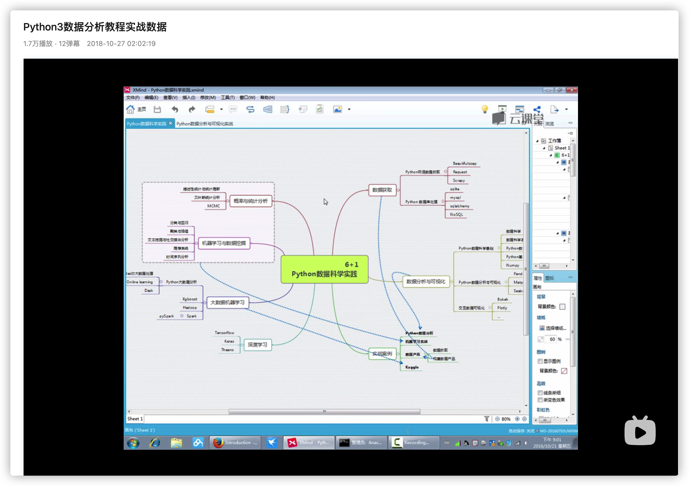
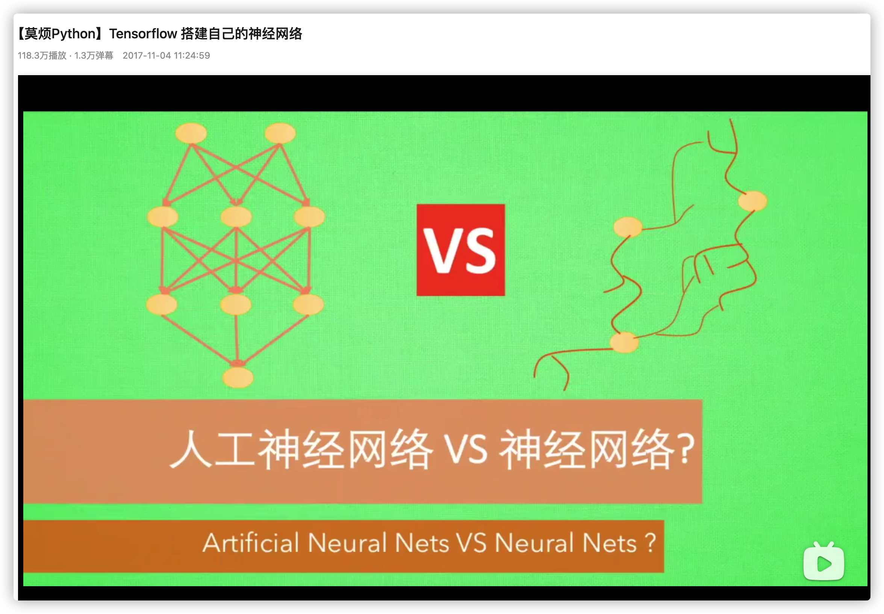

<h1 align="center">我学编程全靠B站了，真香（第二期）</h1>

> 作者：阿秀
>
> 原文链接：[https://mp.weixin.qq.com/s/GI1QnwTlkMFRY36Z4G2pMg](https://mp.weixin.qq.com/s/GI1QnwTlkMFRY36Z4G2pMg)

  
这是六则或许对你有些许帮助的信息:

⭐️1、阿秀与朋友合作开发了一个编程资源网站，目前已经收录了很多不错的学习资源和黑科技（附带下载地址），如过你想要寻求合适的编程资源，<a href="https://tools.interviewguide.cn/home" style="text-decoration: underline" target="_blank">欢迎体验</a>以及推荐自己认为不错的资源，众人拾柴火焰高，我为人人，人人为我🔥！
  
2、👉23年5月份阿秀从<a style="text-decoration: underline" href="https://mp.weixin.qq.com/s?__biz=Mzk0ODU4MzEzMw==&mid=2247512170&idx=1&sn=c4a04a383d2dfdece676b75f17224e78" target="_blank">字节跳动离职跳槽到某外企</a>期间，为方便自己找工作，增加上岸几率，我自己从0开发了一个互联网中大厂面试真题解析网站，包括两个前端和一个后端。能够定向查看某些公司的某些岗位面试真题，比如我想查一下行业为互联网，公司为字节跳动，考察岗位为后端，考察时间为最近一年之类的面试题有哪些？

网站地址：<a style="text-decoration: underline" href="https://top.interviewguide.cn/" target="_blank">InterviewGuide大厂面试真题解析网站</a>。点此可以查看该网站的视频介绍：<a style="text-decoration: underline" href="https://www.bilibili.com/video/BV1f94y1C7BL" target="_blank">B站视频讲解</a>   如果可以的话求个B站三连，感谢！
  
3、😊
    分享一个学弟发给我的20T网盘资源合集，<a style="text-decoration: underline" href="https://docs.qq.com/sheet/DY3VPVklVaFFMcUZ4?tab=9h5afr" target="_blank">点此白嫖</a>，主要是各类高清影视、电视剧、音乐、副业、纪录片、英语四六级考试、考研考公等资源。
  

  
4、😍免费分享阿秀个人学习计算机以来收集到的免费学习资源，<a style="text-decoration: underline" href="/notes/07-resources/01-free/01-introduce.html" target="_blank">点此白嫖</a>；也记录一下自己以前买过的<a style="text-decoration: underline" href="/notes/07-resources/02-precious.html" target="_blank">不错的计算机书籍、网络专栏和垃圾付费专栏</a>；也记录一下自己以前买过的<a style="text-decoration: underline" href="/notes/07-resources/02-precious.html" target="_blank">不错的计算机书籍、网络专栏和垃圾付费专栏</a>
  

  
5、🚀如果你想在校招中顺利拿到更好的offer，阿秀建议你多看看前人<a style="text-decoration: underline" href="https://www.yuque.com/tuobaaxiu/httmmc/npg1k81zeq4wfpyz" target="_blank">踩过的坑</a>和<a style="text-decoration: underline"  target="_blank" href="https://www.yuque.com/tuobaaxiu/httmmc/gge9ppd0mbu2d3dp">留下的经验</a>，事实上你现在遇到的大多数问题你的学长学姐师兄师姐基本都已经遇到过了。
  

  
6、🔥 欢迎准备计算机校招的小伙伴加入我的<a  style="text-decoration: underline" href="https://www.yuque.com/tuobaaxiu/httmmc/xg0otqvc17wfx4u9" target="_blank">学习圈子</a>，一个人踽踽独行不如一群人报团取暖，圈子里沉淀了很多过去21/22/23届学长学姐的<a  style="text-decoration: underline" href="https://www.yuque.com/tuobaaxiu/httmmc/gge9ppd0mbu2d3dp" target="_blank">经验和总结</a>，好好跟着走下去的，最后基本都可以拿到不错的offer！此外，每周都会进行<a  style="text-decoration: underline" href="https://www.yuque.com/tuobaaxiu/httmmc/npg1k81zeq4wfpyz" target="_blank">精华总结和分享！</a>如果你需要《阿秀的学习笔记》网站中📚︎校招八股文相关知识点的PDF版本的话，可以<a style="text-decoration: underline" href="https://www.yuque.com/tuobaaxiu/httmmc/qs0yn66apvkzw0ps" target="_blank">点此下载</a> 。
   

大家好啊，上次给大家推荐了不少B站上的好视频。

看得出来还是有不少B站大学的校友的，哈哈哈

本来说这期给大家接着推荐我收藏和看过的国外视频的，可是上篇文章下有朋友留言说想要看点Go语言的视频，我就合计着这期就把**Python（爬虫、数据分析、机器学习等）、GO语言、前端（JavaScript以及Vue）、还有一些其余的学习教程**给大家安排一手吧。

第三期再推荐国外的优秀视频吧。

上期推荐的主要是C/C++、Java、操作系统、计算机网络、数据结构与算法、数据库（MySQL）、Linux相关的视频，没有看过的朋友可以移步去看下。

本文也会中间掺杂着推荐一些经典书籍，这些书籍基本上在当当和京东都有售，至于电子版则在下面这个电子书仓库中可以找到：[https://github.com/forthespada/CS-Books](https://github.com/forthespada/CS-Books)

好了，话不多说，这就开始吧。

这是本期提纲：

## 1、Python

细细想来其实我看过不少Python相关的视频，最开始是学习Python的需要，再后来是研一分研究方向的时候，我差点选了机器学习，所以吴恩达老师的机器学习视频我也是看过的。

哪知最后时也命也，选了数据库方向，所以最后又跟爬虫搭上线了。不过我爬虫也都是自学的，基本都是在B站和Youtube上看的一些教学视频。

### 1、Python基础

**可能是B站唯一一个过千万播放的Python视频**

如果要说哪个B站的Python视频最火的话，那肯定是黑马的这个视频了。

**足足超过1000万的播放量...**

多说一句，这个视频的教程设置也非常好，我在看的时候发现很多人很多人说前一部分的Linux没用。

但是你要考虑到，整个课程是为了学员毕业后，能在工作中真正排上用场的，如果只懂Python，不懂其他的在实际工作中需要用到的软件，没办法完成工作的。

另外这个老师非常懂学生，学生在学习过程中哪些环节可能会有疑问，统统都考虑到了。

当你有疑问的时候，不要急，先耐心看下去，后面老师基本都会讲到。

**地址**：https://www.bilibili.com/video/BV1ex411x7Em

**推荐指数**：⭐⭐⭐⭐⭐

### 2、爬虫

**崔庆才老师的爬虫视频**

我学习爬虫只看了这一个视频，是的，唯一一个爬虫相关的视频！

这一个视频就让我受益匪浅，虽然现在已经不写爬虫了，但这个视频讲的非常不错！姥姥级别的手把手带你抓数据...

崔老师也是很负责任的那种人，条理清晰，层次分明。

听他讲课感觉是一种耳朵上的享受！强推！

**地址**：https://www.bilibili.com/video/BV1a7411f76Z

**推荐指数**：⭐⭐⭐⭐⭐

### 3、数据分析

下面是数据分析相关的几个好课：

在研一学习爬虫的时候，当时觉得自己可能以后要靠Python找工作了。

于是自己就去调查了一番，发现有三个方向供我选择：爬虫工程师、数据分析工程师、数据挖掘工程师。

其中爬虫工程师，精进太难，没人带，我就转行去看数据挖掘和数据分析。

数据挖掘门槛太高，我是个渣渣配不上，只剩下数据分析了。

数据分析两大阵营：**Tableau 和 Bi**，各有优缺点，详情自己去百度吧。

我当初选择的是 Tableau，所以下面的视频也基本是基于Tableau的视频。

对了，这里推荐一本书《**利用Python进行数据分析**》，这本书可以说是所有从事数据分析行业的小伙伴都要看的一本书了。

因为这本书可以说是Python数据分析的基础必备书籍了，就如同《C++ Primer》之于C++，《JavaScript高级程序设计教程》之于JavaScript一样。。

**1、Python3数据分析教程实战数据**

这个实战类视频还不错，会教你一些最基本的数据分析思路。

实战就是最好的学习方法，不用担心学不会。

其实学习编程最开始不能应该叫做写代码，应该叫做抄代码。

多跟着敲一敲，自然进步的很快。

**地址**：https://www.bilibili.com/video/BV1Tb411N7Qg

**推荐指数**：⭐⭐⭐⭐

**2、用 Tableau 做大数据分析**

看完上面那个我就直接上手Tableau大数据分析了，下面这个视频不错，资料很全，我跟着做了一遍下来。

做完之后，我对于Tableau这个神器越发佩服！！！实在是太牛逼了！

这个软件就跟Adobe系列的软件一样，比如Adobe PhotoShop，如果你用不好Adobe PhotoShop不是Adobe PhotoShop的问题，是你的问题。

同样的，如果你用不好Tableau不是Tableau的问题，是你的问题。

**地址**：https://www.bilibili.com/video/BV16t41117mK

**推荐指数**：⭐⭐⭐⭐

**3、Tableau商业智能与可视化应用实战**

这个视频则是Tableau的商业化的实战教程，一共七天的课程。

我记得不到三天就看完了，全程也跟着做了一遍，最后把成品保存在研究生实验室电脑里了，可惜离校的时候忘记带走保存了。

**地址**：https://www.bilibili.com/video/BV1xb411v7YJ

**推荐指数**：⭐⭐⭐⭐

### 4、机器学习、人工智能

**1、机器学习经典视频-吴恩达老师**

吴恩达老师的机器学习视频是任意一个机器学习相关的从业人员都应该看的，可以说优先级极高！

我相信很多刚准备读研的同学，导师都会在准研一的那个暑假让他们去看看吴恩达老师的这个视频的。

现在机器学习相关的研究方向是不少硕士都会优先选择的，吴恩达老师的这个视频以及南京大学周志华老师的西瓜书可以说是入门视频和入门书籍了。

对了，还有李航老师的统计学习也算是入门书籍之一了。

**地址**：https://www.bilibili.com/video/BV124411A75S

**推荐指数**：⭐⭐⭐⭐⭐

**2、莫凡教你搭建自己的神经网络**

神经网络、LSTM、Bi-LSTM。。。。这些机器学习、深度学习相关的名词咋一看起来确实会让人眼花缭乱，摸不着头脑。

要想真正理解一个名词，最好的方法就是自己去实践一下。

所以很多人在学习机器学习的时候都会有这样的一个想法：为什么不尝试自己去搭一个神经网络呢？

莫凡就是这么想的，于是B站上的这个神经网络搭建课程就这么孕育而生了。

**地址**：https://www.bilibili.com/video/BV1Lx411j7ws

**推荐指数**：⭐⭐⭐⭐

**3、【机器学习/Kaggle教学】kaggle案例实战班**

我在以前这篇编程语言如何选择的文章中：也提到过现在要想选择算法工程师作为自己的从业方向，一定的实战能力必不可少！

一些国内外知名比赛的参赛经历或者是奖牌更是一大加分项，比如阿里天池比赛、JD算法比赛，还有最知名的Kaggle比赛！

这个视频是B站少有的几个不错的Kaggle实战视频了，推荐有算法岗意向的小伙伴认真看一下这个视频，最好跟着做一遍！

**地址**：https://www.bilibili.com/video/BV19b411z73K

**推荐指数**：⭐⭐⭐⭐⭐

## 2、Go语言

写到这里，忽然想问一句，大家知道现在校招/社招最卷的岗位是什么岗位吗？

可能还有人会觉得是算法岗，比如自然语言处理工程师(NLP工程师)、计算机视觉工程师（CV工程师）、推荐算法工程师等等。

如果在19、20年你这么说是没啥问题的。

在21年之后，最卷的应该是Java开发岗了。

其实也很好理解，算法岗没有一个好的学历+不错的论文加成+知名比赛的奖牌，可以说是很难上岸了，所以以前的那些算法岗同学就纷纷弃坑，转向开发岗。

要问开发岗哪种语言能兼顾好上手和找工作方便，那非Java莫属了。。。

所以，很多人都被Java卷的受不了了，就纷纷转投别的语言，Go语言自然是其中的典型代表。

除去内卷严重这一主观原因，还有一层客观原因就是不少国内大厂都开始使用Go语言作为后端开发的选择之一了。

字节跳动应该是国内最先使用Go语言的大厂，腾讯的很多部门也都开始拥抱Go语言了。

Go语言的一些好书也不少，我去年还在学校的时候就买过几本，后来在校期间就看完了。

主要就是这四本《Go语言实战》、《Go并发编程实战（第2版）》、《Go Web编程》、《Go语言高级编程》。

目前B站上的Go语言相关视频不多，我仔细看了一下我的Go语言收藏夹，值得推荐的确实不多。

### 1、小白新手的Go语言

”【**尚硅谷】Golang入门到实战教程丨一套精通GO语言**“尚硅谷的这套视频教程是面向小白新手的Go语言视频，也就是那些从没接触过其余编程语言的同学。

所以相应的这套视频讲的也比较细致，方方面面都给你讲清楚了。

可有的地方讲的太太太细致了，有点啰嗦了，所以这个视频比较适合那些编程小白。

**地址**：https://www.bilibili.com/video/BV1ME411Y71o

**推荐指数**：⭐⭐⭐⭐⭐

### 2、有一定基础的同学

很多学习Go语言的同学都有其余的编程语言基础了，比如我就是在前期学了一两年的C++后再去学的Go语言。

因此，对于这样的小伙伴再从头去看0基础的视频的话性价比太低，有点浪费自己的时间了，得不偿失。

”**Go语言编程快速入门（Golang）**“这个课讲得有点快，或者可以说讲的比较粗糙，因为它的定位就是你有其余的编程语言基础了，所以很多基础语法基本都是一笔带过，三两句就解释完了。

这个视频也不长，就六个小时，很快就看完了。

**地址**：https://www.bilibili.com/video/BV1fD4y1m7TD

**推荐指数**：⭐⭐⭐⭐⭐

### 3、黑马程序员20个小时快速入门go语言

**黑马，YYDS！！！**

想当初，我学习C++的视频就是选择了黑马的C++基础视频入门，现在又轮到Go语言了。。。。

黑马的这套教程结合了上述两个Go语言视频的优点，能够同时兼顾基础和有基础的同学，强烈推荐一手！！！

如果你既想学Go语言，又想能尽快上手干活做事，推荐这个视频。

**地址**：https://www.bilibili.com/video/BV1UW411x7v2

**推荐指数**：⭐⭐⭐⭐⭐

## 3、前端

前端三大马车HTML、CSS、JavaScript优秀的视频太多，B站上更是数不胜数，今天就推荐一下我看过不错的前端方面的视频吧。

### 1、黑马程序员pink老师

Pink老师，YYDS！！！！

我想很多学习前端的同学都是从Pink老师的前端视频开始的！

Pink老师可以说是黑马前端的金牌讲师了，口音友善，人也和蔼！

**给五星！**

pink老师的”**前端入门教程，零基础必看的h5(html5)+css3+移动端前端视频教程**“讲的很不错，我前段时间开的2.0倍速看的，很快就看完了。

不过因为自己本科时期就学过一些HTML、CSS等概念，所以即使是开2.0倍速我还是会时不时的手动快进，所以我看的速度很快。

**地址**：https://www.bilibili.com/video/BV14J4114768

**推荐指数**：⭐⭐⭐⭐⭐

### 2、黑马程序员JavaScript核心教程

上面那门Pink老师的那门课大致给你讲了前端方面的基础技能，HTML、CSS、JavaScript三大基础技能都大致讲了不少。不过比较核心的JS相关概念讲的不是很好！

所以我建议后期再看一下这门JS核心教程补充一下核心概念！这个必看！！

**地址**：https://www.bilibili.com/video/BV1k4411w7sV

**推荐指数**：⭐⭐⭐⭐

### 3、Vue相关

Vue作为目前前端主流框架之一，很多成熟项目的前端开发都是基于前端框架Vue的。

Vue的渐进式就很讨人喜欢，至少在我这个后端出身的同学看来，很喜欢Vue的渐进特性！

以下几个视频是我自己这段时间看的关于Vue相关的视频，觉得还不错，也一起推荐给大家！

**1、电商平台数据可视化实时监控系统-Echarts-vue项目综合练习**

是的，这个视频还是黑马的视频，我依旧是白嫖的。。。

讲真，我学习编程真的就靠B站和我自己看书了，我简单统计了一下我在B站看的视频80%都是出自黑马机构。。。

这个视频是实战类视频，所以如果能够从头到尾跟着认真敲下来收获会又不小。

**地址**：https://www.bilibili.com/video/BV1bh41197p8

**推荐指数**：⭐⭐⭐⭐⭐

**2、Vue源码解析**

不止是否有同学跟我类似，在学习一门新技术时对于底层的源码很感兴趣。

在学习C++的时候，我就对STL下的源码很感兴趣，后来就去看了侯捷老师的STL源码剖析视频和书籍；

在学习Golang的时候，同样对源码实现很感兴趣，于是现在也在慢慢看一些Go源码解析视频；

现在在学习Vue的时候，对于它的渐进特性非常感兴趣，所以也去找了有没有源码解析方面的视频，还真让我找到了..

就是尚硅谷出品的这个源码讲解视频，还没看完，不过讲解的非常不错！

如果有跟我一样对于Vue底层原理比较感兴趣的同学，推荐你们看一下该视频！

**地址**：https://www.bilibili.com/video/BV1op4y1h7Fv

**推荐指数**：⭐⭐⭐⭐

其实优秀的视频有很多，可能我推荐的也不是很全，如果大家有更好的视频推荐，欢迎在评论区进行留言。
