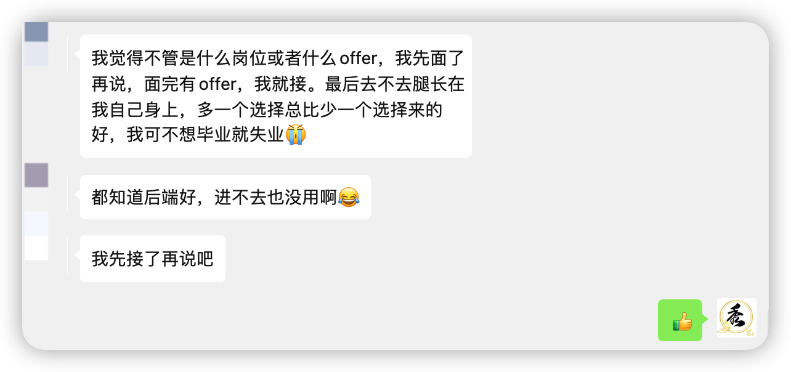
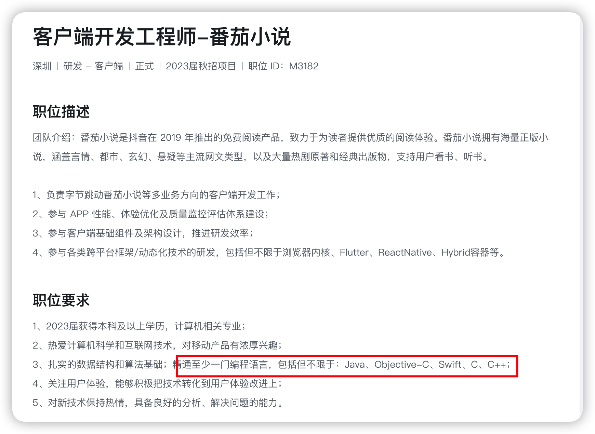
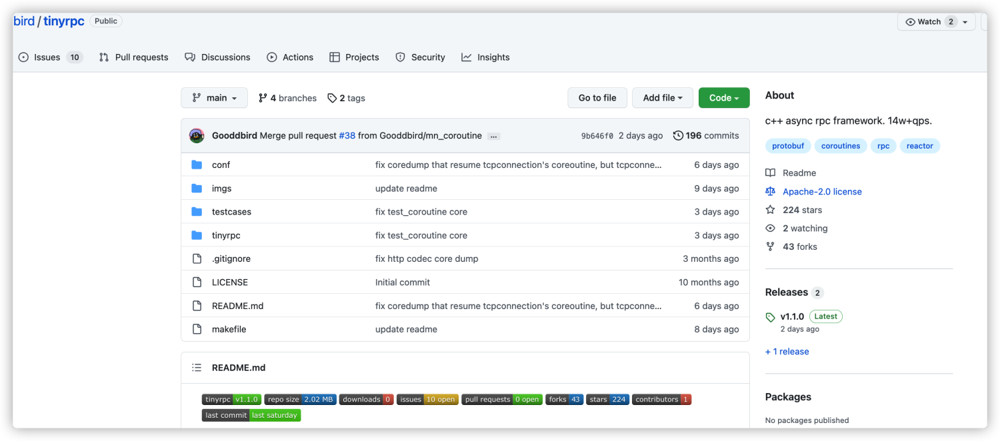

<h1 align="center">不管那么多，offer先接了再说</h1>

  
这是六则或许对你有些许帮助的信息:

⭐️1、阿秀与朋友合作开发了一个编程资源网站，目前已经收录了很多不错的学习资源和黑科技（附带下载地址），如过你想要寻求合适的编程资源，<a href="https://tools.interviewguide.cn/home" style="text-decoration: underline" target="_blank">欢迎体验</a>以及推荐自己认为不错的资源，众人拾柴火焰高，我为人人，人人为我🔥！
  
2、👉23年5月份阿秀从<a style="text-decoration: underline" href="https://mp.weixin.qq.com/s?__biz=Mzk0ODU4MzEzMw==&mid=2247512170&idx=1&sn=c4a04a383d2dfdece676b75f17224e78" target="_blank">字节跳动离职跳槽到某外企</a>期间，为方便自己找工作，增加上岸几率，我自己从0开发了一个互联网中大厂面试真题解析网站，包括两个前端和一个后端。能够定向查看某些公司的某些岗位面试真题，比如我想查一下行业为互联网，公司为字节跳动，考察岗位为后端，考察时间为最近一年之类的面试题有哪些？

网站地址：<a style="text-decoration: underline" href="https://top.interviewguide.cn/" target="_blank">InterviewGuide大厂面试真题解析网站</a>。点此可以查看该网站的视频介绍：<a style="text-decoration: underline" href="https://www.bilibili.com/video/BV1f94y1C7BL" target="_blank">B站视频讲解</a>   如果可以的话求个B站三连，感谢！
    
3、😊
    分享一个阿秀自己私藏的黑科技网站，<a style="text-decoration: underline" href="https://hkjtz.cn/" target="_blank">点此直达</a>，主要是各类小众实用APP、网站等，除此外也包括高清影视、音乐、电视剧、AI、纪录片、英语四六级考试、考研考公、副业等资源。
  

  
4、😍免费分享阿秀个人学习计算机以来收集到的免费学习资源，<a style="text-decoration: underline" href="/notes/07-resources/01-free/01-introduce.html" target="_blank">点此白嫖</a>；也记录一下自己以前买过的<a style="text-decoration: underline" href="/notes/07-resources/02-precious.html" target="_blank">不错的计算机书籍、网络专栏和垃圾付费专栏</a>；也记录一下自己以前买过的<a style="text-decoration: underline" href="/notes/07-resources/02-precious.html" target="_blank">不错的计算机书籍、网络专栏和垃圾付费专栏</a>
  

  
5、🚀如果你想在校招中顺利拿到更好的offer，阿秀建议你多看看前人<a style="text-decoration: underline" href="https://www.yuque.com/tuobaaxiu/httmmc/npg1k81zeq4wfpyz" target="_blank">踩过的坑</a>和<a style="text-decoration: underline"  target="_blank" href="https://www.yuque.com/tuobaaxiu/httmmc/gge9ppd0mbu2d3dp">留下的经验</a>，事实上你现在遇到的大多数问题你的学长学姐师兄师姐基本都已经遇到过了。
  

  
6、🔥 欢迎准备计算机校招的小伙伴加入我的<a  style="text-decoration: underline" href="https://www.yuque.com/tuobaaxiu/httmmc/xg0otqvc17wfx4u9" target="_blank">学习圈子</a>，一个人踽踽独行不如一群人报团取暖，圈子里沉淀了很多过去21/22/23/24/25届学长学姐的<a  style="text-decoration: underline" href="https://www.yuque.com/tuobaaxiu/httmmc/gge9ppd0mbu2d3dp" target="_blank">经验和总结</a>，好好跟着走下去的，最后基本都可以拿到不错的offer！</a>如果你需要《阿秀的学习笔记》网站中📚︎校招八股文相关知识点的PDF版本的话，可以<a style="text-decoration: underline" href="https://www.yuque.com/tuobaaxiu/httmmc/qs0yn66apvkzw0ps" target="_blank">点此下载</a> 。
   

> 如果你想在校招中顺利拿到更好的offer，阿秀建议你多看看[前人的经验](/notes/05-xiustar/01-xiustar_reading_guide/01-introduce.md) ，比如[准备](/notes/05-xiustar/02-campus_prepare/02-01-校招重要时间点科普.md) 、[简历](/notes/05-xiustar/03-resume/01-00-简历开篇词.md) 、[实习](/notes/05-xiustar/04-school_practice/20220320-从公司角度来看，为什么要招实习生.md) 、[上岸经历](/notes/05-xiustar/09-question_answer/20220817.md) 、[校招总结](/notes/05-xiustar/05-campus_recruitment/2020-12-16-双非渣硕的秋招之路总结（已拿抖音研发岗SP）.md) 、[阿里、字节、腾讯、美团等一二线大厂真实面经](/notes/07-resources/01-free/04-schoolSchample.md) 、[也欢迎来一起参加秋招打卡活动](/notes/05-xiustar/01-xiustar_reading_guide/01-introduce.html#阿秀组建了一个校招学习圈子) 等；如果你是计算机小白，学习/转行/校招路上感到迷茫或者需要帮助，可以[点此联系阿秀](/notes/08-other/02-question.md#_4、阿秀-如何才能联系到你)；免费分享阿秀个人学习计算机以来的收集到的好资源，[点此白嫖](/notes/07-resources/01-free/01-introduce.md)；如果你需要《阿秀的学习笔记》网站中求职相关知识点的**PDF版本**的话，可以[点此下载](/notes/08-other/02-question.md#_5、如何下载阿秀的学习笔记内容pdf版本) 

>  原文地址：[https://mp.weixin.qq.com/s/-7IlSRsVZXiE4S0llPbAhQ](https://mp.weixin.qq.com/s/-7IlSRsVZXiE4S0llPbAhQ)
>
> 作者：阿秀

如果你常逛脉脉的话，你一定能听到一个词叫做`客三消`，这个词的意思很简单就是说客户端这行大概要在三年之内就消失了，三年之后就不会再有客户端这行了，劝大家赶紧从这行run吧。

其实这个词几年前就有了，大概19年前后就出现了，三年已经过去了，客户端好像活的好好的。。。。

现在这个时代是超级APP的时代，比如QQ、微信、淘宝、支付宝、抖音这些，可以回想一下，你有多久没在手机上装过新软件了？

取而代之的反而是一些小程序，微信小程序就不说了，抖音貌似也在做小程序。

客户端严格意义上来说不能算是一个单独的行业，它是属于大前端这一行的，大前端性能过剩不是一天两天了，可能客户端的从业者回你觉得客户端都是网页 + 一层electron，现在不就已经是了嘛，，，，

今天分享一位学弟上岸IOS客户端的经历，这是近期分享的第四篇上岸经历了，以后会继续分享一些提前批&正式批的上岸经历，包括但不限于技术岗：Java、C++、前端、Golang、测开和测试岗以及一些非技术岗：产品、运维等。

说回这位学弟，他的心态很好，用他自己的话说就是："不管是什么岗位或者什么offer，我先面了再说，面完有offer，我就接。最后去不去腿长在我自己身上，多一个选择总比少一个选择来的好"

下面是他的分享，其中的“我”代表这位学弟本人，主要按照以下几个小节进行分享：

1、个人介绍

2、校招准备

3、番茄小说面经（三轮技术面 + HR面）

4、建议

---

## 1、个人介绍

你好，我是志海，一名2023届的本科应届生，大学是在宁波的一所普通双非学校读的，属于那种好好读书好好期末考试的学生，后来加了秀哥的粉丝二群，见识到了不少，比如蚂蚁佬、国佬。。。。

我的大学四年一直都是顺顺利利过来的，老师教课我上课，期末考试就完事，无实习、无竞赛，没取得什么值得拿出来说的荣誉，当然如果力扣周赛算竞赛经历的话，那我差不多有过20多次的竞赛经历了哈哈哈。

唯一值得说的就是自己在大二的时候把六级过了，后来在跟二群里跟一些已经工作的大哥哥大姐姐的聊天中才知道六级原来真的很重要，根本不像我以前想的那样觉得计算机这样看实力，软技能不重要。

简单来说就是英语等级不过关，有些岗位或者公司都不让你去投简历，这一点在某些银行和国企显现的尤为明显。

虽然计算机这行看实力，但你也要有给别人展示你实力的机会啊。

像某些国企&银行，英语水平不够直接不让你投递，连展现自己的机会都没有。

今年行情太差了，特别是后端这块，虽然C++服务器/后端方向没有Java那么卷，但投的人也很多，后来我听从一些佬们的建议，试试IOS客户端。

IOS客户端开发主要是用的**Object-C**语言，是从C语言衍生出来的，最开始自己也是担心自己不会Object-C，会不会不能投递？或者投了就被刷掉？

后来面试的时候才发现，面试官貌似知道我是C++的，根本没咋问我Object-C的东西，我在招聘要求上也看到不少IOS客户端开发也招C++技术栈的。

于是就投了字节跳动，我投递的是番茄小说的客户端开发，挺幸运的，一周前已经OC了。

## 2、校招准备

我是学C++的，一直都按照C++的技术栈在学习，虽然现在接了飞科IOS客户端的offer，但我一直都是走的C++后端/服务器技术栈的2333。

很庆幸自己在大二的时候在知乎上刷到了秀哥在“你的编程能力是什么时候突飞猛进”下的回答，觉得自己不能一直温水煮青蛙了，要多为以后考虑的着想了。

于是我把秀哥在知乎上的回答全翻了一遍，打算按照他的路线走下来，包括C++的学习、算法刷题、操作系统、计算机网络这些的学习，我都打算按照他的路线来走，后来我也是确实这么干的。

所以C++学习这块我没什么经验可以介绍的，因为我是直接照搬的秀哥的路线，就是他网站上的这篇：https://interviewguide.cn/notes/02-learning_route/02-language/01-C++%E5%AD%A6%E4%B9%A0%E8%B7%AF%E7%BA%BF.html。

是的，全部照搬，就连看的视频都是直接照搬的他的路线，你可以去B站黑马2017年的C++培训视频下翻留言，去年，也就是21年的时候我还在秀哥19年的留言回他了。

至于算法，剑指offer三遍 + 600道的力扣（HOT 100全刷）就完事了，我很认同一句话：量不到，一切都是白谈。

不要认为什么模板、套路能让你秒杀一些题目，要知道算法题是层出不穷的，考察形式也越来越多样化。

现在力扣都将近2500道题了，根本不可能只刷100+就全部掌握，即使你会用那些所谓的模板和套路，不加以联系也还是不行，真到面试的时候你也想不起来那些所谓的套路和技巧，因为太太太紧张了。

这里推荐三个不错的资料：《MySQL45讲》《Redis设计和实现》《MySQL是怎样运行的》，其中前两个是极客时间的专栏，第三个则是掘金小册，特别是《MySQL45讲》，非常不错。在这里你能找到详细介绍：https://interviewguide.cn/notes/02-learning_route/01-basic-project/quick.html

我单独说说不一样的点和地方，主要是项目这块自己跟大多数人都不一样，我没有做Web服务器这种烂大街的项目，我的项目一个是Redis客户端，一个是tinyRPC框架。

我觉得我能进面试，这两个项目有很大关系。

Redis客户端这里可能不能分享，因为它是我在秀哥星球上看到的，是他总结出来的11个C++项目中的一个。

我大致说说RPC项目，我用的是github上的**tinyRPC**项目，是一款基于 **C++11** 标准开发的小型**异步 RPC** 框架，刚好自己也对C++11 有所了解，侯捷老师的那几门课我基本都刷了2遍，tinyRPC核心代码大概在几千行。

> 地址：https://github.com/Gooddbird/tinyrpc

**我是直接啃的源码，真的很难**。

最开始自己根本看不懂，我就把其中的核心代码抄一遍下来用A4纸打印好，每天上课都在看看到不懂的函数就去查，就这么啃了3个月才啃下来。

真的太难了，差点把我抬走。。。。

## 3、番茄小说面经

一共三轮技术面，一二轮是连在一起面的，一面过后10分钟就是二面了，因此我连在一起说好了，二面个人感觉是最难得。

### 一面(70min)

一面面试官是一个比较严肃的人，全程没怎么笑过，很多时候都是他问我回答，但偶尔也会给一些提示。

首先是自我介绍，我提到了自己

1.虚函数说一下

2.vector具体实现说一下 

3.c++从cpp文件到exe可执行文件经历的流程

4.操作系统中虚拟内存的作用

5.操作系统中的分页机制

6.路由器和交换机的区别

7.virtual memory说一下

8.移动构造函数用法

9.c++11的新特性说一下: auto 、智能指针、右值引用

10.你认为智能指针有哪些缺陷？

11.C++动态链接和静态链接的比较

12.了解Linux内核态和用户态吗（我答不了解，然后没有然后了）

13.内部类分两种，static和非static，有什么区别？

14.算法题：

1、首先自定义树的结构，不一定是二叉树，按顺序输出节点的值，做一个层次遍历。

2、改进然后是只输出一层的首尾节点的值，输入n，输出第N层的节点值。

3、输入一个由(、)、[、]、{、}，组成的字符串，若其符合规则，输出true，否则输出false。

面试官说让我等一下，5分钟后开始二面。

### 二面（80min）

10min后二面面试官到了，还说了抱歉说刚在开会，让我说下自我介绍，然后他看看我简历。

1.排序稳定性以及非稳定排序，稳定排序有什么作用？

2.快排、堆排、冒泡、归并，哪几个是稳定？哪几个是不稳定？

3.10分钟内写一下归并排序（刻意强调了只有10min）

4.进程和线程

5.你了解范式吗

6.Inner join、left join、right join的区别

7.关系型数据库和非关系型数据库区别

 8.TCP和UDP区别

9.TCP三次握手和四次分手，为什么分手要四次

10.问Redis项目，深挖？

11.你是如何学习Redis的？用过哪些资料？

12.Redis底层通信模型知道吗？

13.跳表是如何实现的？

14.问RPC项目？各种问，快懵了，还好我看过源码，能扯两句

15.有做笔记或者写博客的习惯吗？

16.开放题：一个圆形纸上一个不规则多边形图案，问这个图案占纸大小？(概率论)

17.让我打开力扣：找了一道转动有序数组查找值，一看我刷过了，就让我讲了一下思路，面试官就直接跳过了，没有手写。

18.手写代码： 多线程固定打印值，对多线程这一块了解并不深，所以直接沟通后换题。

19.手写代码: 面试官自己想的题目：若a依赖于b依赖于c, c依赖于d，d依赖于e。（a->b->c , c->d , d->e），那么最终linking顺序为edcba，要求输入：数字k表示k行依赖；k行string，每一行代表依赖关系(ab表示a->b)；最后输出linking顺序。

面完以为自己要凉了，因为很多问题觉得自己答得都不好，没想到四天后HR约三面了。

### 三面（90min）

leader面，三面面试官是一个很和善的人，全程带笑，就算你哪儿不会，也会讲没关系没关系。

但问的问题都很简单，基本都是八股文这块的东西，好好看秀哥网站基本都能答出来！太感谢秀哥了！！！秀哥网站YYDS

1.自我介绍

2.进程和线程(老问题了)

3.算法题：实现一下单例模式（因为之前扯到了设计模式）

4.算法题：给一个数组和一个目标数，找出所有的相加之和等于这个目标数的数字组合。

5。有没有了解虚拟内存和物理内存

6.讲一下LRU

7.数据库多个用户访问时发生冲突怎么办(

8.介绍http协议的过程（第一个问题就没有答上来 胡乱说了什么先进行DNS解析啥的 然后面试官就问dns了

9.DNS是做什么的？DNS解析的过程

10.https是如何加密的？描述一下https是怎么加密的？

11.问项目RPC

12.输入密码的时候 用get还是post 为什么？

13.智力题：腾讯赛马问题和三门问题

14.反问

个人感觉三面答得还好，但一直没后文，拜托秀哥去问问结果，因为我填的就是他的内推码，他能帮我问问面试结果。

秀哥跟我说过了，等后续通知就行！

一块悬着的石头终于落了地。。。

### HR面 (50min) 

老实说，hr面给我压力比之前还要大，之前技术面谈笑风生，hr面感觉被压力面了。

1.怎么不打算考研？

2.未来职业规划

3.了解我们岗位么?如果团队做的事情和自己预想的相差大，那么你会怎么办？（我说听从领导安排，积极适应变化）

4.面对的最大挑战是什么。

5.还有投过其他公司么？有offer了吗、?

6..公司的工作时间有了解过么?觉得自己能适应吗？（必须能！！！）

7.介绍了下目前团队在干的事情

8.反问环节（问了下最快什么时候能知道结果）

## 4、建议

最重要的写在第一个：**一定要多投！**，必要的时候可以适当降低自己的预期。

后端进不去，那就换别的赛道，总好过毕业就失业，要懂得根据环境调整自己！

还有就是尽早准备，如果你是跟我一样的普通学校学生，没有985、211的的话，一定要早点准备！一定要早点准备！一定要早点准备！

先天不足，那就后天多努力！不如别人那就在别的地方多用功！

再一次强烈推荐秀哥的网站，真的是神级宝藏网站！！！秀哥YYDS！！！

最后，请相信，**努力是一定会有收获的！**
