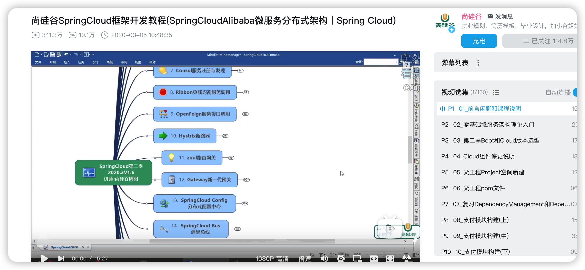

<h1 align="center">顺利上岸字节电商后端，但也真的很不顺利</h1>

  
这是六则或许对你有些许帮助的信息:

⭐️1、阿秀与朋友合作开发了一个编程资源网站，目前已经收录了很多不错的学习资源和黑科技（附带下载地址），如过你想要寻求合适的编程资源，<a href="https://tools.interviewguide.cn/home" style="text-decoration: underline" target="_blank">欢迎体验</a>以及推荐自己认为不错的资源，众人拾柴火焰高，我为人人，人人为我🔥！
  
2、👉23年5月份阿秀从<a style="text-decoration: underline" href="https://mp.weixin.qq.com/s?__biz=Mzk0ODU4MzEzMw==&mid=2247512170&idx=1&sn=c4a04a383d2dfdece676b75f17224e78" target="_blank">字节跳动离职跳槽到某外企</a>期间，为方便自己找工作，增加上岸几率，我自己从0开发了一个互联网中大厂面试真题解析网站，包括两个前端和一个后端。能够定向查看某些公司的某些岗位面试真题，比如我想查一下行业为互联网，公司为字节跳动，考察岗位为后端，考察时间为最近一年之类的面试题有哪些？

网站地址：<a style="text-decoration: underline" href="https://top.interviewguide.cn/" target="_blank">InterviewGuide大厂面试真题解析网站</a>。点此可以查看该网站的视频介绍：<a style="text-decoration: underline" href="https://www.bilibili.com/video/BV1f94y1C7BL" target="_blank">B站视频讲解</a>   如果可以的话求个B站三连，感谢！
    
3、😊
    分享一个阿秀自己私藏的黑科技网站，<a style="text-decoration: underline" href="https://hkjtz.cn/" target="_blank">点此直达</a>，主要是各类小众实用APP、网站等，除此外也包括高清影视、音乐、电视剧、AI、纪录片、英语四六级考试、考研考公、副业等资源。
  

  
4、😍免费分享阿秀个人学习计算机以来收集到的免费学习资源，<a style="text-decoration: underline" href="/notes/07-resources/01-free/01-introduce.html" target="_blank">点此白嫖</a>；也记录一下自己以前买过的<a style="text-decoration: underline" href="/notes/07-resources/02-precious.html" target="_blank">不错的计算机书籍、网络专栏和垃圾付费专栏</a>；也记录一下自己以前买过的<a style="text-decoration: underline" href="/notes/07-resources/02-precious.html" target="_blank">不错的计算机书籍、网络专栏和垃圾付费专栏</a>
  

  
5、🚀如果你想在校招中顺利拿到更好的offer，阿秀建议你多看看前人<a style="text-decoration: underline" href="https://www.yuque.com/tuobaaxiu/httmmc/npg1k81zeq4wfpyz" target="_blank">踩过的坑</a>和<a style="text-decoration: underline"  target="_blank" href="https://www.yuque.com/tuobaaxiu/httmmc/gge9ppd0mbu2d3dp">留下的经验</a>，事实上你现在遇到的大多数问题你的学长学姐师兄师姐基本都已经遇到过了。
  

  
6、🔥 欢迎准备计算机校招的小伙伴加入我的<a  style="text-decoration: underline" href="https://www.yuque.com/tuobaaxiu/httmmc/xg0otqvc17wfx4u9" target="_blank">学习圈子</a>，一个人踽踽独行不如一群人报团取暖，圈子里沉淀了很多过去21/22/23/24/25届学长学姐的<a  style="text-decoration: underline" href="https://www.yuque.com/tuobaaxiu/httmmc/gge9ppd0mbu2d3dp" target="_blank">经验和总结</a>，好好跟着走下去的，最后基本都可以拿到不错的offer！</a>如果你需要《阿秀的学习笔记》网站中📚︎校招八股文相关知识点的PDF版本的话，可以<a style="text-decoration: underline" href="https://www.yuque.com/tuobaaxiu/httmmc/qs0yn66apvkzw0ps" target="_blank">点此下载</a> 。
   

>  原文地址：[https://mp.weixin.qq.com/s/UPKpTIBUal27YcasjIlEcA](https://mp.weixin.qq.com/s/UPKpTIBUal27YcasjIlEcA)
>
> 作者：阿秀

如果要问两年前计算机校招中最卷的是哪个岗位？

那肯定是**算法岗**，也就是AI相关的，特别是19年前后，因为互联网风口和资本的原因，人工智能的浪潮风卷残云一般呼啸而过，那几年NLP、CV、推荐这些算法岗都很火。

我现在还记得20年的时候便利蜂的NLP算法工程师的offer是38K/月，38是什么概念呢？

这么说吧，**38K/月抵得上两个研发的薪资了**了。

可后来大家也都知道了，算法岗坑少要求高，没有SCI二区以上的论文 + 好的比赛获奖 + 985的学历基本上不了岸，近一两年校招中算法岗的热度慢慢下来了。

以前就聊过算法岗不适合普通人去投递，这里就不再展开了：

可如果要问今年校招中哪个岗位最卷？

那绝对是**Java后端**，算法岗由于这几年大家都知道上岸难反而卷的没那么厉害了，现在是Java后端卷的起飞。

我想造成Java后端卷到飞起的原因主要有2个：

- 1、以前算法上不了岸的选择都来做开发了，Java是首选，Java后端自然人就多了；
- 2、Java由于学习成本相对较低，是很多非科班选手的转行首选，比如生物、化学、材料、机械、土木等专业转行基本都会选择Java开发。

所以如你所见，今年Java后端！boom！直接起飞了。。。

经常出现Java后端成千上万份简历争一个HC的情况，所以Java后端上岸越来越难了。

今天分享一位学弟上岸字节电商的经验，老实说他能上岸我一点也不奇怪，阿秀看过他的简历，很丰富。

虽然没有很出色的学历背景，不是什么985 211的学校，但他的履历很丰富，足以掩盖自己学历上的不足，单就二面就面了130分钟之久，其中也跟面试官聊的有来有回的。

下面是他的分享大纲，下文中的“我”代表这位学弟本人：

1、自我介绍

2、决定转行

3、我的Java学习之路

4、充分简历优势

5、上岸面经（1、2、3面）

6、总结

----

## 一、自我介绍

大家好，我是小黑，看了那么多秀哥分享的上岸经验，终于轮到我了，我很激动，也很担心。

激动的是自己终于有机会为后来的学弟学妹留下一些经验，留下一点自己走过来的痕迹；

担心的是自己的分享起不到正向的作用。

这篇文章是我在回学校的车上用手机敲下来的，可能有些内容写的不太好，但都是我的真心分享，我是真心想借助秀哥这个平台来分享一下自己的上岸之路的。

首先简单介绍一下自己，2023届应届毕业生，目前在江西一所普通农业学校读本科，本来是个“种田的”，结果却一心想要来互联网。

上周刚刚字节给我发了口头offer，算是上岸了吧。

自己经历了转行、深耕、实习、校招后，顺利从2023互联网校园招聘的深坑里爬出来了，接下来也不打算面了，字节的这个offer我很满意，打算接了。

## 二、决定转行

我跟大多数人转行来互联网的原因都一样，就是为了高薪资，农学真的没出路。

或许网上都说生化环物机械土木这些没出路，但农学才是真的没出路，毕业了的学长学姐没有一个从事农学相关的工作的，基本都转行了，有的转向文职了，有的回老家做小生意去了，有的直接去送外卖了。

或许是因为从小就各种兼职打暑假工的缘故吧，自己相对同龄人比较成熟一点，早早被社会毒打过还是有点好处的。

**我是我们村第一个大学生，虽然到目前为止一共也就三个。**

可能大多数人都觉得上大学是一件很普通的事，有手就行，但有些地区的教育落后到你无法想象。

就比如大多数人都是小学就开始学英语，但我初三那年才开始学英语，中考英语试卷也水的不行。

因为我们那里没有英语老师，我的英语老师也是我的数学老师，初三中考完我去了表哥家的饭馆去做服务生，一小时6块钱，一天50块钱，我干了2个多月，挣到了3500块钱，后来这笔钱被我用在了高一交学费和住宿费上。

高一暑假打工挣高二的学费、资料费，垫补我上学的各种开销；高二暑假赚高三的。

高三高考完后我去了昆山电子厂做暑假工，那是我第一次走出江西，走出十万大山，见识到了外面的花花世界，也是我第一次坐地铁。

高考填报志愿是我父亲花了500块钱找人帮我填的支援，说是一定能上大学，保证能录。

最后也确实像他保证的那样，确实录上了。

因为都没人报这个专业，我的高考分数高出现在就读专业差不多40分了。

所以我对钱很敏感，因为我想在大城市生活下去，或者说生存下去。

在北上广深这种一线城市定居根本是我想都不敢想的事情，**我最大的愿望就是在南昌有自己的一个小房子，能将我父母接来看看外面的世界**。

后来自己了解了计算机专业，也从秀哥以前的文章中看到了很多人上岸的经验。

我没有他们那么大的理想，毕业20W对当时的我来说，真的是想都不敢想，我能够找到一个15W/年的工作就已经很知足了。

现在自己手上的这个offer已经超出自己预期的两三倍了，这也**再一次让我感谢自己当初决定自学计算机转行并且坚持为之努力的决定**了。

## 三、我的Java学习之路

我学习Java跟秀哥学习C++类似，都是从B站开始，也都跟着学下来很多的视频，这里推荐一些我自己看过觉得不错的视频，我就按照我学习的顺序推荐。

**JavaSE知识体系**

我看的是高淇老师的Java300集，跟着他学习有一种很强的舒适感，他讲解的也很清楚。

javaSE是Java最基础的内容，各种类、方法、继承、JavaWeb等，也是我们打好Java编程基础能力的关键。

>  地址：https://www.bilibili.com/video/BV1qQ4y1m7hQ

**JavaWeb知识体系**

JavaWeb是看的颜群老师的视频课程，他说话很有意思，跟教计算机网络的湖科大的韩立刚老师一样，属于那种你看他的视频不会犯困，反而会跟着他一起学下去的那种老师。

JavaWeb在学习的过程中，正向反馈很高，在这一部分中你会知道我们日常生活中所浏览的网站是如何搭建起来的，前端、后端、数据库是怎么相互配合的，什么叫接口，什么叫请求。

> 地址：https://www.bilibili.com/video/BV18s411u7EH

学到这里的时候，**我发现每个课程老师用的开发工具不一样**，有的是Eclipse，有的是IDEA。

于是当时跟秀哥咨询过这个问题，秀哥让我跟着老师的工具走，老师用什么我就用什么；老师在视频里怎么写代码，我就怎么写代码；老师怎么调试代码我就怎么调试代码。

他说他以前最开始自学的时候就是这样的，老师的变量名起的是什么他就起什么。

**后来才明白我们是要学会编程，也就是说内容才是最重要的，工具只是手段而已。**

就好像我们吃饭一样，最终的目的是把饭吃到嘴里，你用筷子还是勺子都可以，只要能吃到嘴就行。

面试的时候面试官不会问你用Eclipse还是IDEA，就好像别人只会问你吃了没？吃饱没？

但不会问你中午吃饭用的是筷子还是勺子，这是一样的道理。

**Spring系列课程**

推荐黑马的这个视频，讲的很清楚。

> 地址：https://www.bilibili.com/video/BV1Sb411s7vP

 **SpringMVC**

很适合入门的一个视频。  

>  地址：https://www.bilibili.com/video/BV1Sb411s7qa

**MyBatis**

 这个是B站好评度最高的MyBatis课程，如果你不确定自己要看哪个视频的话，那就看播放次数最高的那个、评价最好的那个，这种一般都不会差。 

> 地址：https://www.bilibili.com/video/BV1bb411A7bD

 **SpringBoot**

  这个真的是吐血推荐！！！必须要看我李哥的课程！！

我特别喜欢李哥挂在口上的一句：“**有道无术，术尚可求，有术无道，止于术**”。

在这个视频中还会顺带看到Docker的知识。  

> 地址：https://www.bilibili.com/video/BV1et411T7Rt

**SpringCloud**

这里推荐尚硅谷课程，你会知道什么叫做微服务？什么又叫做分布式架构？

> 地址：https://www.bilibili.com/video/BV18E411x7eT

大致就是这些了，除此之外自己还买过一些不错的Java书籍，比如《 Java 核心技术 》、《深入理解Java虚拟机》、《Java并发编程实战》等。

至于操作系统和计算机网路我是跟着秀哥网站上的路线学的，这里就不卖弄了。

> 操作系统：https://interviewguide.cn/notes/02-learning_route/01-basic-project/02-os.html
>
>
> 计算机网络：https://interviewguide.cn/notes/02-learning_route/01-basic-project/quick.html

主要说一下数据库这方面的学习，

MySQL不要去看尚硅谷的那个视频，太长了，足足有340集，讲得好，但是看完需要的时间太久了。

我听了秀哥的建议，看的黑马的。

> 地址：https://www.bilibili.com/video/BV1Kr4y1i7ru

Redis只推荐周阳的！只推荐周阳老师的，其余的都不要去看！这点我看秀哥的计算机基本学科速成路线上也有提到，周阳老师的Redis超级棒！

> 周阳Redis地址：https://www.bilibili.com/video/BV1oW411u75R
>
>
> 计算机基本学科速成路线：https://interviewguide.cn/notes/02-learning_route/01-basic-project/quick.html

**算法刷题**

我主要用到的有王卓老师的数据结构视频，这个也是秀哥推荐的，秀哥YYDS！！！还有《大话数据结构》、《图解算法》。

剩下的就是多在力扣上实战刷题了，我大概是刷了600多道的题目。

周赛从最多能做出来一道到现在能够顺利做出来前三道，有时候勉强能排进前800名。

**我知道自己做算法题的目的是什么，我不是什么ACMer出身，那些特别难的题我会直接放弃不刷，只刷对自己找工作求职有利的题。**

其余没用的，直接略过，刷了没意义，浪费时间不说还没啥收益。

力扣现在都2000多道了，挨个刷一遍肯定不现实，况且我还有其余的科目要去跟进。

我在牛客上看到很多人仿佛有种过于追求数量了，就是感觉为了刷题而去刷题，而不是为了找工作为了拿到offer而去刷题。

## 四、充分建立优势

我觉得自己能顺利通过字节简历这关，主要是**我的项目和实习**，还有**源码这块研究的比较透彻**。

**先说项目**

我从0开始维护了一个自己项目，直到现在为止已经有了2K多的star，这在整个gitHub也许不出众，但这也**足以成为我简历上的一个亮点**。

此外，我没有做什么烂大街的电商项目和秒杀项目，而是将自己的实习内容和谷粒商城结合在一起，做了一个分布式的项目。

**再说实习**

我大二就自己跑去南昌实习了，没有像大一那样继续去做没有意义的服务生暑假工。

当时去的是一家很小的公司，整个公司加起来也只有不到20人。

我当时做的是将一个老系统重构的工作，从0搭建了一套SpringBoot + Vue的项目，前端 + 后端都是我来做。

我知道自己的劣势，不要说大中厂、就连互联网小厂我都不敢奢望，有人愿意要我就是对我最大的肯定了。

所以当时这家公司给我抛来橄榄枝的时候别提我有多高兴了，虽然实习工资只有2K不到，但足以让我欣喜若狂了。

当时实习的时候，每天八点我就到了，晚上十点才下班，**我像海绵一样拼命吮吸着自己所能吸收到的一切**。

**这是我当时第一次，也是唯一接触到正式的工业级的开发。**

我知道我必须好好把握，错过这个村真的可能就没这店了，实习结束后我要回学校继续读书了。

老板在我走之前还额外给我发了300块红包，说希望我毕业后依然欢迎我过来。

**最后再说一下源码**

确定转行之后我就去知乎上看了Java的就业形势，也知道Java比较卷，但Java已经是非科班比较好的转行选择了。

可惜当时没了解到前端，其实就自己今年的面试和了解情况来说，对于非科班比较友好的应该是前端，比Java更友好一些。

但在我大一了解的时候Java还是没有现在这么卷的，所以我知道要增加自己的优势，JVM算是Java里比较有难的部分了。

我着重研究了**JVM的源码**，还有**雪花算法**这种自己也能够手写出来。

后来在秀哥的建议下自己也去了解了一下**红黑树**的实现过程，刚好字节二面的时候就用到了。

## 五、上岸面经

今年自己差不多投了将近**200**份简历，大厂只有字节给了我面试机会，此外携程，小红书这两个中厂也给我了我面试机会。

其中携程走到了二面，小红书则在一面的时候面试官一直问我一些MySQL的细节，我数据库这块学的不是很好，应该再看看《MySQL45讲》的。

除此之外一些小公司自己也断断续续面了20多家，**拿到了四五个offer**，不过如果字节offer能够顺利批下来，自己可能会优先去字节电商。

这里分享下我的字节电商面经，一共三面轮技术面 + 一轮HR面，其中一面80分钟，二面130分钟，三面70分钟，HR面40分钟。

### 1、一面

一面面试官是个比我大不了几岁的小哥哥，说话也很温柔，轻声细语的。

1.  HTTPS了解吗？说一下加密过程？
1.  什么叫幂等？POST是幂等的吗？
1.  路由器如何进行路由转换？
1.  为什么三次握手，四次挥手？五次挥手行不行？
1.  进程和线程区别 
1.  如何避免死锁？
1.  可重入锁了解吗？
1.  读写锁？
1.  函数调用时堆栈的变化 
1.  聚集索引和非聚集索引 
1.  写个SQL吧，找出班级里排名在第3和第6之间的同学，这三名同学按照语文成绩的高低进行降序排列
1.  事务和 MVCC 
1.  LRU（我说了LinkedHashMap的实现） 
1.  Redis为什么快，为什么不需要多线程 
1.  AOF是什么意思？
1.  终端执行过程时 ctrl + c 发生了什么 
1.  算法题：词语翻转，比如 i am a cat -> cat a am i，O(1)空间复杂度 
1.  算法题：八皇后

其中终端执行那里答得不好，以为自己这辈子没有去大厂的命了，结果第三天HR约二面了，很开心！

### 2、二面

二面的面试官年级稍大一些，30岁左右，问的很细，不仅问了我JVM的源码，还问了我红黑树的左旋操作变化。

1. 看你以前还去实习过，实习期间做了什么
1. 栈帧有哪几个部分
1. 什么可以作为GC Roots
1. 事务隔离级别
1. 事务特性以及如何保证ACID
1. 为什么用B+树做索引
1. 非聚类索引的叶子结点和根结点分别是什么
1. TCP泛洪攻击听说过吗？
1. 为什么三次握手四次挥手
1. 看你简历上还说自己对JVM有过了解，那JVM有哪几个部分？说你最了解的地方
1. JVM 内存模型，内存回收策略，回收不了的对象
1. 你还研究过红黑树？大致说说？
1. 什么时候要打破双亲委派机制？
1. HashMap的Put过程
1. BeanFactory和FactoryBean有什么区别
1. 数据不一致可能是由于哪些引起的？我只能想到缓存。。。
1. 项目相关，说说分布式？
1. springIOC的设计思想？
1. bean的生命周期你知道吗？
1. Java线程安全集合有哪些，concurrenthashmap如何做到线程安全
1. hashmap在什么情况下出现线程不安全（回答插入节点时，会短暂的形成环形）
1. hashmap扩容时为什么线程不安全（
1. Stiring是不是线程安全的（我猜的不是）
1. sync的底层原理
1. AQS怎么保证锁的可重入性
1. 内存管理的基本方式有哪些
1. Mysql用的什么引擎，Innodb的索引大概讲一下
1. 接上一问讲到的B+树，为什么使用B+树而不使用B树
1. 链表可以像B+树一样优化查询吗，怎么做，我猜是转化为跳表
1. 场景题：如何设计一个高铁售票系统以及可能遇到的难点
1. 三道算法题，都不难：最长公共字串长度、递归和迭代实现二叉树中序遍历、LRU实现O(1)复杂度的查找

**这是我学习计算机以来经历过最长的一次面试**，从下午面到了晚上，足足有130分钟，算法题三道、场景题一道，更有很多Java难点。

### 3、三面

面试官上来就讲了团队目前在做的业务有那些，老实说我听得云里雾里的，没咋懂。

但还是尽力装作一副大开眼界的表情，时不时发出**哦、啊、原来如此**之类的表情。。。。。

1. 项目问题
1. 进程调度策略
1. IO模型，BIO 和 AIO 应用场景
1. 线程池参数，BlockingQueue有哪几种，ArrayBlockingQueue 和 LinkedBlockingQueue 的区别
1. SpringBoot 里的 aop 了解吗
1. 介绍一下 bin log，三种模式
1. cpu 调度的基本单元
1. DNS是基于什么协议的
1. 浏览器输入一个URL后的全过程
1. gc 调优工具
1. CA证书具体是怎么验证的
1. 除了GET和POST还有哪些请求指令
1. Redis的String底层是怎么实现的
1. Radis的持久化方式
1. 场景题：如何设计一个高可用的系统，说出你想到的点，尽量都说说。
1. 算法题：字符串，打印没有重复字符的最长子串
1. 算法题：判断字符串是否可以由其子串重复构成
1. 反问环节

字节的这几次面试体验都很好，反问环节面试官会给建议，指出我的不足，点赞。

## 六、总结

老实说我也没什么值得分享的建议，秀哥粉丝中有大把学历比我好，起点比我高的人，自己没什么资格去给他们建议。

后来秀哥跟我说不要这么想，**过去是过去，过去的事情只能代表一个人的过去，决定不了你的将来，况且自己的经历也值得被分享**。于是才有了这篇文章以及下面这四个建议。

### 1、过程很辛苦，但值得

从0去了解一个别的行业是很难的，在我学编程的过程中最让我痛苦的不是老师教的东西我不会，而是最开始的那几个月，包括配环境、装插件，各种各样对我来说很新的词，对我都是挑战。

我根本不知道什么叫做IDEA，不知道什么叫做git，也不知道什么叫做环境编程和系统编程。。。

**现在我一年能挣过去六七年的钱，过程很辛苦，但绝对值得**！

### 2、可以放松，但不要摆烂

自从我决定转计算机以来，不敢说每天都有敲代码和看书，但基本不超过3天。

就连去年过年的那天晚上我也在刷视频，也是敲代码。

所以我很认可秀哥说的：**我试过更累、更辛苦的工作，编程这点苦根本不算什么**。

可以放松，可以去玩，但不要三天打鱼两天晒网；

更不要直接摆烂，摆烂到最后后悔的还是你自己。

### 3、找个伴很重要

我不知道科班的那些同学是怎样的，但特别是对于一些转行的小伙伴来说，找个伴真的很重要。

相信我，你远没你想的那么坚强，也没你想的那么能抗，因为我以前也觉得自己很坚强，很能抗。

但人真的会懈怠，你的神经不可能一直紧绷着，如果可以的话，找一个志趣相投的伴远比你想的重要。

我看那些在知乎上分享考研上岸经历的也都提到了这一点，有个伴会好很多，你需要时不时的激励。

我一直都在秀哥的学习圈里**打卡记录自己每天的进度**，每周对自己的进度**做个简单回顾**，有时候看着其他人的打卡记录真的会给你**打上一针鸡血**。

看到那些学历比我好，会的比我多的人比我还要努力，自己还有什么理由懈怠呢？

### 4、机会给你了，但你要抓得住

大厂很看重学历吗？

**是的**

但我们这种普通人没机会了吗?

**我想不是的**。

他们真的会给我们机会了，但我们都抓不住。

这句话我现在才真正明白它的真正含义，真的是给你机会，你自己要抓住才行。

秋招不易，希望大家都能顺利上岸！！！冲冲冲！

----

