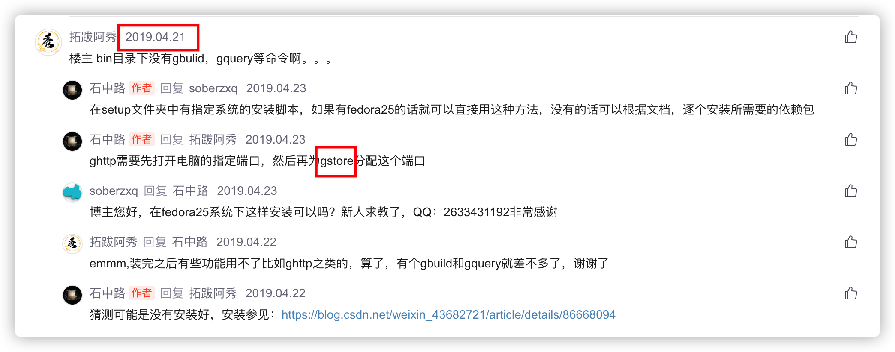
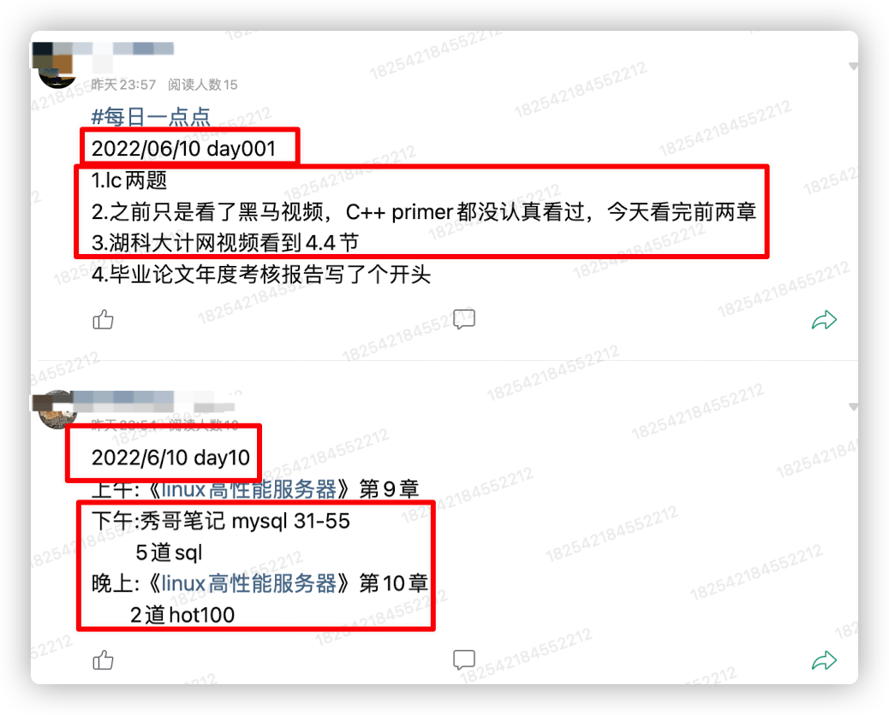
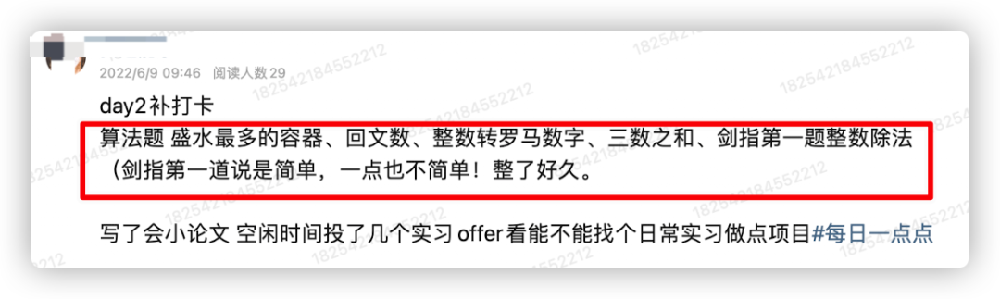
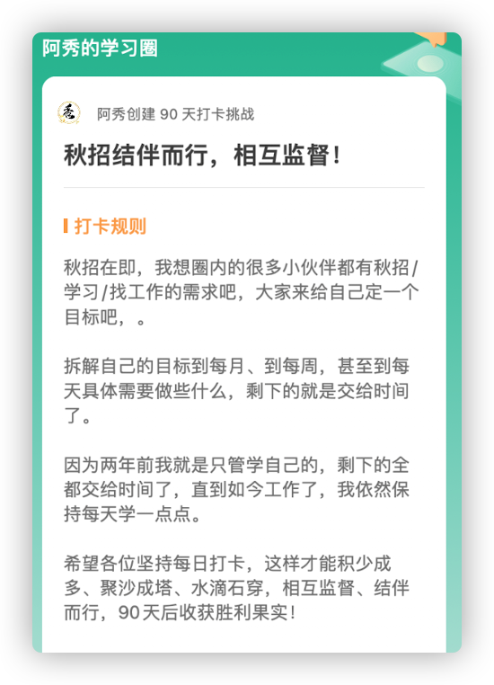

<h1 align="center">
  研一一整年都在搞深度学习，研二打算转开发
</h1>

  
这是六则或许对你有些许帮助的信息:

⭐️1、阿秀与朋友合作开发了一个编程资源网站，目前已经收录了很多不错的学习资源和黑科技（附带下载地址），如过你想要寻求合适的编程资源，<a href="https://tools.interviewguide.cn/home" style="text-decoration: underline" target="_blank">欢迎体验</a>以及推荐自己认为不错的资源，众人拾柴火焰高，我为人人，人人为我🔥！
  
2、👉23年5月份阿秀从<a style="text-decoration: underline" href="https://mp.weixin.qq.com/s?__biz=Mzk0ODU4MzEzMw==&mid=2247512170&idx=1&sn=c4a04a383d2dfdece676b75f17224e78" target="_blank">字节跳动离职跳槽到某外企</a>期间，为方便自己找工作，增加上岸几率，我自己从0开发了一个互联网中大厂面试真题解析网站，包括两个前端和一个后端。能够定向查看某些公司的某些岗位面试真题，比如我想查一下行业为互联网，公司为字节跳动，考察岗位为后端，考察时间为最近一年之类的面试题有哪些？

网站地址：<a style="text-decoration: underline" href="https://top.interviewguide.cn/" target="_blank">InterviewGuide大厂面试真题解析网站</a>。点此可以查看该网站的视频介绍：<a style="text-decoration: underline" href="https://www.bilibili.com/video/BV1f94y1C7BL" target="_blank">B站视频讲解</a>   如果可以的话求个B站三连，感谢！
    
3、😊
    分享一个阿秀自己私藏的黑科技网站，<a style="text-decoration: underline" href="https://hkjtz.cn/" target="_blank">点此直达</a>，主要是各类小众实用APP、网站等，除此外也包括高清影视、音乐、电视剧、AI、纪录片、英语四六级考试、考研考公、副业等资源。
  

  
4、😍免费分享阿秀个人学习计算机以来收集到的免费学习资源，<a style="text-decoration: underline" href="/notes/07-resources/01-free/01-introduce.html" target="_blank">点此白嫖</a>；也记录一下自己以前买过的<a style="text-decoration: underline" href="/notes/07-resources/02-precious.html" target="_blank">不错的计算机书籍、网络专栏和垃圾付费专栏</a>；也记录一下自己以前买过的<a style="text-decoration: underline" href="/notes/07-resources/02-precious.html" target="_blank">不错的计算机书籍、网络专栏和垃圾付费专栏</a>
  

  
5、🚀如果你想在校招中顺利拿到更好的offer，阿秀建议你多看看前人<a style="text-decoration: underline" href="https://www.yuque.com/tuobaaxiu/httmmc/npg1k81zeq4wfpyz" target="_blank">踩过的坑</a>和<a style="text-decoration: underline"  target="_blank" href="https://www.yuque.com/tuobaaxiu/httmmc/gge9ppd0mbu2d3dp">留下的经验</a>，事实上你现在遇到的大多数问题你的学长学姐师兄师姐基本都已经遇到过了。
  

  
6、🔥 欢迎准备计算机校招的小伙伴加入我的<a  style="text-decoration: underline" href="https://www.yuque.com/tuobaaxiu/httmmc/xg0otqvc17wfx4u9" target="_blank">学习圈子</a>，一个人踽踽独行不如一群人报团取暖，圈子里沉淀了很多过去21/22/23/24/25届学长学姐的<a  style="text-decoration: underline" href="https://www.yuque.com/tuobaaxiu/httmmc/gge9ppd0mbu2d3dp" target="_blank">经验和总结</a>，好好跟着走下去的，最后基本都可以拿到不错的offer！</a>如果你需要《阿秀的学习笔记》网站中📚︎校招八股文相关知识点的PDF版本的话，可以<a style="text-decoration: underline" href="https://www.yuque.com/tuobaaxiu/httmmc/qs0yn66apvkzw0ps" target="_blank">点此下载</a> 。
   

> 作者：阿秀
>
> 原文链接：[https://mp.weixin.qq.com/s/OMg9JLt-qwgHxU7qR3MtEA](https://mp.weixin.qq.com/s/OMg9JLt-qwgHxU7qR3MtEA)

你好，我是阿秀。

最近阿秀组建了自己的学习圈子，其实圈子里以前只有我一个人的，每天适当充电、看看书或者看一些教学视频，也会简单打卡记录自己的学习进度，比如这篇文章

后来慢慢放开后，每天就会有一些本科学弟学妹或者研究生师弟师妹们咨询问题，阿秀在每天下班之余，充电完事也会优先看看学弟学妹们的咨询问题，看看他们是不是有什么困惑。

## 1、前言

前几天有个研究生师弟来咨询阿秀，说自己研一一整年都在搞机器学习和深度学习的东西，忙着发论文，现在快研二了，感觉科研无望，想慢慢开始转开发了。

这让我回想起自己以前读研时候的生活，阿秀当时读研时的研究方向是**数据库**。

我们当时研究的东西跟**北大邹磊老师的gStore**和**华科袁平鹏老师**以及**东南大学漆桂林老师**他们的产品比较相关，大方向上比较一致，都是比较偏向于实践一些。

记得研一的时候阿秀还在因为部署gStore而头疼不已，到处翻资料，现在还能再CSDN上看到我当时的留言讨论。

可很多从事机器学习/深度学习的师弟师妹们快研三了才发现自己做的很多东西无法落地，手上也没有拿得出手的paper，找工作也拿不出手，这个时候再急急忙忙去转开发，跟那些在研一时就下定决心转开发的同学一比，可能会发现自己根本没有竞争力。。。

阿秀觉得这位师弟比较有先见之明，没在研三才醒悟。。。

今天分享一下，希望能给各位有着相同处境的研究生师弟师妹一点提示，不要到研三了打开简历一看自己空空无也，什么也拿不出手，想转开发也转不了。

## 2、提问

《[阿秀的学习圈](/notes/05-xiustar/01-xiustar_reading_guide/01-introduce.md)》是阿秀自己组建的学习圈，本来是打算记录自己的学习和充电经历的。后来也慢慢也带着一些研究生师弟师妹以及本科的学弟学妹们一起学习和准备校招相关，目的很纯粹，就是通过自己的努力在校招求职中拿到一个好offer，拥有一个好一点的职业起点。

阿秀的学习圈中就有一位本科学弟，他就是快到找工作的时候才发现自己哪哪都没准备好，看别人的面经心里慌得一批，觉得自己完了。。。

今天分享一下他的情况以及阿秀以过来人的角度给他出的一些应对之策，下面是这位学弟在[学习圈](/notes/05-xiustar/01-xiustar_reading_guide/01-introduce.md)中的提问原文：

---

秀哥好，第一天加入星球，想提问学习规划问题，本人目前研一，本硕一线城市非92双一流，去年半跨考二战高分回本校计算机。

考上之后接近一年的时间全心全意从零开始机器学习深度学习和看论文做实验写论文，最近接近完成一篇论文并准备投SCI期刊（老板要求期刊）。

目前计划投完论文后开始学go后端开发，个人基础如下: 

- 1.数学功底还行；
- 2.计算机基础（408+数据库）考研初复试针对考试学习过，本科课程大多没学过；
- 3.本科阶段学过Java和C++，但不深入，毕业设计用Java开发过一套服务器+安卓端系统（初级入门水平），准备考试复试的上机考试时用C++在牛客网刷过200道左右编程题（大多是简单题，部分中等题）。

但是最近一年都在搞深度学习和论文，之前学的东西感觉都快忘完了，目前打算从头开始学go，并已经了解了一些基本语法，目标8个月后进一二线大厂实习。

本次提问主要有两点疑惑: 

- 1.计算机基础以前应试学过但是学得不全面不深入而且很多忘了，现在要不要从头开始啃书啃视频系统学?

- 计算机基础，go的学习与进阶，力扣刷题，这三方面的学习顺序怎么安排，怎么统筹?
  针对以上问题，秀哥和其他星友很哪些建议，如果有大体时间规划就更好，比如xx模块学习x个月。

  

补充一句，本人上班时间955，其他时间可学，实验室里也可摸鱼刷题，因为已经接近满足毕业要求了。

## 3、回答

首先不得不说他描述的很清楚啊，有前因有后果也有背景，下面是阿秀的回答：

先说点题外话，看你已经在投期刊了，如果能一次就中还好，如果中不了估计要像我实验室同学那样修修改改，然后接着投，短则二三月，长则一年半载。

所以如果你没有读博的打算建议不要像你研一时那样全身心投入了，自己多给自己想想后路。

我挨个说你的问题和给你的建议&意见：

- 1、建议过一遍视频，然后再系统看书。因为按照你的打算是不太够的，前期先过一遍视频，针对一些比较重要点的可以看看，比如os的进程线程、网络的三握四挥这些建议看下书，自己多理解下。

  剩下的就是多看看面经怎么回答的，不要直接成为一个八股文战士了，八股文战士应试可以，但是在面试时可能经不起深挖，一问就露馅。

- 2、我给出我当初的学习计划吧，其实以前在文章里分享过，没看过的话可以看看https://mp.weixin.qq.com/s/vSzbITIYEVQNE1LgIzmPJg。

  我并没有严格的顺序和区分度，没有学哪一门学固定的多长时间的，只能说一个大概的时间分配，C++差不多占35%的时间，算法30%的时间，剩余的时间就是其余的计算机基础课程了。 

  系统性来说我主要是前期周一到周五晚上刷题，你既然打算走go就多用go去刷吧，刷题累了就去看视频/看主攻语言的书籍（我当时看的是C++ Primer），就这么搞了差不多两个多月。

  在编程语言书籍看的差不多的时候，这里指的是基础语言彻底掌握的时候，我就开始去看其余的计算机基础课程了，后期主要时间是花在cs基础上面了。

  周末白天基本都是看基础，晚上就刷题，剩余的时间就是看看C++进阶，严格意义上没有什么准确的时间划分，你的时间也可以按照我的来划分。

- 3、你打算走go的话，gin gorm 这一套的东西记得要好好学学，还有go的并发编程，面试问得比较多，有个极客兔兔，她有一系列的go 的mini框架教学可以去看看，直接百度搜索就可以。

  

## 4、秋招加油

最近阿秀在自己的[学习圈子](http://mp.weixin.qq.com/s?__biz=Mzg2MDU0ODM3MA==&mid=2247503490&idx=1&sn=c0774b72d6db21f49a3ffb9bf500dd29&chksm=ce2632fff951bbe947883131ec62d4f3746355b7f2466a5b2a6c463de36ed9db80954299b6c6&scene=21#wechat_redirect)里发起了一项`秋招结伴而行、相互监督`的活动。

因为两年前我就是只管学自己的，剩下的全都交给时间了：[双非渣硕的秋招之路总结（已拿抖音研发岗SP）](http://mp.weixin.qq.com/s?__biz=Mzg2MDU0ODM3MA==&mid=2247484185&idx=1&sn=39728960ae985a4ecda34da4fb076865&chksm=ce25ff64f95276727955bf6eb0838763c4864fa923d59440a4a3025f8b81df4fab219cba0a8f&scene=21#wechat_redirect)、[没有什么逆袭，有的只是一点点坚持！](http://mp.weixin.qq.com/s?__biz=Mzg2MDU0ODM3MA==&mid=2247490699&idx=1&sn=0f7a1ee4100a310d679f5ab84fbfa3bc&chksm=ce25e0f6f95269e08c740d212bc7b0d7a4f9a5c01b9a5fff7ed92c30f2348638a3b0c829374e&scene=21#wechat_redirect)

直到如今工作了，我依然保持每天学一点点：[坚持充电！我离开学校后坚持学习135天了！](http://mp.weixin.qq.com/s?__biz=Mzg2MDU0ODM3MA==&mid=2247502656&idx=1&sn=f277a32fe401896bf35744baff6e16b1&chksm=ce26373df951be2b5bb79d9b5a98bdfce33effe9a078ef3bcef535c69a3ec9ddab0a0155d93a&scene=21#wechat_redirect)一天可能做不了什么，但是一周、一个月能做的就有很多了。

如果你能拆解自己的目标到每月、到每周，甚至到每天具体需要做些什么，并且去执行，**剩下的就是交给时间了**。

我始终相信成功是一步一个脚印走出来，而不是什么一蹴而成，每天坚持一点，这样才能积少成多、聚沙成塔、水滴石穿。

如果能够有小伙伴一起结伴而行，也能起到相互监督的作用，目前已经有超过**400**多名小伙伴加入了，希望他们都能在今年校招中收获胜利果实！

此外，对于每位阿秀的学习圈中的圈友也会奉上自己以前的学习和校招面试总结笔记，也就是《阿秀的学习笔记》PDF版本：[计算机校招求职八股文PDF版本](http://mp.weixin.qq.com/s?__biz=Mzg2MDU0ODM3MA==&mid=2247503555&idx=1&sn=7bfa20dc7c494187630eb48d8a383ede&chksm=ce2632bef951bba8424f4c3f20747cbafc454a664e533896baebdc54328c47dc6a9eeedec162&scene=21#wechat_redirect)

秋招结伴而行、相互监督打卡-><a href="http://mp.weixin.qq.com/s?__biz=Mzg2MDU0ODM3MA==&mid=2247503490&idx=1&sn=c0774b72d6db21f49a3ffb9bf500dd29&chksm=ce2632fff951bbe947883131ec62d4f3746355b7f2466a5b2a6c463de36ed9db80954299b6c6&scene=21#wechat_redirect">戳我查看活动详情</a>

## 5、题外话

其实在最后阿秀还给了这位师弟一个建议，那就是**保持运动**。

至少每天坚持去运动30min，跑步也好，打球也好都行，因为精力很重要。

很多人学着学着就中道崩殂了，很多都是心气不足，不够坚定的原因所致。

但还有一个就是精力跟不上了，没有那个心气儿劲了，保持运动是一个保持精力&持续上进的好方法。

可能这是一个很长的学习过程，稳扎稳打就行，结果会出乎你意料的。

我就是的，我毕业找工作前就希望找一个年薪10W的工作，现在好几倍都不止！

可以预见的是今年校招估计会比前两年要难，这个从今年日常实习&暑期实习招收就能看出来了，相信很多找实习的应该都有体会。

临时抱佛脚肯定不如早点准备，学弟学妹们在准备的过程中可以《参考阿秀的学习笔记》网址：https://interviewguide.cn，

这是阿秀以前自己**自学计算机&校招求职**时做的**总结笔记**，不是那种直接的八股文，对于每个问题都会做一些深度剖析与延伸。

加油吧！希望各位都能顺利上岸！

