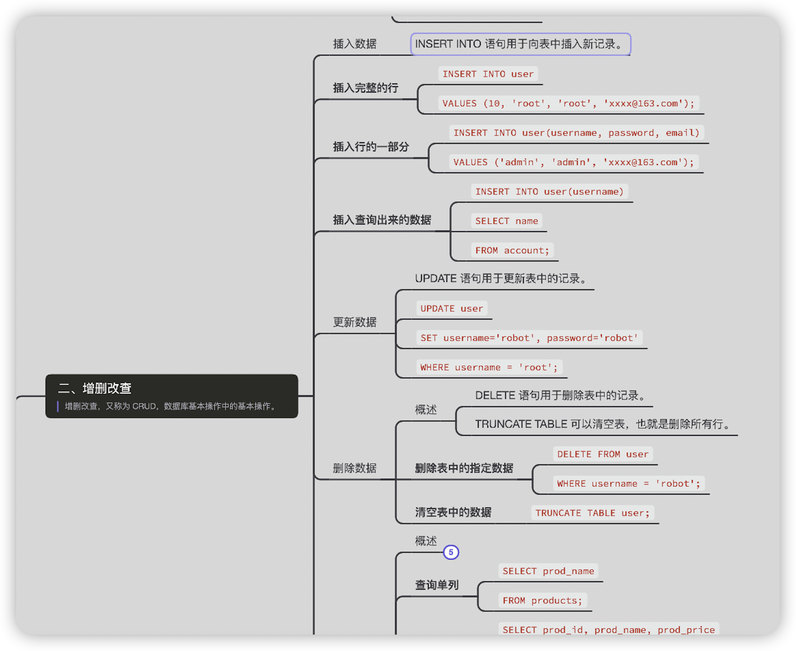

<h1 align="center">后端必备！SQL语法速成手册！~</h1>

  
这是五则或许对你有些许帮助的信息:

0、经常看到有人问哪里有汇总好的校招投递公司信息汇总？甚至还有的人花钱去买这类信息，更有甚者还有被骗的。。。其实这类信息真的很多，牛客网、前程无忧这些招聘网站都帮你总结好了，这里分享一下一位学弟告知的前程无忧推出的校招信息汇总，他们每天都会在群里发招聘公司、行业、岗位等，<a href="https://mp.weixin.qq.com/s/XVrkXg5P0Z7rWhDAWkJDWA" target="_blank">点此免费获取前程无忧总结好的校招资讯汇总</a>
  
1、👉 最近我发现了一个每日都会推送最新校招资讯的<a style="text-decoration: underline" href="https://flowus.cn/ee50d5eb-3cd5-4f74-880e-95b215dd4ff2" target="_blank">《校招日程》</a>文档，包括大厂、国企、银行、事业编等信息都会定期更新，无偿分享一下。
  
  
2、😍
    免费分享阿秀个人学习计算机以来的收集到的免费资源，<a style="text-decoration: underline" href="/notes/07-resources/01-free/01-introduce.html" target="_blank">点此白嫖</a>。
  

  
3、🚀如果你想在校招中顺利拿到更好的offer，阿秀建议你多看看前人<a style="text-decoration: underline" href="https://www.yuque.com/tuobaaxiu/httmmc/npg1k81zeq4wfpyz" target="_blank">踩过的坑</a>和<a style="text-decoration: underline"  target="_blank" href="https://www.yuque.com/tuobaaxiu/httmmc/gge9ppd0mbu2d3dp">留下的经验</a>，事实上你现在遇到的大多数问题你的学长学姐师兄师姐基本都已经遇到过了。
  

  
4、🔥 欢迎准备计算机校招的小伙伴加入我的<a  style="text-decoration: underline" href="https://www.yuque.com/tuobaaxiu/httmmc/xg0otqvc17wfx4u9" target="_blank">学习圈子</a>，一个人踽踽独行不如一群人报团取暖，圈子里沉淀了很多过去21/22/23届学长学姐的<a  style="text-decoration: underline" href="https://www.yuque.com/tuobaaxiu/httmmc/gge9ppd0mbu2d3dp" target="_blank">经验和总结</a>，好好跟着走下去的，最后基本都可以拿到不错的offer！此外，每周都会进行<a  style="text-decoration: underline" href="https://www.yuque.com/tuobaaxiu/httmmc/npg1k81zeq4wfpyz" target="_blank">精华总结和分享！</a>如果你需要《阿秀的学习笔记》网站中📚︎校招八股文相关知识点的PDF版本的话，可以<a style="text-decoration: underline" href="https://www.yuque.com/tuobaaxiu/httmmc/qs0yn66apvkzw0ps" target="_blank">点此下载</a> 。
   

每个学习后端的人都离不开数据库这一关，而学习数据库就是从SQL开始学起，分享一份很高清的SQL语法速成手册！

因为图片比较清晰，所以足足有4M这么大，所以在传上来的过程中肯定会被压缩，这样就会看不清楚，所以只能以链接的形式分享。

这里先带你们看看其中的内容吧，我觉得是很清晰明了了。

获取的方式如下，没有任何套路。

阿秀个人的公众号“**拓跋阿秀**”后台回复 “**007**” 即可获取高清图片。

