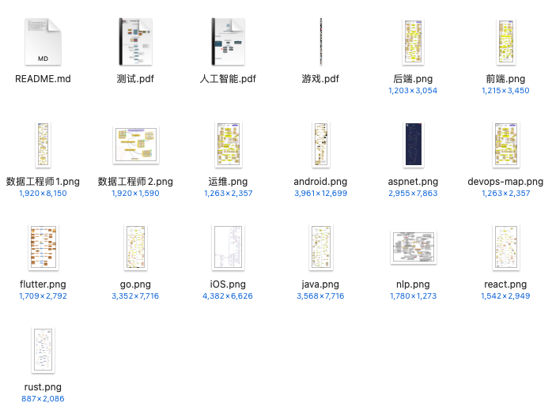
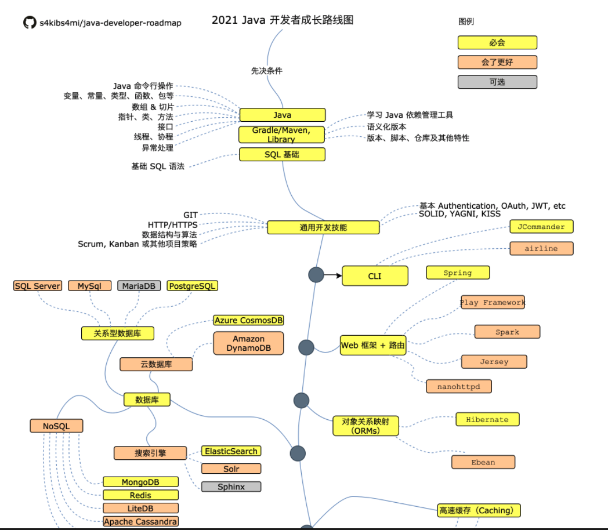
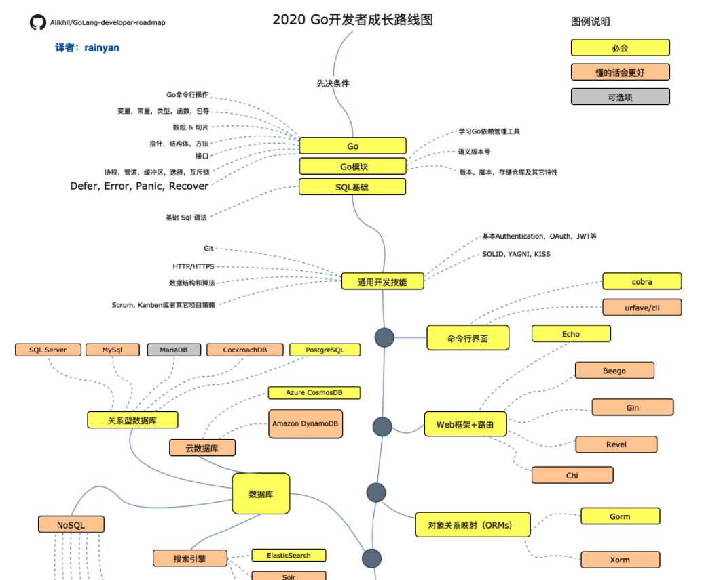
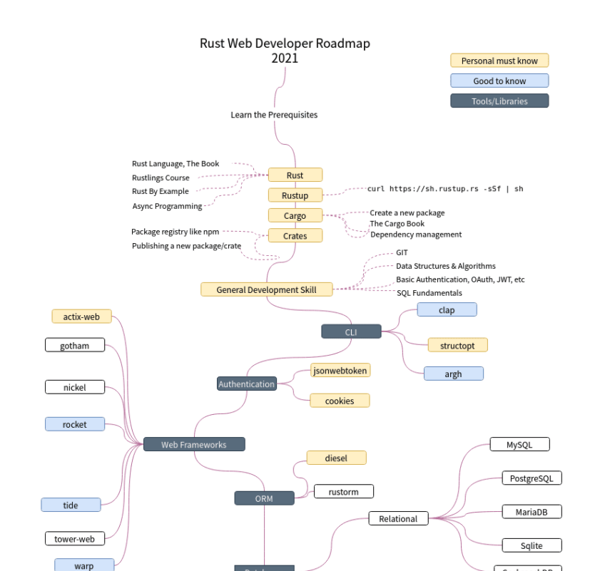
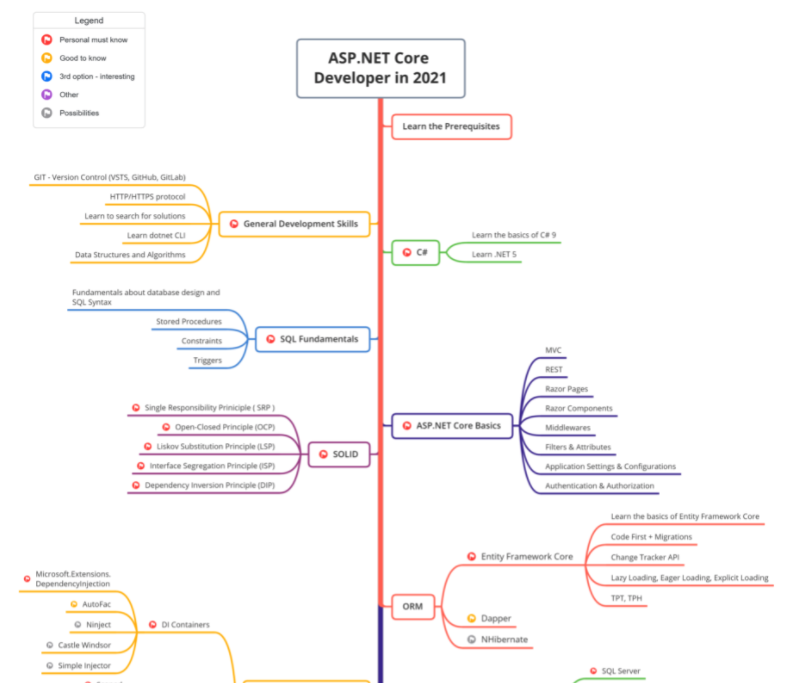
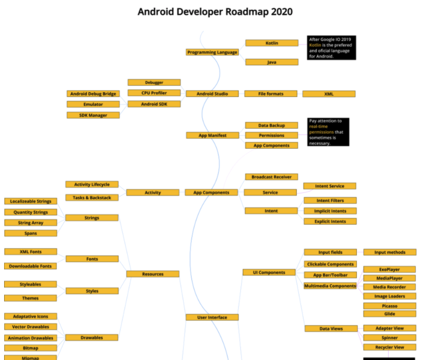
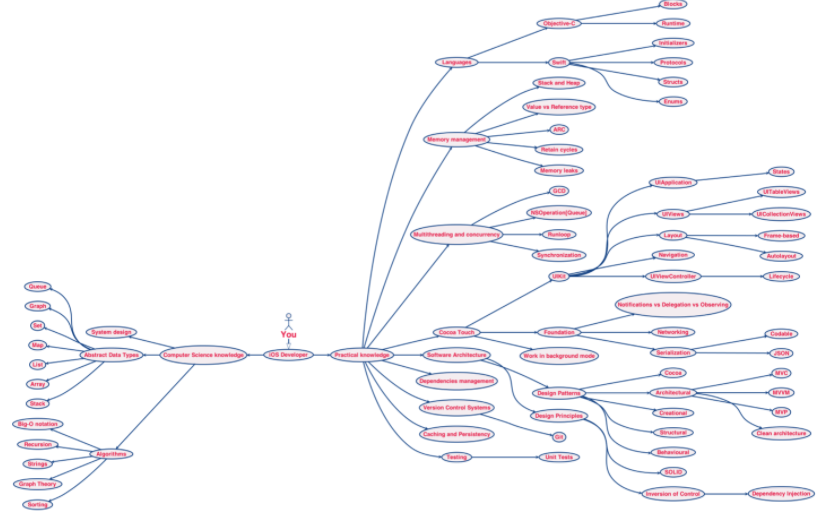
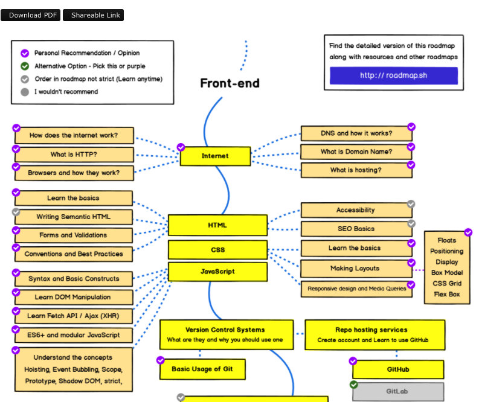

<h1 align="center">Github 上的各种硬核技术学习路线思维导图~</h1>

趁着周末整理了一系列开源的技术学习路线图，涵盖 Java、Go、Rust、客户端、iOS、前端....分享一下她的整理内容，这些学习路线她已经分享出来了。

### 获取方式

扫描下方二维码，回复关键字” **020**“，即可获取！

相信这些可以为想要学习新技术的你提供一份详细且清晰的学习路线，希望各位学弟学妹们能在校期间好好学这些技术才是真，现在校招真的太卷了。。。

下面是一些简单介绍~

### Java

Java 是当下企业开发最热门的编程语言，它有着强大的生态以及庞大的用户群体。

路线图非常清楚直观，并且是 2021 的最新的 Java 学习路线版本!

### 获取方式

扫描下方二维码，回复关键字” **020**“，即可获取！

###  Go

像腾讯、字节、滴滴、七牛云、shopee 等等公司的很多新项目都在用 Go 。

因此，有越来越多的小伙伴投入到了 Go 语言的怀抱。

###  Rust

Rust 是一种性能和安全性都很好的编程语言。由于 Rust 的性能太好，所以，其也是可以像 C 和 C++ 一样写操作系统或者游戏引擎的。

项目地址：⇲https://github.com/anshulrgoyal/rust-web-developer-roadmap 。

### C#

国外使用 C# 和 .NET 还是非常多的，国内就比较少，很少

### Android

国内的纯 Android 开发岗位比较少，如果是为了找工作的话，不太建议学习 Android 开发。

###  iOS

和 Android 开发类似，国内的纯 iOS 开发岗位比较少，近几年从 iOS 转到别的方向的小伙伴也有很多。

### 前端

Web Developer Roadmap 是一个大一统的 Web 开发学习路线，涵盖了绝大部分 Web 开发工程师需要掌握的知识

###  其他

- •⇲Game Developer Roadmap ：成为游戏开发的学习路线。
- •⇲Quality Assurance Roadmap ：成为测试/软件质量保证工程师的学习路线。
- •⇲Data Engineer Roadmap : 成为数据工程师的学习路线。
- •AI ：

这些学习路线阿霜已经下载到了本地。

### 获取方式

扫描下方二维码，回复关键字” **020**“，即可获取！

