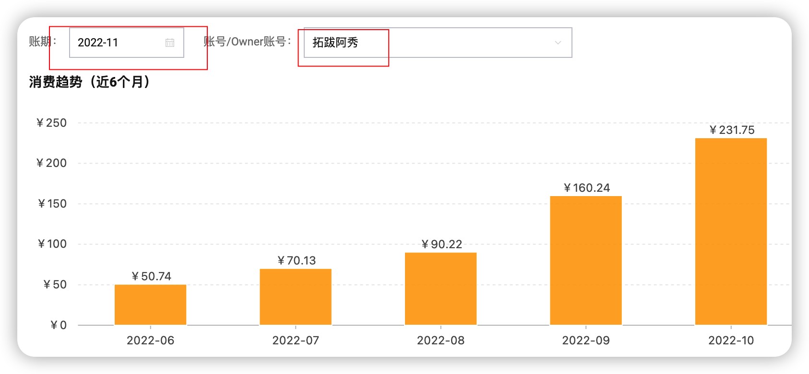
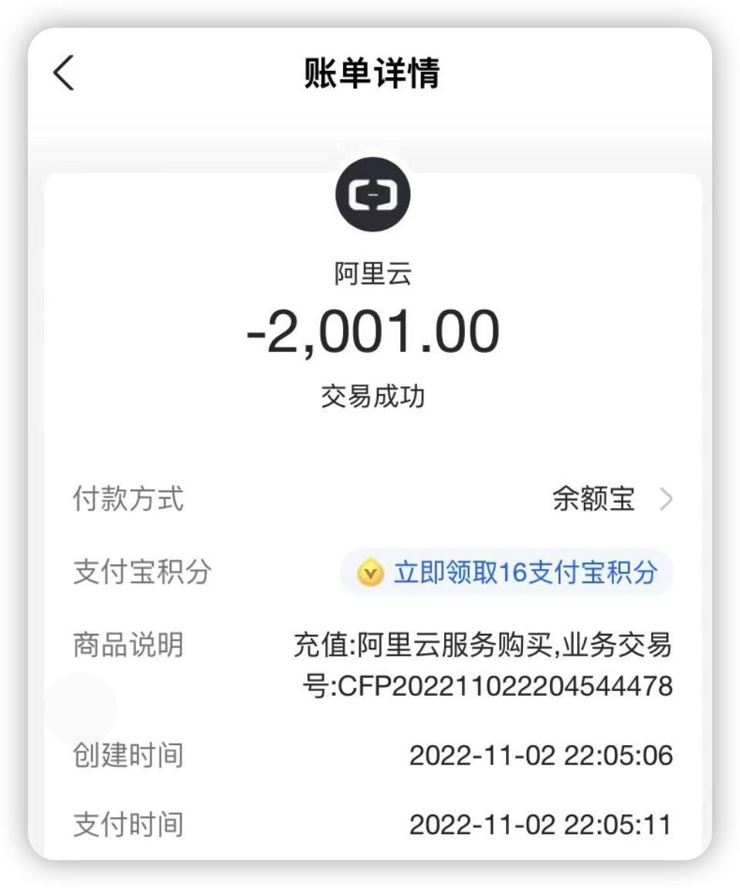
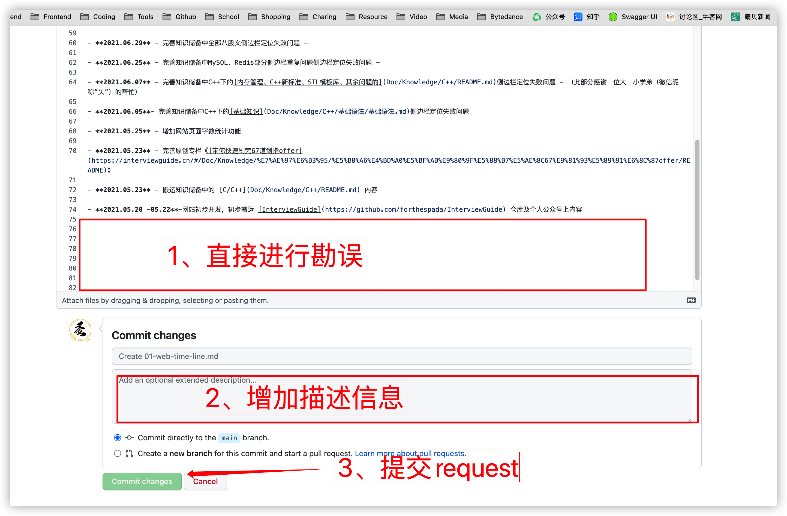
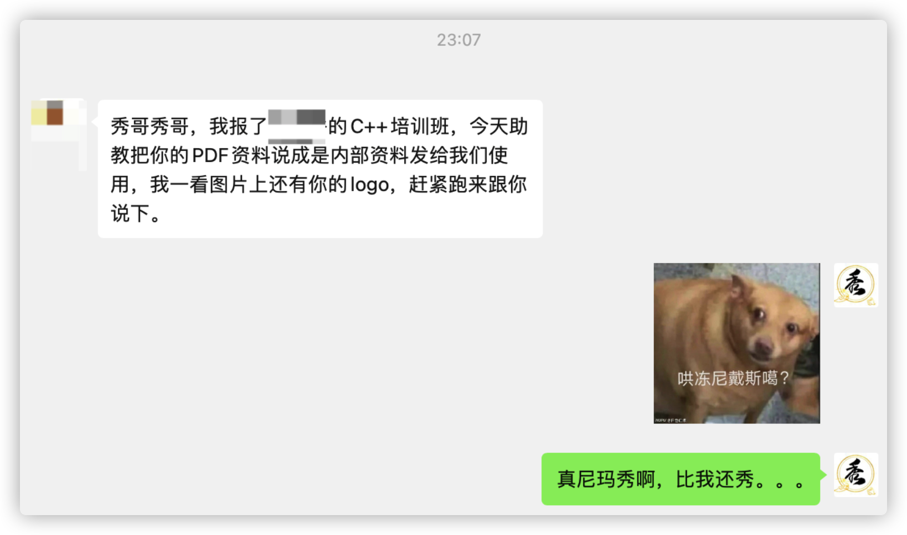

  <h1 align="center">
    读者问题
  </h1>

## 1、维持这个网站一年的费用有多少？

其实维持这个网站的费用比大多数人想要多很多，《阿秀的学习笔记》网站自**2022.06**月以来用户访问量就一直逐步攀升，从下图中可以看出阿里云oss对象存储花费正在逐步攀升ing

趁着双十一活动，我也是直接充值了2K到阿里云账户，购买oss包年套餐，要不这费用一直涨下去，光是oss存储就够阿秀喝一壶的了。。。

oss目前是网站费用的大头，相比之下每年租用阿里云服务器的费用反到不多了，所以网站可能会接点推广，比如阿里云或者百度云服务器的优惠活动，也能恰点烂钱，维持一下网站费用。

  

  如果网站的一些推广信息有对你造成困扰，这里给你真诚道歉，sorry！ 
  希望阿秀以前的学习笔记对你的计算机编程学习或者校招求职之路有所帮助！

## 2、发现错误，如何勘误校对？

本站95%以上的文字均来自阿秀个人学习笔记，不免会有一些错误如笔误等。

截止2022.05.14号前，已经fix多达129个错误，但仍可能会有一些漏网之鱼！

如果你在阅读本仓库过程中，如果你发现一些`内容`、`图稿`、`代码`等中的错误，可以提交Issue或者PR的方式进行问题反馈。

阿秀每天都会看自己的仓库，也会持续性进行完善，感谢你的支持；

- Issue：[https://github.com/forthespada/InterviewGuide/issues(opens new window)](https://github.com/forthespada/InterviewGuide/issues)
- PR：[https://github.com/forthespada/InterviewGuide/pulls (opens new window)](https://github.com/forthespada/InterviewGuide/pulls)

勘误步骤：

1、在打算编辑的文章的最下面左侧找到`在 GitHub 上编辑此页`的按钮。

  

2、进行勘误，填写描述信息并提交request

## 3、网站内容适用人群？

答：《阿秀的学习笔记》适用人群为**计算机校招技术岗以及毕业三年之内的社招党**，尤其是前者，面试中考察计算机基本功还是很常见的。

对于毕业三年以上的社招党来说，求职面试中考察的更多则是经验和项目了。

## 4、阿秀，如何才能联系到你？

如果你对我整理的某个知识点感到困惑或者有你自己的看法，可以[直接提交PR](/notes/08-other/02-question.md#_2、发现错误-如何勘误校对)，我每周都会审查。

如果：

- 你有计算机学习、技术方向、编程语言选择等方面的困扰；
- 你有考研、读研等方面的困扰，毕竟阿秀自己也是考研过来的人，也负责过[计算机考研复试](/notes/06-about/02-school/20210315-近期招收计算机考研调剂学生有感%7C考研调剂指南.md)；
- 你有校招、社招、offer选择等求职找工作方面的困扰；
- ....

那么欢迎你加入[阿秀的学习圈子](/notes/05-xiustar/01-xiustar_reading_guide/01-introduce.md)，每天阿秀都会**优先**看学习圈子中小伙伴们遇到的问题，一起努力、报团取暖、打卡学习、顺利拿到好offer，完成自己的目标！

如果你是想一起学习，一起找工作，一起进步的，那你可以加我，交个朋友，一起学习技术，甚至一起找工作；

如果你是不上进、不学习、打广告的，或者整体怨天怨地的，遇到点事情就放弃的，那千万别别别加我，我不想跟你这种人交朋友，也不想浪费自己的时间！

  

    个人微信：<strong>coderxiuxiu</strong>，或者扫描下方二维码即可添加
  

    

备注

1、我自己也在字节跳动这边工作，字节条的工作强度很大，我还在抖音这边搬砖写码，工作也比较繁重，所以有可能添加好友通过不及时，还望海涵！

每天我都会在回答完[阿秀的学习圈](/notes/05-xiustar/01-xiustar_reading_guide/01-introduce.md)中学弟学妹们的问题后专门抽出30min的时间来进行粉丝免费答疑，可以放心。

2、如果我通过好友了，不要问”在吗“/”秀哥在吗“这种话，有问题直接问就好！最大程度上节省双方时间！这对你对我都是一种双赢的事情，我也能多回答几个学弟学妹的问题！

## 5、如何下载阿秀的学习笔记内容PDF版本？

很抱歉，**2022.04.23**日后可能以后都不会再免费开放下载本站内容了，因为**23**号这天有学弟专门跑来告知我有某些机构使用我的学习笔记PDF版本分发给学员，美其名曰为**机构内部资料**🤕。。。

**故以后都不会再提供免费PDF版本的下载了**，**2022.04.23**日之后《阿秀的学习笔记》网站上全部内容的PDF版本只为[阿秀的学习圈子](/notes/05-xiustar/01-xiustar_reading_guide/01-introduce.md)中的圈友提供。

如果你有意一起学习&为秋招努力&拿到好offer，欢迎了解并加入[阿秀的学习圈](/notes/05-xiustar/01-xiustar_reading_guide/01-introduce.md)，附赠[加入方式](/notes/05-xiustar/01-xiustar_reading_guide/01-introduce.md#五、加入方式)。

具体截图见下💔💔💔：

## 6、关于夜间模式

阿秀自己开发实现了暗黑模式功能，实现夜间模式，具体可见网站建设时间线：[网站日记](/notes/08-other/01-web-time-line.md)
