<h1 align="center">C++训练营</h1>

大家好，我是阿秀。

**经常发现有学弟学妹在准备校招时非常迷茫，不知道从何下手，详细聊下来发现和我当时的遇到的问题一模一样，**

所以我打算借这个机会写一篇文章，来给大家详细说说秋招，备战秋招时，最令我难受的有以下几件事：

- 迷茫，不知道复习什么，不知道从何下手，以至于前两个月复习效率贼低，后面才慢慢的摸索出来一条学习路线及方法，这个过程确实走了好多弯路
- 缺少可以往简历上写的，含金量高的 C++ 项目经验，而且开源的 C++项目也比较少，不知道如何增加项目经验。
- 不知道怎么写出令人眼前一亮的简历，突出自己的优势，令自己的简历脱颖而出
- 不知道自己掌握程度，是否能够符合面试要求，无法检验自身水平，

这些确实是校招生经常遇到的问题！

其实不仅仅是校招生，也包括一些想要跳槽大厂，工作经验较短的同学，也有类似的问题。

后来我工作后，我慢慢发现社招一两年的同学在想换工作时，也基本存在以下困扰：

- 没有较深的项目体会，因为是校招入职，这两年做的都是一些较边缘的工作，感觉技术得不到提升，更多的是为业务服务。
- 没有从 0 到 1 的项目经验，入职后多是在原有的项目上堆砌代码，增加变量和简单逻辑，甚至没有从 0 实现过一个类。
- 薪资不太满意，被刚入职的应届生倒挂，被同龄人越拉越远，想寻求改变。

我转念一想，为何不联合一些大佬，将备战校招和社招的经验分享给大家呢，并且从 0 到 1 完成几个 C++项目，增加大家的项目经验！

说干就干，**整个技术提升训练营**！！！

训练营前期准备了小半年，现在已经运营了 将近一年时间了！陆陆续续也帮助学员拿到了一些 offer！

还是比较担心训练营推出后，不及大家预期，所以我们打磨了很多遍，也追踪了一些试运营招收的学员，反响真的很不错，这才敢推荐给大家！

是的，我们已经准备好了！

  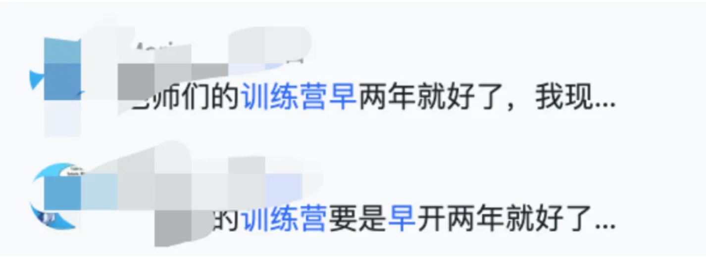
  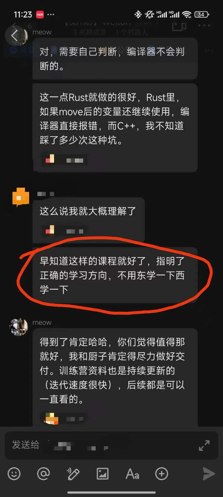

这里可能有疑问，训练营那么多事，你一个人能忙的过来么？

我一个人肯定忙不过来，所以训练营有数位伙伴共同参与，**导师全部来自互联网头部大厂包括但不限于腾讯、百度、字节、小红书等。**

跟某些拿虚假大厂充当导师的训练营不同，阿秀在这里可以保证这个训练师都是有大厂背景的朋友来一起做的，都有丰富的面试经验及项目开发经验，硬实力不达标的我们没让进来一起合作。

下面是对部分导师的简单介绍：

- **程序喵**：大厂资深C++技术专家，《C++20高级编程》、《C++23高级编程》著书籍译者
- **程序厨**：秋招 offer 收割机，前腾讯高级后端研发工程师，现创业中，github 10000+ star 开源作者
- **拓跋阿秀**：前字节跳动全栈工程师，现外企项目组组长，有C++、Golang、Node.js等多种语言开发经历
-  **Yellow**：大厂音视频技术专家，精通OpenGL、FFEMPG
- **阿杜** : 10年C++开发经验，先后在上市公司、基金公司担任C++后台高级开发工程师，CSDN签约讲师。
- **昊天**：某头部音视频公司资深C++开发工程师，多年音视频开发经验，多年QT、FFMPEG、OpenGL经验。

**有这么多大佬的加持，训练营的质量绝对有保障**。

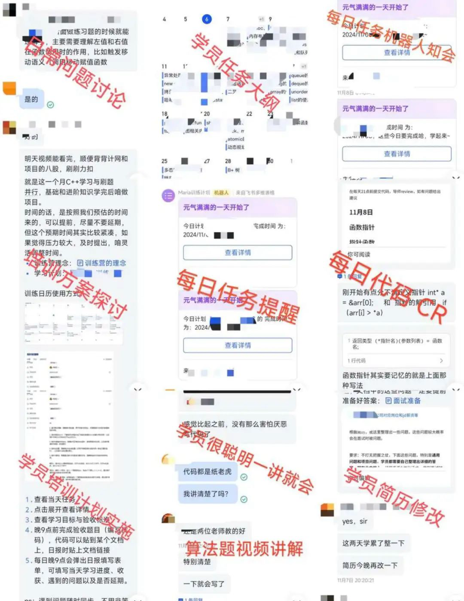

训练营主要包含以下几个模块，建议感兴趣的同学仔细看一下上图，详细了解训练营，并判断训练营是否适合自己。

下面针对每个模块进行详细解答

## 训练营服务列表

### **1、定制学习计划**

每个入营的学员，会有面试诊断，根据学员情况，量身制定学习计划，让学员学习更有针对性，更加高效。

以下为**基础能力提升专项训练**，还有项目实战、面试培训等日程。

下面是其中一些内容的学习目标及验收标准：

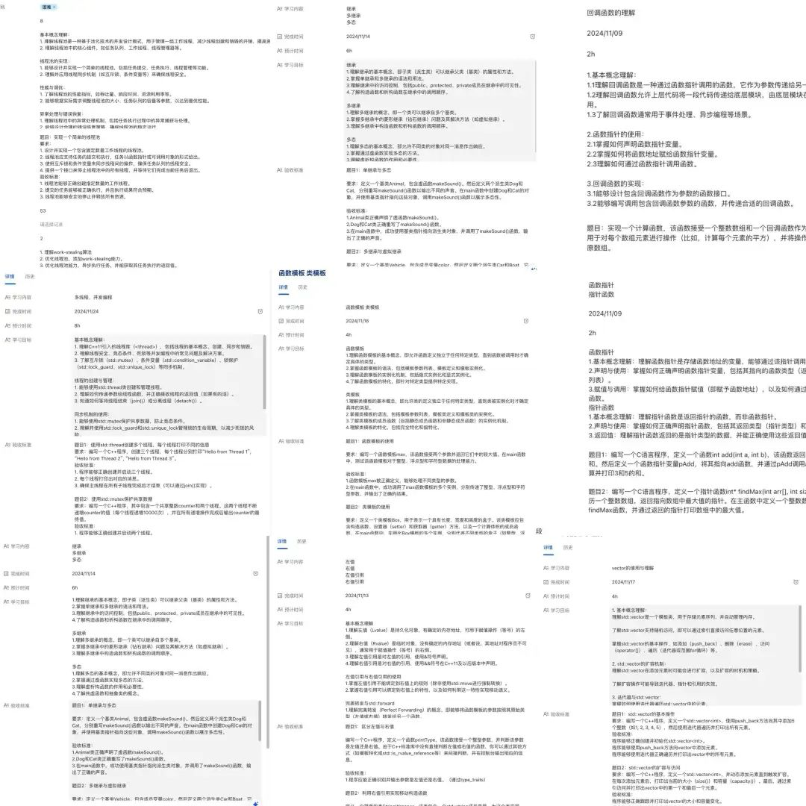

这一阶段的目的，是为了让学员将 C++ 知识点，掌握牢固，也是为之后的项目实战打下基础。

### **2、每日代码 Review**

很多同学拥有这种苦恼，**不知道自己对知识点的理解情况，不清楚自己编码风格是否规范**，觉得自己掌握了知识点，但是没办法验证，心里没底。

不用担心，训练营导师会为你每天批改代码，**从大厂 C++ 工程师的角度帮你指出问题，给出优化建议，帮助你更好的理解知识点，让你养成良好的代码风格**。

当遇到较难理解的知识点，直接在群内沟通，导师写出示例代码帮助学员理解，下面是部分记录：

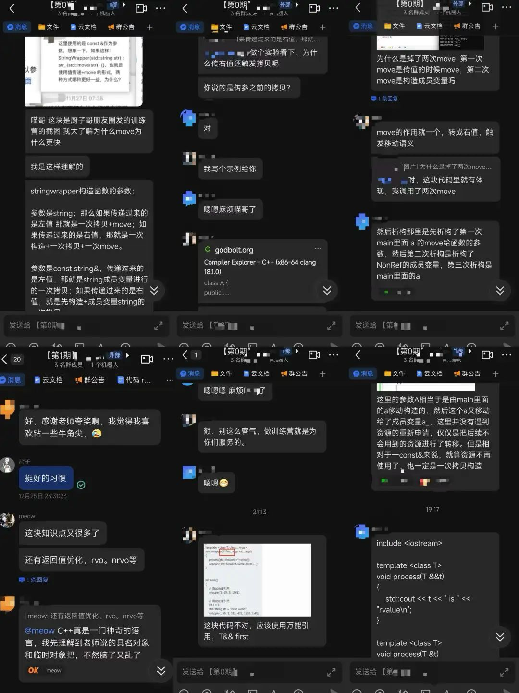

1v1专属群内沟通

### **3、技术提升**

训练营内学习列表包含**计算机基础、C++、Linux、计算机网络、操作系统、数据库、数据结构与算法**这几类，训练营内有大量的文字及视频讲解。

遇到不会的问题，导师会拉会讲解（讲解时会录屏，方便后面的学生学习）帮助你更好的理解知识点。

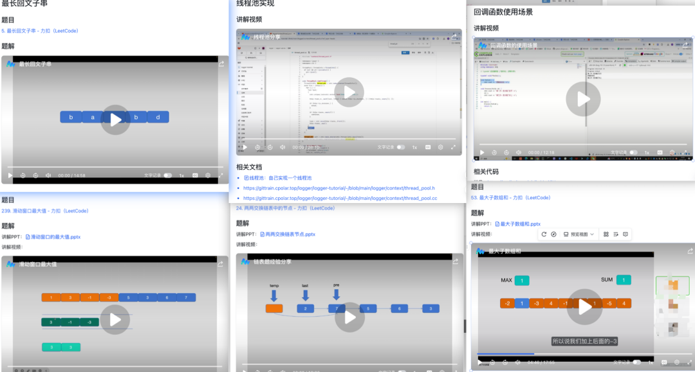

例题讲解

### **4、从 0 到 1 项目实战**

**训练营的初衷，是帮助学员提升代码能力与解决问题的能力。**

**上面的题目旨在提升代码能力，而本模块则聚焦于从 0 到 1，全面培养做项目及解决问题的能力。**

学员完成训练计划后，训练营项目导师，会手把手带你完成 3 个项目（从项目池中任选 **2 个**项目+1 个赠送项目）

**以此来帮助你提升做项目的能力，帮助你熟悉做项目的完整流程，比如开发环境、编译脚本、架构设计、框架搭建、代码发布、问题调试、单元测试。**

另外做项目的过程中必然会遇到种种问题，可以逐步提升你的调试能力，分析问题的能力，掌握更多的调试手段。

**遇到棘手的问题，有专门的导师给答疑解惑，给出具体建议。**

项目池里面的项目，是导师团队花费大量时间完成的，不仅有完整的代码及清晰的注释，还有详细的文档和视频，并且有专门的项目导师答疑，完全不用担心自己学不会。

**相信我，这些项目绝对能够让你进步巨大**！下面简单介绍一下各个项目：

| 项目名称           | 简介                                                         | 受众           | 主要知识点                                                   |
| :----------------- | :----------------------------------------------------------- | :------------- | :----------------------------------------------------------- |
| 高性能日志         | 一个具有低延迟、资源占用少、安全可靠并且易于扩展能力的日志库，满足线上软件的需求 | 社招和校招学员 | mmap、defer机制、并发编程、数据压缩、数据加密、protobuf 序列化,、effective formatter、effective sink |
| 自制RPC            | 从 0 到 1 的 RPC 项目，一个高效、可靠且易于使用的通信框架。  | 校招           | 并发编程、zstd、zlib、数据加解密密、protobuf json 序列化、通信协议定义，网络编程，负载均衡、服务注册 |
| AI音视频特效播放器 | 音视频处理项目                                               | 校招、社招     | 音视频解码、OpenGL、音视频播放，视频渲染上屏、人脸检测和贴纸、音视频编码、性能优化 |
| 自制STL            | 从 0 到 1 实现一个 STL                                       | 校招           | allocator、SPFNAE、type_traits、iterator、vector、string、deque、queue、stack、array、pair、tuple、optinal、list、hash_table、unordered_multimap、unordered_multiset、priority_queue、tree、map、set、multimap、multiset、unique_ptr、shared_ptr、chrono、mutex、RAII lock、thread |
| 飞书机器人         | 一个用来监督提醒大家学习的智能机器人                         | 校招           | mysql、redis、httpserver、httpclient、广播、spdlog           |
| 嵌入式音视频推流   | 嵌入式音视频推流项目                                         |                | h264、h265、SRT、ffmpeg、RV1126推流、RV1126 解码、RV1126 多路码流、拍照功能 |

下面贴一下，其中音视频处理、日志库、嵌入式推流三个项目的说明文档：

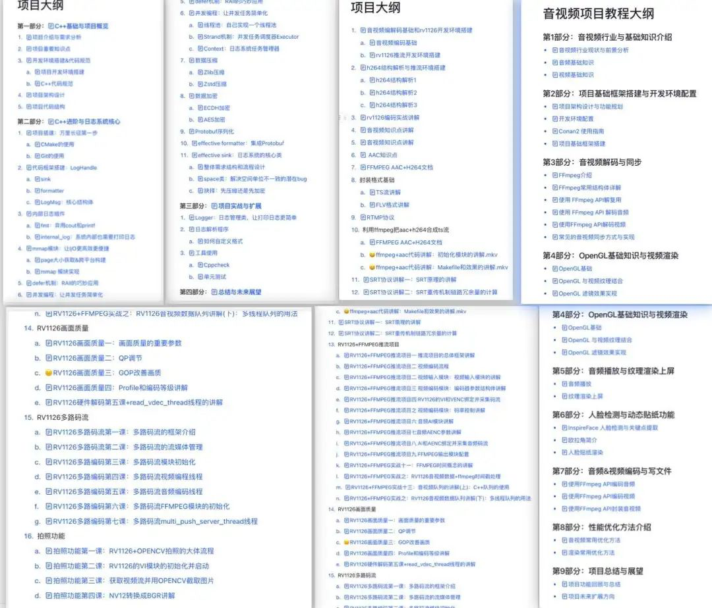

项目文档

另外训练营也在开发一个新项目，该项目共有 4 个模块， 3 个项目导师同时开发，涉及多个方向，单独一个模块拿出来都可以写到简历上，敬请期待呀！

### **5、简历修改与优化**

训练营提供简历撰写指导、简历优化以及简历投递服务，让您的简历不再空洞。

导师凭借丰富的面试经验，从面试官的视角出发，为学员提供专业的简历优化建议。

考虑到学员隐私问题，具体内容不便公开展示，若感兴趣，欢迎私聊详询。

### **6、面试真题详解**

面试真题包含面试技巧、上千道面试真题讲解、面试复盘记录、面试真题讲解，帮助你在真实的面试中从容面对，以下为部分面试题展示：

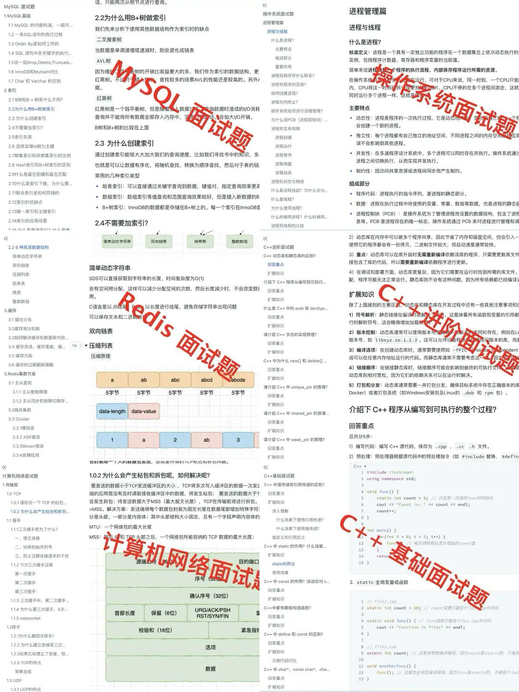

训练营所提供的面试真题均来自各大互联网大厂，并配备了详细的参考答案，助力学员全面了解大厂面试的难度。

### **7、每周进度复盘（强制性）**

每周会进行一次学习进度复盘，对本周学习内容进行总结。

**是的，这个是强制性的，介意的勿来！**

**训练营会强把控学员学习进度，相当于一直有人在 Push 你的学习，不欢迎三天打鱼两天晒网的学员，请见谅！**

训练营这么做是为了把握学员学习情况，及时调整学习计划，以下为部分学员的学习进度同步会议。

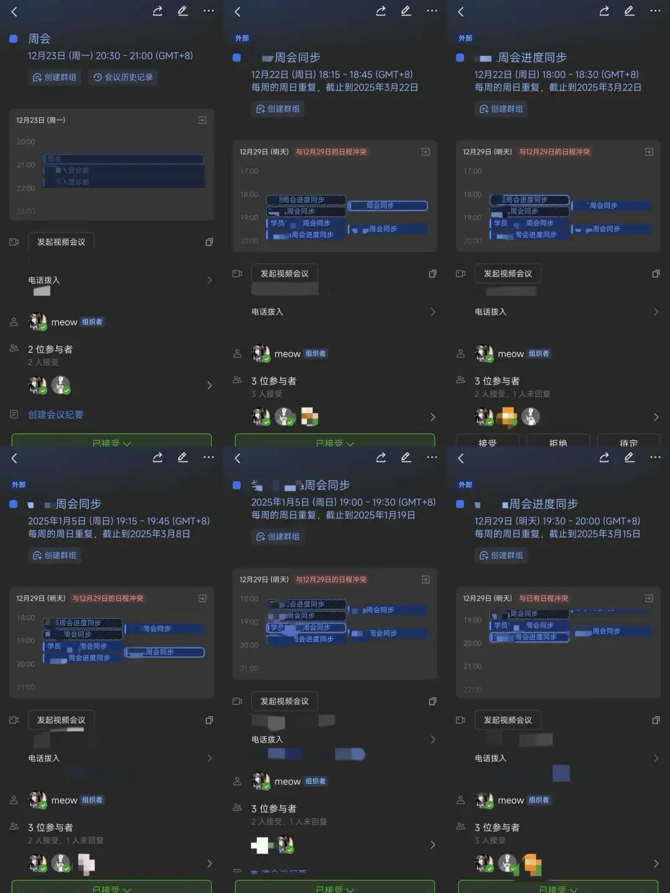

以上就是我们训练营的简单介绍。

### **8、适合人群**

**面向人群**

这是一个专注于 C++ 的训练营，主要面向以下 3 类选手：

- 备战春招和秋招的应届生，科班非科班均可
- 使用 C++ 工作 3 年以内，想跳槽的社招同学
- 互联网行业，如测开、运维、想要积累开发经验的同学

**解决痛点**

如果你有以下困扰，欢迎联系我们，我们愿意为你提供帮助和支持

- 不知道该复习哪些内容，如何开始复习。
- 对面试考察重点不清楚，复习效率低下。
- 缺乏有含金量的实战项目经验。
- 想要提升自己的实战能力，提升做项目及解决问题的能力。
- 对算法题无从下手，缺乏解题思路和常见解题模板。
- 自控力不足，难以专注于系统复习。
- 希望获得大厂的内推机会。
- 独自备战校招社招感到孤单，想要找到学习伙伴。

**不适合人群**

- 缺乏耐心和毅力，急于求成的人
- 对编程逻辑思维基础薄弱，且不愿努力提升的人
- 只想快速获得成果而不注重基础学习的人

**再次重申一遍，如果你是三天打鱼两天晒网的选手，真的不要浪费你我的时间。**

已经劝退不少背景不合适的同学了，比如下面这两位就不太合适，训练营导师评估背景后决定做劝退处理。

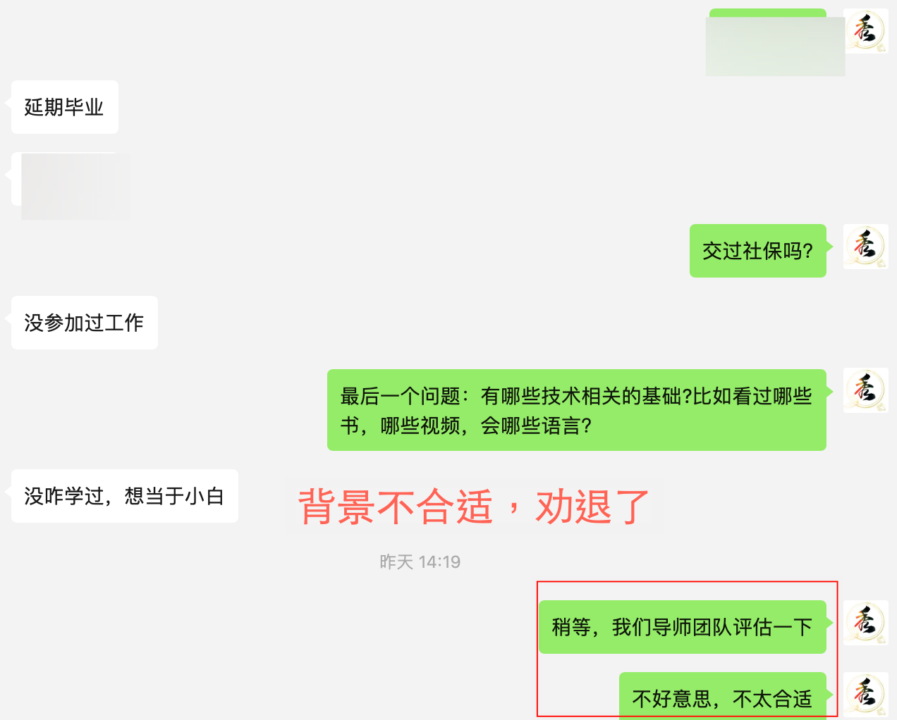

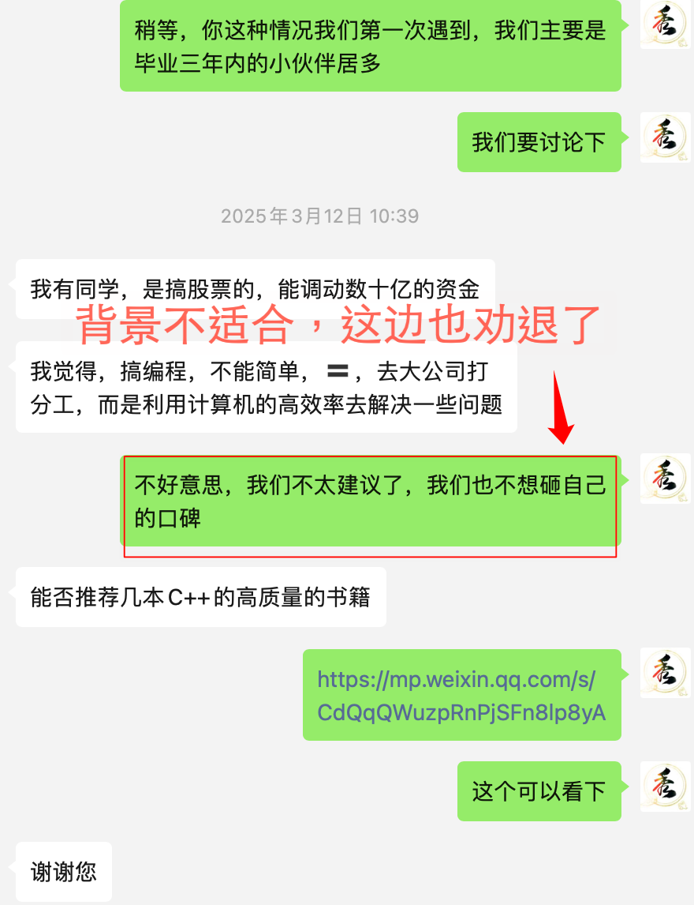

------

好了，以上就是训练营的详细介绍，下面通过已毕业的学员的形式，讲一下训练营具体训练流程，也顺便说一下训练营某位学员取得的成绩。

**学员背景**

211 硕，工作两年，非科班出身，工作中多为排查问题，实际开发经验很少，没深入学习过 C++。

秋招时通过背诵八股拿到的 offer，没太有项目经验，学习能力比较强，年级第一。

**入营摸底**

以下为该学员入营时的面试诊断

  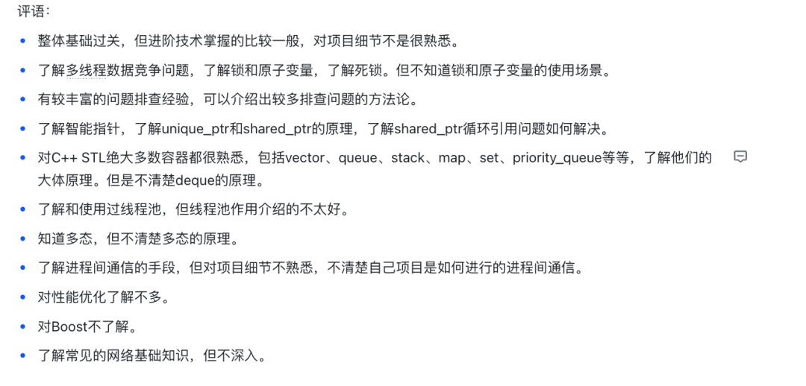

导师团了解过学员情况之后，根据其每日可支配时间及基础掌握情况，制定适合该学员的学习计划。

**量身定制学习计划**

  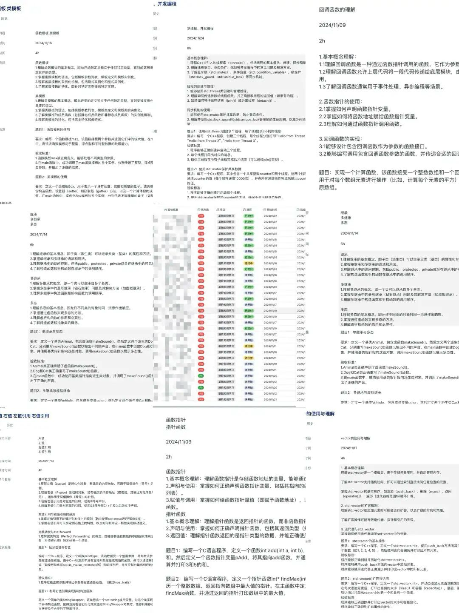

**代码评审**

制定好计划之后，学员每天完成特定任务即可，并将作业提交到作文本上，每天会有导师为其批改作业，指出代码中的问题

  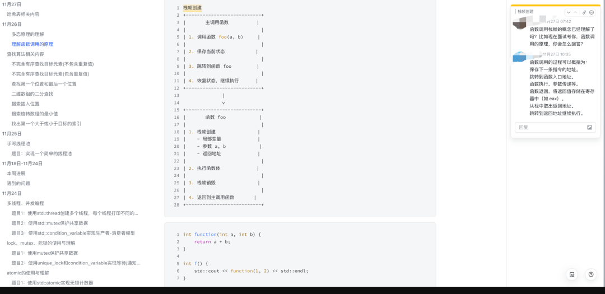
  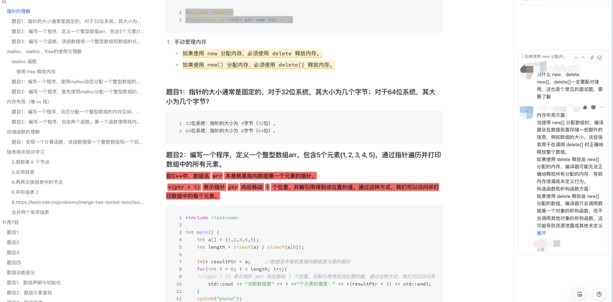
  

碍于篇幅就不一一展示了。

**收割 offer、顺利毕业**

目前这位学员也已经拿下了若干 offer，薪资待遇也还不错，算是成功上岸了。

因为是非科班出身，相比科班同学，确实吃了不少亏，所以这位同学非常珍惜这次机会，学习非常努力，最终拿到了满意的 offer。

  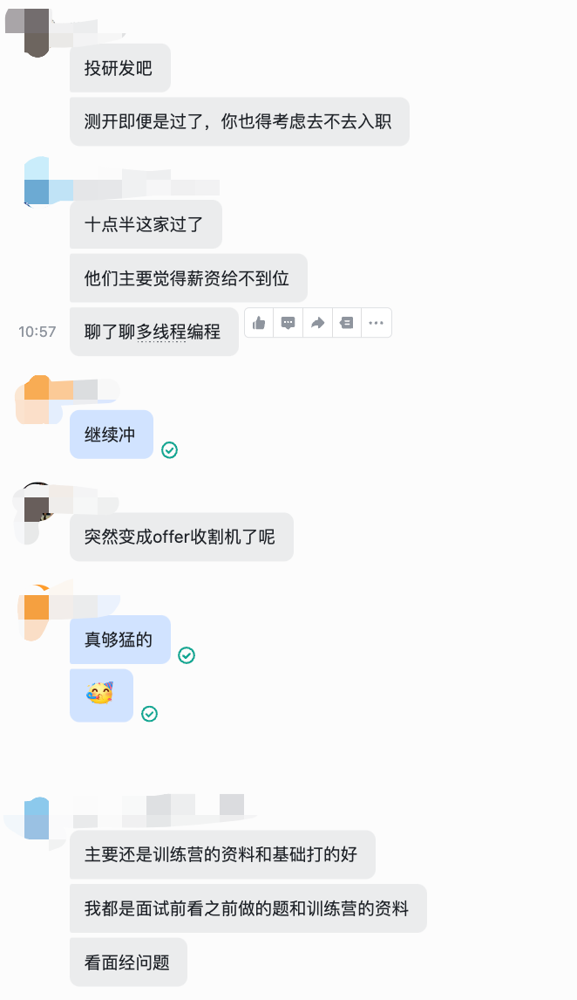

这个训练营确实，是在用心做的，也绝对是超值的，需要了解更多细节可以扫描下方二维码联系阿秀。

  
   

     麻烦备注"<strong>C++训练营</strong>"，否则可能会不予通过。
  

**最后的最后，这里再次重申一遍，如果你是三天打鱼两天晒网的选手，真的不要浪费你我的时间。**

------

